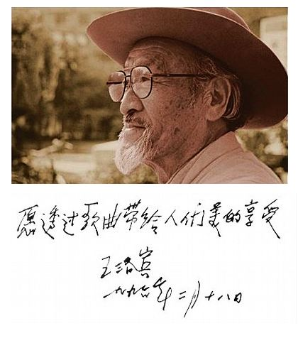
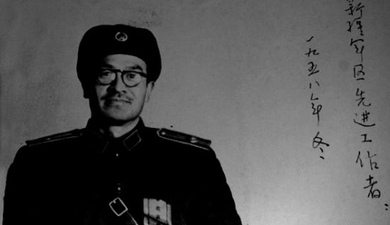
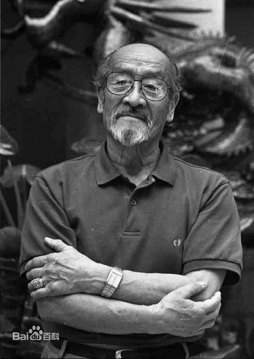
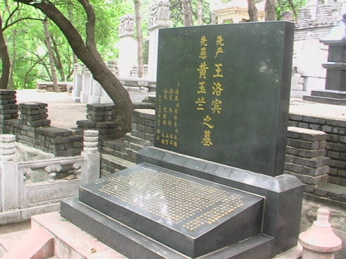
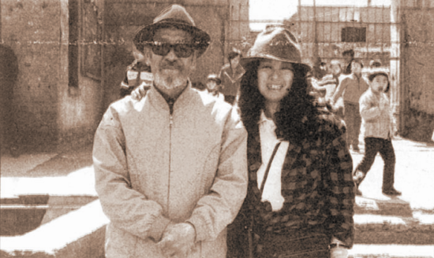

## 104年前的今天，入狱多次却受到三毛景仰的西部歌王王洛宾出生

适合所有人的历史读物。每天了解一个历史人物、积累一点历史知识。三观端正，绝不戏说，欢迎留言。  

王洛宾小传：在那遥远的地方，达坂城的姑娘掀起你的盖头来

【1913年12月28日】104年前的今天，凯歌进新疆、与三毛忘年之恋的西部歌王王洛宾出生

王洛宾（1913年12月28日－1996年3月14日），北京人，汉族，有“西北民歌之父”、“西部歌王”之称。主要作品有《在那遥远的地方》《半个月亮爬上来》《达坂城的姑娘》《掀起你的盖头来》《阿拉木汉》《在银色的月光下》等，在中国是家喻户晓、无人不知，其中许多歌曲被编入大学声乐教材。。

1949年，与王震将军共同创作合唱歌曲《凯歌进新疆》：“白雪罩祁连，乌云盖山巅，草原秋风狂，凯歌进新疆”。随后，十万解放军唱着这首战歌，浩浩荡荡进入新疆。

由于曾在西北马步芳军队工作，解放后曾被判入狱15年。晚年和台湾作家三毛交往甚深。三毛自杀后，王洛宾在家大醉一场，并写出《等待》一歌。

【走上音乐之路】

1913年12月28日，王洛宾出生于北平东城牛角湾艺华胡同，祖父和父亲都是画师。1925年，考入基督教会创办的通县潞河中学，在唱诗课里接触到了西洋合声，使他喜欢上了音乐。1928年暑假，父亲去世，15岁的王洛宾到哈尔滨的姐姐家报丧。在哈尔滨中东铁路线上的横道河子车站，做列车连接工（摆小旗的）时，结识赛克等人，学弹“七弦琴”奇达尔（即“吉它”）唱歌、作曲。

1930年，王洛宾考入北平师范大学音乐系，主修声乐和钢琴。同年，王洛宾为萧军的小说《八月的乡村》创作了插曲《奴隶之爱》，这首曲子是王洛宾的处女作。同时，也开始使用王洛宾这个名字。1934年毕业后，在北京铁路扶轮中学任音乐教员，为学生创作了《詹天佑之歌》。

【达坂城的姑娘】

1937年，“芦沟桥事变”后，前往山西参加八路军“西北战地服务团”，投身抗日救亡运动。创作《老乡上战场》《风陵渡的歌声》《洗衣歌》等大量抗日歌曲。

1938年4月，王洛宾、罗珊、萧军、塞克、朱星南五人赴兰州，参加西北抗战剧团。王洛宾改编了新疆民歌《达坂城的姑娘》，从此与西部民歌结下了不解之缘，一生都献给了西部民歌的创作和传播，有“西北民歌之父”、“西部歌王”之称。

【在那遥远的地方】

10月，王洛宾与罗珊结婚。有一首名为《曼丽》的歌曲，曾在当年上山下乡的知青群体间传唱，不少人一度以为这首动人的歌来自港台，事实上它由王洛宾创作，歌中的女主角则是他最初的爱人罗珊（杜明远）。

1939年（26岁），中国电影创始人之一的郑君里在青海湖畔拍摄影片《祖国万岁》时，邀请了正在西宁教书的王洛宾参加。影片中的牧羊女由17岁的当地藏族女孩萨耶卓玛扮演，王洛宾则扮演萨耶卓玛的帮工。短暂的三天相处，让两人难舍难分。在返回西宁的驼峰上，王洛宾连续三晚借助哈萨克民族的曲调写出了不朽之作《在那遥远的地方》

1941年3月，王洛宾和罗珊在兰州登报离婚。

【马家军的音乐教官】

随后不久王洛宾因“共党嫌疑”被军统逮捕入狱。王洛宾在狱中为随母关押的3岁小女孩罗立力创作了歌曲《蚕豆谣》。因没有任何证据，王洛宾由青海省主席马步芳保释出狱，成为成了青海军、政、学界共同的音乐教官。

1945年（32岁），与黄玉兰在西宁农村结婚，之后生育三子。1947年底，王洛宾回北平省亲，马步芳还委派王洛宾为特使，向60大寿的傅作义送寿礼。

【凯歌进新疆】

1949年9月，王洛宾以国民党起义人员身份在西宁参加了解放军第一野战军，随部队翻越祁连山。在张掖，与王震将军共同创作合唱歌曲《凯歌进新疆》：“白雪罩祁连，乌云盖山巅，草原秋风狂，凯歌进新疆”。随后，王洛宾随着十万解放军唱着这首战歌，进入新疆，任军区政治部宣传部文艺科长。改编《在银色的月光下》等新疆民歌。

1950年11月，因为西北镇压反革命的气氛紧张，王洛宾携家属回北京居住，并到北京八中任教。1951年6月，王洛宾被捕押回新疆；妻子黄玉兰受惊吓，卧床不起，留下三个无人照料的儿子离开了人间。

1952年2月，新疆军区军法处以长期逾假不归为由，判处王洛宾两年劳役。1954年8月，被释放后，被安排到南疆军区文工团任音乐教员。改编《沙枣儿花香》等民歌。

【15年牢狱的人民音乐家】

1960年4月，因历史问题被捕，1961年被新疆军区军事法院判刑15年。1975年5月22日，刑满释放。王洛宾无家可归，在乌鲁木齐打零工。

1981年，新疆军区召开平反大会，为他恢复名誉和军籍，王洛宾终于重新穿上了军装，任新疆军区文工团艺术顾问。

1986年11月，新疆军区政治部、新疆音乐家协会联合为他举办《人民音乐家王洛宾作品音乐会》，首次向社会全面介绍他的音乐作品，并且授予他“人民音乐家”这一光荣称号。1988年，获胜利功勋荣誉章。1991年，享受政府特殊津贴。

晚年寓居乌鲁木齐，1996年3月14日在新疆军区总医院因病去世。与妻子黄玉兰并骨合葬在北京西郊金山陵园。

【写给三毛的等待】

1990年4月，台湾作家三毛参加一个台湾的旅行团，赴敦煌、吐鲁番游览。三毛到新疆采访王洛宾时，两人交往甚密。王洛宾收藏了三毛的发夹，并写了一首歌《幸福的D弦》。三毛回到台湾，不久自缢身亡，王洛宾难过得在家大醉一场，并写出《等待———寄给死者的恋歌》一歌。

你曾在橄榄树下，等待再等待。
我却在遥远的地方，徘徊再徘徊。

人生本是一场迷藏的梦，莫将我责怪。

为把遗憾赎回来，我也去等待。
每当月圆时，对着那橄榄树，独自膜拜。

你永远不再来，我永远在等待。
等待，等待，等待，等待。
越等待，我心中越爱。

### 

