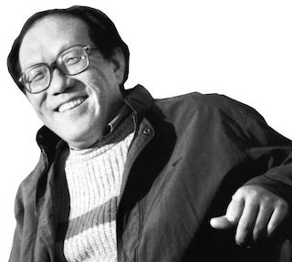
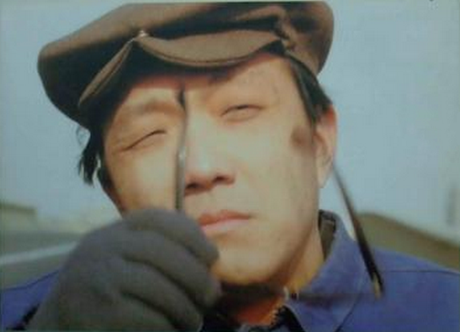

## 7年前的今天，用作品让地坛家喻户晓的残疾人作家史铁生去世

适合所有人的历史读物。每天了解一个历史人物、积累一点历史知识。三观端正，绝不戏说，欢迎留言。  

史铁生（1951年1月4日－2010年12月31日），中国当代作家，电影编剧，北京作家协会副主席、驻会作家，中国作家协会第五、六、七届全国委员会委员，中国残疾人作家协会副主席。
史铁生年轻时就双腿瘫痪，后又患上尿毒症，需靠透析维持生命，自称是“职业是生病，业余在写作”。

1980年代，史铁生是“知青情结”的代言人之一，作品大受欢迎和推崇，是中国文学界的中坚人物。代表作《我的遥远的清平湾》、《我与地坛》、《务虚笔记》、《病隙碎笔》

《我的遥远的清平湾》是当代作家史铁生创作的一篇小说。小说描绘了黄土高原上的小山村和一个风趣的放牛倌的故事。小说以抒情散文的笔法，通过老知青对插队生活的回忆，真实鲜活、自然贴切地描绘了革命根据地陕北黄土高原的风貌，为读者展示了陕北人民的朴实、忠厚、积极乐观的性格，以激发人们认真地思考人生，思考社会。小说感情深厚，娓娓叙来，令人回味无穷。

《我与地坛》是一篇长篇哲思抒情散文，中国当代作家史铁生著。这部作品是史铁生文学作品中，充满哲思又极为人性化的代表作之一。其前第一段和第二段被纳入人民教育出版社的高一教材中。是作者十五年来摇着轮椅在地坛思索的结晶。散文中饱含作者对人生的种种感悟，对亲情的深情讴歌。地坛只是一个载体，而文章的本质却是一个绝望的人寻求希望的过程，以及对母亲的思念。

《务虚笔记》是轮椅上的史铁生的首部长篇小说，发表于1996年《收获》杂志上，同时也是他半自传式的作品。由二十二个段落合成，叙述了上世纪50年代以来的社会嬗变带给残疾人C、画家Z、女教师O、诗人L、医生F、女导演N等一代人的影响。全部的内容只是为了告诉我们一件事，那就是生活的偶然性，很多时候，如果你打开的是另一扇门，走的是另一条路，生活的轨迹可能完全不同，而选择多数时候只是一念之间的偶然。

《病隙碎笔》中，史铁生用生动而通俗甚至是优美的语言追寻和控索了关于我们人生的书籍和未知的道理：人生、命运、爱情、金钱、道义、信仰，健康的心态、成功的途径和价值、孩子的教育、家庭的纽带……共分六部分，243则，字字珠玑，充满着智慧和安详。史铁生在书中所说的一句话概括了本书中心思想：“生命本无意义，是‘我’使（自己的）生命获得了意义。”

生平

1951年1月4日，生于北京。父亲史耀琛，北京农业大学林学系，毕业后曾去东北，母亲在北京林学院工作。铁生从小跟奶奶生活。
1964年，毕业于东城区王大人胡同小学，1967年，毕业于清华大学附属中学。
1969年1月13日，18岁时上山下乡运动展开，自愿到陕北延安农村插队。
1969年4月，因腰腿病返京治病，6月回村，生产队照顾他，让他担任饲养员，放牛喂牛。
1971年9月，史铁生腰疼加重，回北京治病。

1972年1月5日，住友谊医院，一年有半，治疗结束之时即轮椅生涯开始之日。

1974年，23岁时到某街道工厂做工，1981年因患肾病回家疗养。后从事写作。

1979年，发表第一篇小说《法学教授及其夫人》。成名作是《我的遥远的清平湾》，获1983年全国优秀短篇小说奖。小说《老屋小记》获首届鲁迅文学奖。

1989年，和陈希米结婚;

1991年，发表散文《我与地坛》

1997年，发表长篇小说《务虚笔记》（获上海市长篇小说奖）

1998年，被确诊为尿毒症，需隔日透析以维持生命，其经费主要由中国作协和北京市负担。

2005年，《病隙碎笔》（获第三届鲁迅文学奖）

2009年，荣获首届残疾人“绽放文学艺术成就奖”。

2010年12月31日凌晨3点46分，史铁生因突发脑溢血在北京宣武医院去世。根据他的遗愿，不举行遗体告别仪式，器官捐献给医学研究。31日凌晨6时许，其肝脏已移植给天津的一位病人。

