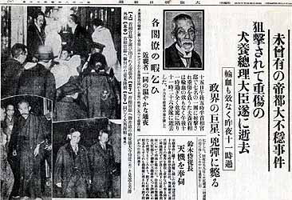

0515犬养毅

85年前的今天，1932年5月15日，不承认满洲国的日本首相犬养毅被乱枪打死

犬养毅（1855年6月4日－1932年5月15日），日本政治家。第29任日本内阁总理大臣。孙中山的革命密友，绰号鬼狐。

犬养毅早年在日本第一次护宪运动中发挥了重大作用，被称为“宪政之神”，1931年12月，授权组阁之后，犬养毅削减军费，拒绝了军部要求承认满洲国的指示，而利用自己的管道与国民政府进行秘密谈判解决九一八问题，军部对犬养的做法十分愤怒。

1932年5月15日，海军激进军人经密谋后袭击首相官邸（史称五一五事件），将犬养毅乱枪打死，享年77岁。犬养毅的死是日本政治史的一个重要分水岭。从此，日本军部逐步控制了日本的政局，走上了全面侵略和对外扩张的道路。

（犬养毅与孙中山合影）

宪政之神

1855年6月4日，犬养毅出生于今日本冈山县的武士家族。1877年（22岁），犬养毅曾作为记者从军采访西南战争，这是明治维新期间平定鹿儿岛士族反政府叛乱的著名战役，标志着倒幕派的正式终结。

1890年（35岁），当选第一批众议院议员，之后42年间18次当选，次数仅次于尾崎行雄。1898年（43岁），犬养毅首次入阁。1913年（58岁），在第一次护宪运动中为推翻当时的桂太郎内阁发挥了重大作用，与尾崎行雄被并称为“宪政之神”。

之后犬养毅一直领导小政党进行活动。直到1929年（74岁），犬养毅出任立宪政友会第六任总裁。

授命组阁

1931年12月（76岁），立宪民政党的内阁倒台，犬养毅作为反对党总裁被授命组阁，出任日本第29任内阁总理大臣。时值全球范围的经济大萧条，日本军队又武力侵占了中国东北省份，日本内外形势十分复杂、混乱。

他任命高桥是清为大藏大臣（即财政部长），禁止黄金输出，以积极的财政政策对抗经济危机。但因削减军费而得罪军部，为自己日后被军人刺杀埋下诱因。又命自己的女婿芳泽谦吉为外相，在容易受军部影响的外交政策方面也确立了领导权。

他对九一八事件的解决方案是承认中国对东北地区的形式领有权，但日本要在经济上实质性地支配东三省。犬养毅拒绝了军部要求承认满洲国的指示，而利用自己的管道与中国政府进行秘密谈判解决九一八问题，军部对犬养毅的做法十分愤怒。

和蒋介石(右).jpg)

（1929年，犬养毅、蒋介石（右一）等人合影）

犬养毅之死

犬养任职期间，日本国内激进民族主义势力十分猖狂，先后制造樱田门事件、血盟团事件等恐怖事件。

1932年5月15日，海军激进军人经密谋后袭击首相官邸（史称五一五事件），将犬养毅乱枪打死。享寿77岁。据传，在凶手射击前，犬养曾说“有话好好讲”，但杀手则冷冷地说“多说无益，射击！”，然后便开枪。

5月19日，于官邸大厅举行了隆重的葬礼。参加仪式者众多，其中还包括当时正在日本访问的著名喜剧电影演员查理·卓别林。遗骨后葬于位于东京港区的青山墓地。

（朝日新闻对五一五事件的报道）

军国主义不归路

五一五事件的凶手虽在后来经军法会议审判，但数年以后，全员蒙恩赦获释，分别在满洲和华北任要职。即使枪杀现任首相，也未能判处死刑。这恐怕是1936年二二六事件，日本法西斯发展壮大的一个远因。

事件以后，日本的政治家对恐怖行径十分恐惧，引起了一阵不批评、不反对军方的风潮。报社大量刊登亲军方的报导，政客们纷纷暗地里购买私宅，就连当时的无产阶级政党都打出了“建立人民和军队的统一战线，打倒万恶的资产阶级”的标语。

后来，昭和天皇受二二六事件影响，开始自觉不刺激军方。侵华日军中，虽然石原莞尔等人不想进一步扩大侵略，但无人对这一主张给予声援。日本军部逐步控制了日本的政局，走上了全面侵略和对外扩张的道路。

