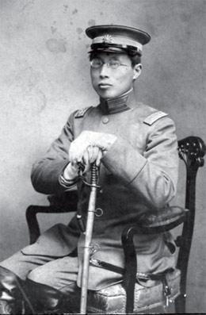
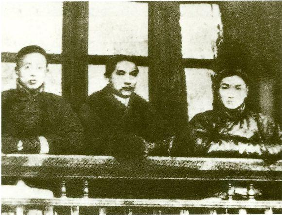
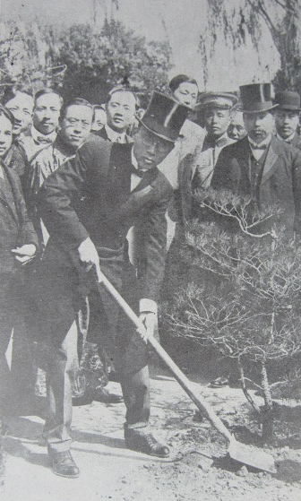
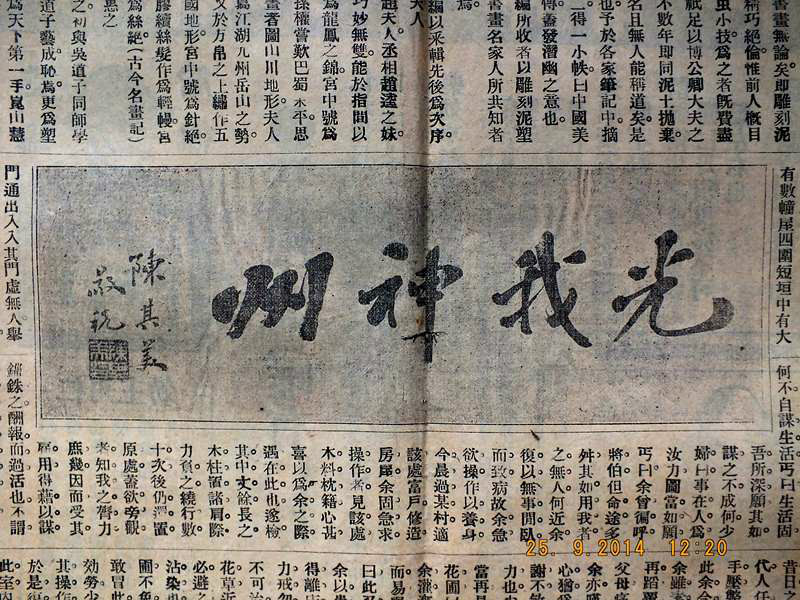

0518陈其美

（万象历史特约作者：东西望）

101年前，1916年5月18日，青帮大佬，孙中山左臂右膀，蒋介石的结义兄弟陈其美被暗杀

陈其美（1878年1月17日－1916年5月18日），字英士，浙江吴兴人。中华民国早期政治人物，青帮代表人物，孙中山的左臂右膀，蒋介石的结义兄弟。

上海光复后，争得沪军都督府都督。热衷于暗杀，曾暗杀了陶骏保、陶成章、夏瑞芳、郑汝成等异己。自己也被袁世凯指使的张宗昌派人暗杀。后民国政府对其进行国葬，陵墓规模仅次于后来的中山陵。

陈其美的政治生涯不足十年，却成为民国史上的风云人物。当年沪军都督府的部下，不少在民国政府中身居要职。他的侄儿陈果夫、陈立夫也成为炙手可热的人物、四大豪门家族之一，他因此身价百倍。孙中山高度赞扬他是“革命首功之臣”。

（墓前石牌坊，孙中山、林森、蒋介石的题字）

**青帮“大”字辈**

1878年1月17日，陈其美出生于浙江吴兴。父亲死后，15岁辍学，在一家当铺当学徒。1902年（24岁），三弟从日本回中国，讲述日本富强的情况，陈其美受启发。1903年，陈其美离开当铺，只身到上海，做了两年会计。

1906年（29岁），陈其美赴日本留学，入东京警监学校，结识了徐锡麟、秋瑾、张静江、谭人凤、褚慧僧等大批反清志士。他加入中国同盟会；并结交蒋介石，二人后来结拜为异姓兄弟。

1908年（31岁），陈其美回到上海。陈其美性情豪放，善于组织，在同仁中以“四捷”即口齿捷、主意捷、手段捷、行动捷而著称。他加入青帮，属于“大”字辈，辈分极高。

（陈其美、孙中山、戴季陶合影）

**沪军都督**

1911年，陈其美任同盟会中部总会庶务部长。10月，武昌起义爆发后，陈其美发动青帮和革命党人响应，攻入浙江杭州。不久上海也宣告独立，大家几乎一致推光复会的李燮和为上海都督，但陈其美利用其青帮弟兄，大闹会场，反对李燮和，陈其美就这样被举为沪军都督。

1911年12月12日，陶骏保（光复会会员，江浙联军参谋长）到上海先后拜会了宋教仁、黄兴，陈述北伐策略，后到沪军都督府拜访时，被陈其美枪杀。

1912年1月14日，陶成章（光复会创始人）因病秘密疗养于上海法租界广慈医院。陈其美在孙中山的许可下，命令蒋介石与王竹卿，对陶成章执行暗杀。陶成章胸部中弹，血如涌泉，医治无效去世。

**二次革命**

1912年，中华民国成立，陈其美被任命为唐绍仪内阁工商总长，未就任。7月，其上海军政府被众多议员指责，被迫辞去都督。

1913年3月，宋教仁在上海火车站被暗杀，孙中山组织二次革命爆发。7月，陈其美宣布上海独立，黄兴任命他为上海讨袁军总司令。二次革命失败后，赴日本支持孙中山另组中华革命党，被推为中华革命党总务部部长。

二次革命期间，夏瑞芳（商务印书馆的创办人）联合商界反对“陈其美驻兵闸北”。1914年1月10日，夏瑞芳在上海遇刺身亡。

（民国元年《神州日报》五周年纪念，陈其美题词）

**暗杀者被暗杀**

1915年，袁世凯意在称帝，陈其美再回中国反袁，主持中华革命党上海总部，兼中华革命军东南军司令长官。11月10日，陈其美派人刺杀袁世凯任命的上海镇守使郑汝成于外白渡桥。

12月5日，发动肇和舰起义失败。当夜，中华革命党上海总部被法租界巡捕房搜查，多人被捕。陈其美向孙中山推荐蒋介石做自己接班人。

1916年5月18日，陈其美在寄宿的上海法租界萨坡赛路14号（后改名英士路，1950年改淡水路至今）日本侨民山田纯三郎的寓所被杀手枪杀。一般相信是由袁世凯指使张宗昌派员去刺杀的。灵堂就设在蒋介石寓所（重庆南路35弄，今拆）。

**隆重国葬**

1917年5月12日，在上海打铁浜苏州集议公所为陈其美举行国葬，上万人送行。孙中山、唐绍仪、章太炎等主祭。次日归葬浙江湖州。在蒋介石逝世之前，在中国国民党大员的葬礼等级上，陈其美葬礼的声势规格和坟墓规模仅次于孙中山一人。

在湖州碧浪湖畔的墓前石牌坊，顶天立地，招示四方，上面的题字，正中是孙中山的"成仁取义"，左面是林森的"浩气长存"，右面是蒋介石的"精神不死"。

陈其美的政治生涯不足十年，却成为民国史上的风云人物。1927年，蒋介石建立南京政府，当年沪军都督府的部下有不少身居要职。他的侄儿陈果夫、陈立夫也成为炙手可热的人物、四大豪门家族之一，他因此而身价百倍，名声之显赫几乎盖过了黄兴、宋教仁、蔡锷等人。

（陈其美墓全景）