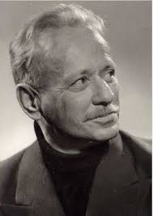
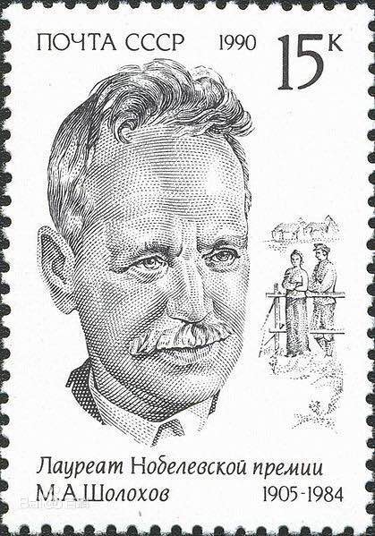

惟一一个既获斯大林文学奖，又获诺贝尔文学奖的作家肖洛霍夫出生于俄罗斯

万象特约作者：一一

112年前的今天，1905年5月24日，获诺贝尔文学奖，《静静的顿河》的作者肖洛霍夫出生

肖洛霍夫（1905年5月24日－1984年2月21日），苏联作家。连任多届苏共中央委员，当过苏联作家协会书记，是惟一一个既获斯大林文学奖，又获诺贝尔文学奖的作家。

年仅23岁的肖洛霍夫，以一部《静静的顿河》声誉鹊起，受到国内外的瞩目。年轻的萧洛霍夫跃升世界级作家。1965年，以《静静的顿河》一书荣获诺贝尔文学奖。

1999年，“顿河”手稿被发现，普京下令财政部筹款，以50万美元购得，珍藏于“高尔基世界文学研究所”。联合国教科文组织决定，2005年命名为“肖洛霍夫年”。

成为知名作家

1905年5月24日，肖洛霍夫生于今罗斯托夫州维申斯克区的农民家庭。1917年十月革命后（12岁），担任苏维埃政权下粮食部门的职员。在这段时间里，年轻的肖洛霍夫为红军做过各种工作，其中一项是在顿河地区征集军粮。

1922年（17岁），前往莫斯科，加入“青年近卫军”。1923年，与一位哥萨克的女教师玛丽姬·格罗斯拉伕斯卡娅结婚，并发表第一部短篇小说《胎记》。1924年，他加入俄罗斯无产阶级作家联合会（拉普），成为职业作家，并回到顿河开始创作。

《静静的顿河》

1928年（23岁），《静静的顿河》第一部在苏联《十月》杂志上发表，立刻声名鹊起。1930年（25岁），肖洛霍夫见到了斯大林。1932年（27岁），在苏联农业集体化的过程中写出长篇小说《被开垦的处女地》第一部，并成为一名正式的苏共党员 。

1937年至1938年之间，他多次致信斯大林，几乎遭受迫害。1957年（52岁），发表的短篇小说《一个人的遭遇》 （又译《人的命运》）产生了很大的影响，被称为当代苏联军事文学新浪潮的开篇之作。

获得诺贝尔奖

1965年（60岁），肖洛霍夫因其“在描写俄国人民生活各历史阶段的顿河史诗中所表现出来的艺术力量和正直品格”而获得诺贝尔文学奖。1984年（64岁），肖洛霍夫在他的出生地克鲁齐林诺村去世。

1999年，“顿河”手稿被发现存于其密友库达绍夫的远亲家中。后总统普京下令财政部筹款，以50万美元购得，目前珍藏于“高尔基世界文学研究所”。联合国教科文组织决定，2005年命名为“肖洛霍夫年”。

 

在中国的影响力

肖洛霍夫是位享有世界声誉的苏联作家，其作品在中国产生过巨大影响。《静静的顿河》第一部在苏联出版后，第二年鲁迅先生便约请贺非翻译，并亲自校订，还撰写了后记。1931年，《静静的顿河》中译本作为鲁迅编辑的“现代文艺丛书”之一，由上海神州国光社出版。

从此，肖洛霍夫的作品几乎每发表一部，都很快介绍到中国来。尤其是《一个人的遭遇》在《真理报》上刚一刊出，当月就译成了中文，而且有两个不同的译本，先后在《解放军文艺》和《译文》上发表。这在中国翻译史上是难寻之事。

在周立波、丁玲、柳青、刘绍棠、陈忠实等现当代作家的创作实践中，我们可以清晰地见到“肖洛霍夫的影响因子”，它宛如一条生生不息的长河，静静地流淌在中国作家的创作血液中。

