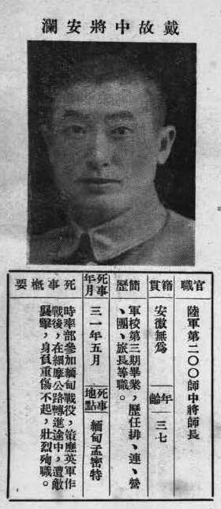

（万象特约作者：一一）

75年前的今天，1942年5月26日，血战昆仑关、中国远征军将领戴安澜在缅甸殉国

戴安澜（1904年11月25日－1942年5月26日），安徽省无为县人。国民革命军第五军第二〇〇师师长，著名抗日将领，以血战昆仑关、远征缅甸闻名。

戴安澜曾在长城抗战血战古北口，后参加台儿庄战役、武汉会战、徐州会战，在攻克昆仑关战役中击毙日军中村正雄少将，并因此获得蒋介石"当代之标准青年将领"的赞誉。他是二战中第一位获得美国勋章的中国军人。

1942年，戴安澜率第二〇〇师作为中国远征军的先头部队赴缅甸参战。取得同古会战（歼敌五千余，而日军兵力4倍于戴部）、收复棠吉等战功。后在郎科地区指挥突围战斗中负重伤，以身殉国。追赠陆军中将，解放后追认为革命烈士。

**昆仑关大捷**

1904年11月25日，戴安澜出生于安徽省无为县。1924年（20岁），加入北伐军，当二等兵。1925年，入黄埔军校第三期毕业，翌年参加国民革命军北伐。先后在教导第二师、第四师、第二五师任连、营、团长等职。

1933年春（29岁），日军协同满洲国军全面进攻热河，危及平津，长城抗战爆发。戴安澜当时在国军十七军第二十五师关麟征部，任第三十七旅第一五三团团长随军北上，担任守备古北口；参加了长城抗战，获得三等云麾勋章一枚，之后升至旅长。

七七事变后，在1938年的鲁南会战中，曾率部在中艾山与日军激战4昼夜，因战功卓著，升任第八十九师副师长。同年8月参加武汉会战。1939年（35岁），升任第五军第二〇〇师师长。12月，在广西昆仑关与日军第5师团激烈鏖战，戴安澜指挥有方，重伤不下火线，击毙日军旅团长中村正雄少将，赢得著名的昆仑关大捷。

（昆仑关阵亡将士纪念碑）

浴血同古保卫战

1942年3月（38岁），戴安澜率第二〇〇师西出云南，入缅甸作战。他不惜冒孤军深入的危险，开进同古，逐次接替了英军的防务。为了掩护英军安全撤退，充分作好迎战准备，戴安澜率部日夜抢修工事，布下三道防线，阻击迟滞敌军前进。他带头立下遗嘱：只要还有一兵一卒，亦需坚守到底。如本师长战死，以副师长代之，副师长战死以参谋长代之。参谋长战死，以某某团长代之。全师各级指挥官纷纷效仿，誓与同古共存亡。

3月25日，以8000人挡住日军精锐的第55师团20000余众的进攻，取得同古（今称东吁）保卫战胜利，赢得中外赞赏。同古保卫战历时12天，第二〇〇师以高昂的斗志与敌鏖战，以牺牲800人的代价，打退了日军20多次冲锋，歼灭敌军4000多人，俘敌400多人，予敌重创，打出了国威。

同古战役后期，由于右翼英军只顾逃命，放任日军长驱直入，左翼国军行动迟缓，以致让日军迅速前出并偷袭成功，致使第五军三面受敌，第二〇〇师一度处于被围歼之势，势不得已，第二〇〇师奉命向北突围。为挽颓势，戴安澜指挥第二〇〇师奋勇夺占棠吉，再立战功。

**殉国茅邦村**

缅甸战场形势日下，曼德勒会战计划流产，1942年5月8日上午，缅北远征军基地密支那被日军攻占，与国内的联系被切断，后援断绝，中国远征军有被围歼之势。指挥官杜聿明下令第五军经缅北野人山后撤回国。第三十八师师长孙立人认为撤退路途遥远，拒绝接受命令，率所部第三十八师撤往印度。戴安澜接受撤退命令，率领第二〇〇师经缅北野人山、滇西纵谷撤往云南。日军沿途追击，因地形不利行军，各部遭受严重打击。

5月16日拂晓，第二〇〇师师部在朗科地区行进途中，遭敌伏兵袭击，戴安澜胸、腹部重伤。至5月26日时，因伤口感染严重，已糜烂穿孔，由于缅北复杂的地形和连绵的阴雨，戴安澜终因缺乏药物医治，伤口化脓溃烂，戴自知来日无多，命左右卫士将之扶起，随后向北面高呼“反攻！反攻！中华民国万岁！”后，故于缅甸茅邦村，享年38岁。

戴安澜牺牲的消息传回国，蒋电令：务必将戴师长遗体运回祖国。5月29日，因为天气炎热，戴遗体流脓水发臭，不能再继续行走，又不能留在缅甸，乃决定火化。第二〇〇师官兵将戴棺材遗体在原木上火化后，拣出遗骨，按部位用绸布包好，装在木箱里。第二〇〇师在撤退回国沿途损失超过2,000人以上。

千秋英烈

戴安澜将军殉国后，中华民国政府于1943年4月1日在广西全州的湘山寺为其举行了国葬，并追赠陆军中将；蒋介石写挽联：“虎头食肉负雄姿，看万里长征，与敌周旋欣不忝。马革裹尸酹壮志，惜大勋未成，虚予期望痛何如？”

毛泽东赋诗《五律·挽戴安澜将军，五律·海鸥将军千古》：“外侮需人御，将军赋采薇。师称机械化，勇夺虎罴威。浴血东瓜守，驱倭棠吉归。沙场竟殒命，壮志也无违。”

美国国会授权总统罗斯福颁发”第二次世界大战中外国同盟军将领之军团功勋章“给戴安澜将军，他是第一个受此殊荣的中国军人。

1949年后，中华人民共和国追认其为革命烈士。2009年9月10日，戴安澜被评为“100位为新中国成立作出突出贡献的英雄模范人物”。

