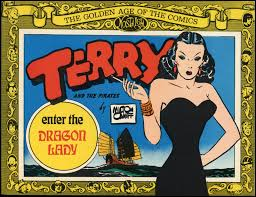
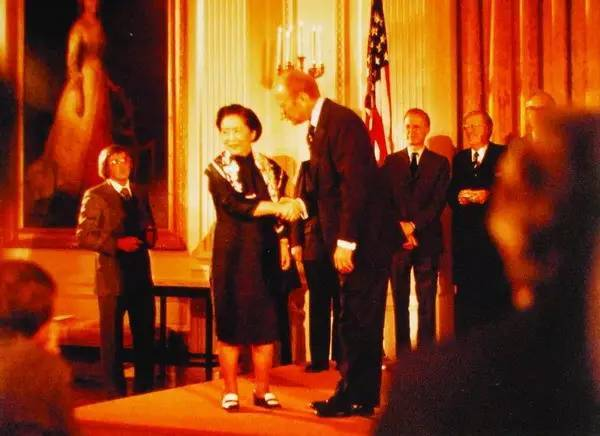

（万象特约作者：一一）

105年前的今天，1912年5月31日，中国的居里夫人、世界最杰出的女性实验物理学家吴健雄出生

吴健雄（英语：Chien-Shiung Wu，1912年5月31日－1997年2月16日），江苏省太仓人，是一位在核物理学领域卓有贡献的美籍华裔物理学家，其丈夫是同为物理学家的袁世凯孙子袁家骝。

她参与了美国陆军部研制原子弹的曼哈顿计划，为原子弹的成功，二战的结束有所贡献。吴健雄用一个巧妙的实验验证了“宇称不守恒”，才使得该原理得到普遍承认。1975年，李政道与杨振宁二人，因此被授以诺贝尔物理学奖。

吴健雄在实验物理学方面的造诣，常令人将她与居里夫人相提并论。她常被人称作是“中国居里夫人”、“物理研究的第一女士”、“核子研究的女王”以及“世界最杰出女性实验物理学家”。本人获授1978年首次颁发的沃尔夫物理学奖。

**胡适的小同事**

1912年5月31日，吴健雄生于中国江苏省太仓县浏河镇。依族谱，是“健”字辈，她与兄弟的名字都源于“英雄豪杰”这个成语。

吴健雄在她父亲为女童创办的明德学校接受小学教育。1923年（11岁），离开家乡前往苏州第二女子师范学校求学。1929年（17岁），吴健雄以班级顶尖成绩毕业并被中央大学录取。依据当时政府的规定，想要继续获得大学教育的师范生需要当一年的学校教师。在这一年中，她在中国公学任教。胡适是这所学校当时的校长。

1930年（18岁），进入中央大学，起初主修数学，后来转为物理。本科毕业后的两年期间，在浙江大学继续进修研究生课程。1936年8月（24岁），被密歇根大学录取，乘坐胡佛总统号邮轮前往美国。她的父母与叔叔一同为她送行，这也是吴健雄与父母见的最后一面。

（胡适和吴健雄）

**嫁给袁世凯的孙子**

吴健雄在到达美国后，拜访了加州大学伯克利分校，她结识了袁家骝。他是首任中华民国大总统袁世凯的孙子。吴健雄听到了密歇根大学对女性不甚尊重的传闻：该校当时由学生捐资建起的学生中心，不允许女学生从其前门进入。吴健雄打消了东去密西根大学的计划，决定改在伯克利进修，两人成了同学。1940年6月（28岁），吴健雄获得了哲学博士学位，然后继续在放射性实验室中当博士后。

1942年5月30日（30岁），吴健雄与袁家骝结婚，婚礼由加利福尼亚理工学院院长、诺贝尔物理学奖获得者密立根教授及其夫人主持，并在密立根院长的花园进行。双方家长由于太平洋战争爆发都没能出席婚礼。随后夫妇二人移居至美国东海岸。

**参加原子弹计划**

1942年6月，美国陆军部开始实施利用核裂变反应来研制原子弹的计划，称为曼哈顿计划(Manhattan Project)。该工程集中了当时西方国家最优秀的核科学家，动员了10万多人参加这一工程，历时3年，耗资20亿美元，成功地进行了世界上第一次核爆炸，并按计划制造出两颗实用的原子弹。整个工程取得圆满成功。

1944年3月（32岁），吴健雄加入了位于哥伦比亚大学的曼哈顿计划下属的替代合金材料实验室（英语：Substitute Alloy Materials Laboratories）。这座实验室的职责是协助曼哈顿工程中铀浓缩的气化扩散项目。吴健雄负责开发监测放射性的仪器。

**东方面孔的龙夫人**

1945年（33岁），在第二次世界大战后，吴健雄担任哥伦比亚大学的副研究员。1947年（35岁），吴健雄生下儿子袁纬承，他后来也成为了一名物理学家。1952年（40岁），升为副教授。1954年（42岁），因持有民国政府护照，无奈加入美国国籍。1958年（46岁），升为正教授。她的学生爱把她叫做“龙夫人”，这个绰号来源于连环画《特里与海盗》的一个角色。

（漫画中的龙夫人）

**验证宇称不守恒定理**

1956年，李政道与杨振宁二人通过理论计算，预测钴-60放出的β粒子的轨迹不对称，也就是说宇称不守恒。此后不久，吴健雄用一个巧妙的实验验证了“宇称不守恒”，从此，“宇称不守恒”才真正被承认为一条具有普遍意义的基础科学原理。1957年，李政道与杨振宁二人被授以诺贝尔物理学奖。

吴健雄用两套实验装置观测钴60的衰变，她在极低温(0.01K)下用强磁场把一套装置中的钴60原子核自旋方向转向左旋，把另一套装置中的钴60原子核自旋方向转向右旋，这两套装置中的钴60互为镜像。实验结果表明，这两套装置中的钴60放射出来的电子数有很大差异，而且电子放射的方向也不能互相对称。实验结果证实了弱相互作用中的宇称不守恒。

（吴氏实验的实验结果示意图）

**魂归中国故里**

1972年，尼克松访华后，中美两国的关系得到了改善。1973年（61岁），吴健雄回国访问。此时，她的叔叔和弟弟已在文化大革命中身故，父母的坟墓也遭到毁坏。她受到周恩来的接见。周恩来亲自就上述情况向她致歉。在此次访问后，吴健雄又多次访问中国。

1981年（69岁），吴健雄退休，成为荣休教授。1997年2月16日，因中风去世，享年85岁。依照她的遗愿，她的骨灰葬于她幼时就读的明德学校的院中。

**一生的荣誉**

吴健雄一生获得的奖项众多，荣誉等身。1958年（46岁），她成为首位获得普林斯顿大学名誉博士学位的女性，当选为美国国家科学院院士。1964年（52岁），获得美国国家科学院颁发的科姆斯托克物理学奖。1975年（63岁），获得美国国家科学奖章，并成为美国物理学会首位女性会长。

（1976年，吴健雄在美国白宫接受福特总统颁发的国家科学奖）

1978年（66岁），成为首任沃尔夫物理学奖得主。1986年（74岁），美国纽约自由女神像落成一百周年之际，她获得了艾丽丝岛奖章。1990年（78岁），一颗小行星以她的名字命名，她是首位在世时享此殊荣的科学家。1994年（82岁），被选为中国科学院首批外籍院士。

1995年，杨振宁、李政道、丁肇中及李远哲四位诺贝尔物理学奖得主，在台湾发起创立吴健雄学术基金会。1999年，东南大学在校园内建造吴健雄纪念馆。纪念馆于2002年落成，设计方案由袁家骝先生亲自选定。纪念馆收藏了袁家骝等人捐献的吴健雄生前所获奖章、奖状及手稿等等遗物。

