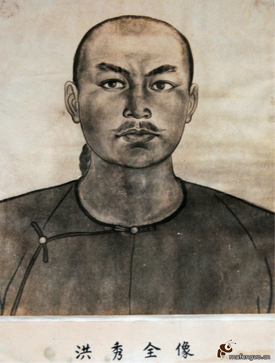
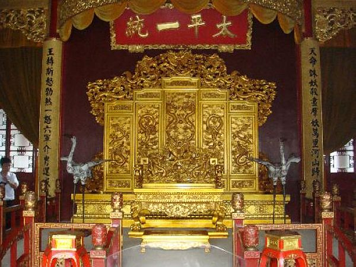
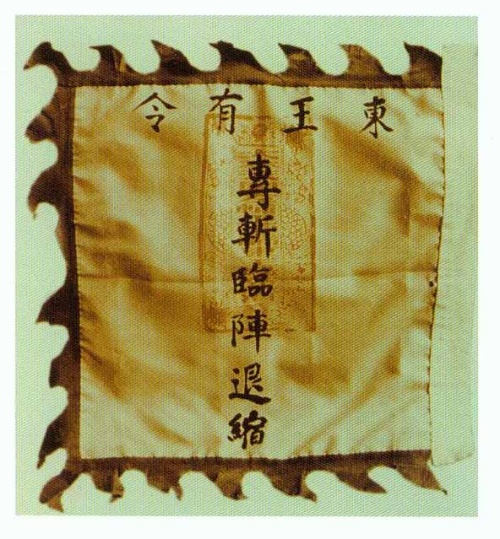
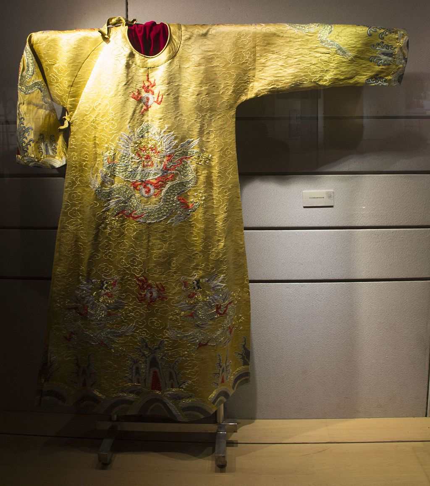

0601洪秀全

153年前的今天，1864年6月1日，一本破书改变命运的太平天国天王洪秀全病死

四次落第，吃草充饥的天王洪秀全病死天京

洪秀全（1814—1864），生于广东花县（今广州市花都区），又名洪日，客家人。太平天国天王，以南京为首都，占据半壁江山长达13年，对晚清中国社会产生了巨大而深刻的影响。

洪秀全先后四次落第，绝望之余，凭一本粗糙的基督教入门书《劝世良言》，创立了拜上帝教。在金田起义后，一路摧枯拉朽，仅仅两年多，就攻占南京，建立了太平天国。

未曾想，正在形势一片大好之时，发生著名的天京事变。东王、北王被杀，翼王出走，顿时急转直下。洪秀全也只能吃草度日，病死天京。天京陷落后，曾国藩挖出洪秀全，“戮尸，举烈火而焚之！”并命人把骨灰和以火药，装入炮弹，然后接连发射出去，目的是要让洪秀全彻底灰飞烟灭，阴魂无归。

四次落第的秀才

1814年1月1日，洪秀全出生于广东花县（今广州市花都区），客家人。家里是农民，7岁起在村中私塾上学，学习四书五经。由于他是兄弟中唯一识字者，村中父老指望洪秀全考取功名光宗耀祖，先后多次到广州参加府试，结果都失败落选。

1837年（23岁），在广州应试时，曾收到基督徒散发的《劝世良言》一书，藏于家中。这是第三次落选，受打击回家后重病一场，一度昏迷。梦中见有一老人对他说：奉上天的旨意，命他到人间来斩妖除魔。

1843年春（29岁），第一次鸦片战争后，他再一次参加了广州的府试，结果还是以落选告终。

一本改变命运的书

此时，洪秀全翻阅《劝世良言》一书，恍然大悟，认为自己是受上帝之命下凡诛妖，于是称上帝耶和华为“天父”，称耶稣为“天兄”。开始宣传他所理解的基督教教义，称之为“拜上帝会”。

洪秀全说：“人心太坏，政治腐败，天下将有大灾大难，唯信仰上帝入教者可以免难。入教之人，无论男女尊贵一律平等，男曰兄弟，女曰姊妹。”洪秀全的“拜上帝会”在教义上模仿基督教。

最初在广州附近传教，但未取得很大成功。1844年（30岁），洪秀全和冯云山转至广西一带传教，洪不久便返回广东，冯留下发展。1845年至1846年间，在家乡的洪秀全写下《原道醒世训》、《原道觉世训》、《百正歌》等作品。

（洪秀全所撰写的《原道救世歌》、《原道醒世训》和《原道觉世训》）

十款天条

1847年初（33岁），洪秀全到广州的礼拜堂正式学习基督教，曾要求受洗，但被认为对教义的认识不足够，拒绝为他施洗。4个月后，洪秀全离开，再到广西会合冯云山，并陆续制订拜上帝会的规条及仪式。

洪秀全、冯云山仿照基督教的十诫，结合中国传统道德，制定了《十款天条》作为拜上帝教的基本教规，后来成为太平天国的军规。

《十款天条》包括：1、崇拜皇上帝；2、不好拜邪神；3、不好妄题皇上帝之名；4、七日礼拜，颂赞皇上帝恩德；5、孝顺父母；6、不好杀人害人；7、不好奸邪淫乱；8、不好偷窃劫抢；9、不好讲谎话；10、不好起贪心。

建立太平天国

1851年1月11日（37岁），在广西桂平的金田村举行起义，建号太平天国，洪秀全称天王；9月，攻克永安城后，太平天国建立起了自己的一整套制度，封杨秀清为东王，称九千岁，萧朝贵为西王，称八千岁，冯云山为南王，称七千岁，韦昌辉为北王，称六千岁，石达开为翼王，并诏令诸王皆受东王节制。史上称为“永安建制”。

1852年（38岁），太平军离开广西后，北上经长沙，攻克武汉。1853年，顺长江而下，攻占南京，改名天京并定都于此，并派出军队西征北伐。

太平天国举行第一次科举考试时，有史以来第一次设立女科，拔取了女状元、女进士等。洪秀全主张把四书五经列为禁书。后来洪秀全按需要修改了《圣经》，在太平天国内颁行。

（洪秀全的龙袍）

天京事变

1856年6月（42岁），太平军攻破清军的江南大营，解天京三年之围。东王杨秀清见当时太平天国形势大好，以“天父下凡”为由，迫洪秀全封他为“万岁”。

9月，洪秀全密诏北王韦昌辉、翼王石达开铲除东王。韦昌辉突袭东王府，诛杀了杨秀清一家。石达开与韦昌辉产生矛盾，石达开离开天京，起兵讨伐韦昌辉。11月，洪秀全下令处死韦昌辉。

石达开在天京主政一段时间，洪秀全封自己的亲兄弟洪仁发、洪仁达为王，以牵制石达开。1857年6月，石达开率兵十万，离开天京，脱离天王指挥。洪秀全虽然掌握了朝政大权，太平天国却开始走下坡。

灰飞烟灭

1857年7月（43岁），清重建“江南大营”，发动进攻。12月，镇江，瓜州，浦口失陷，天京被围。在陈玉成和李秀成等人支撑下，太平军在数年间挡住了清军的多次攻势。1859年，族弟洪仁玕抵达天京，被封为军师、干王，名义上总理天国朝政。1862年（48岁），英王陈玉成被杀后，形势急转直下，天京附近据点逐一陷落。

1864年3月（50岁），天京遭到包围后，城内粮食不足，洪秀全带头吃“甜露”（草团）充饥，因而致病。1864年6月1日，洪秀全病逝天京（也有说是服毒自杀），被秘密葬在天王府的后花园内。

（天王洪日就是洪秀全）

1864年7月30日，天京陷落之后，在一个天王府宫女的指引下，挖出了洪秀全的尸体。8月1日，曾国藩断然下令：“戮尸，举烈火而焚之！”随后，命人把骨灰和以火药，装入炮弹，然后接连发射出去，目的是要让洪秀全彻底灰飞烟灭，阴魂无归。

洪秀全共有妻妾87人，皆称王娘。以其梦见的“天妻”为元配妻子，称正月宫。正室赖莲英称又正月宫，妃嫔依次有副月宫、又副月宫两等。却仅有五个儿子，八个女儿。长子洪天贵福，即位为幼天王。

