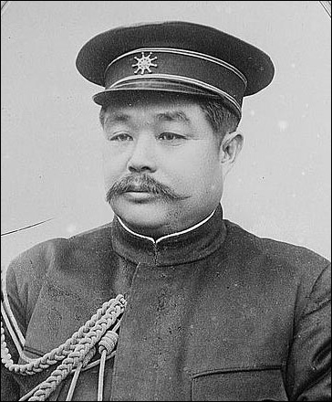
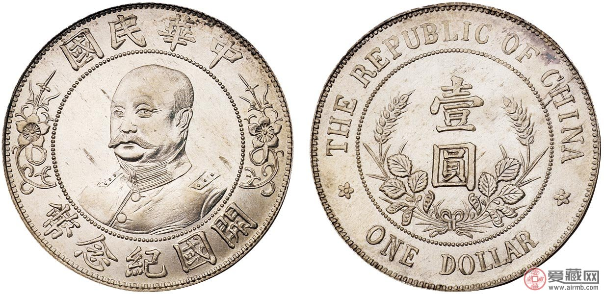
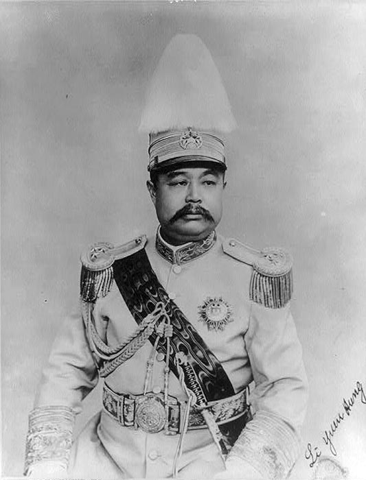
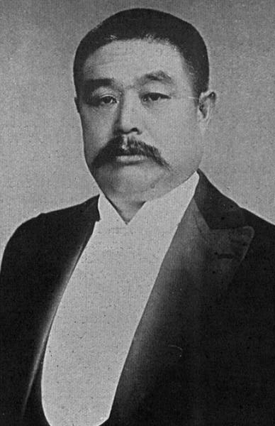

0603黎元洪

黎元洪（1864年10月19日－1928年6月3日），生于湖北省黄陂县黎家河（今属大悟县），人称“黎黄陂”。中华民国第一任副总统、第二任大总统。

清末加入海军，曾参与中日甲午海战，船只搁浅，跳海逃生。辛亥革命时，被逼为都督，成为革命领袖。革命成功后，与革命党人产生激烈矛盾，被称为“黎屠夫”。

支持袁世凯，成为第一任副总统，并结为儿女亲家。袁世凯称帝时，第一道命令就是册封黎元洪为“武义亲王”。袁世凯死后，第二天任大总统，张勋复辟时赶下台。下台5年后，竟然再次继任大总统，成为奇谈。死后7年，国民政府为其国葬。

（中华民国黎元洪开国纪念币）

**甲午战争中跳海逃生**

1864年10月19日，生于湖北省黄陂县黎家河（今属大悟县）。8岁时，父亲投奔天津北塘的游击守备，全家迁居天津北塘。

1883年（19岁），黎元洪考入天津北洋水师学堂管轮科，接受正规的新式海军教育。老师严复评他：“德高才疏”。1888年（24岁），毕业为六品顶戴把总，被派至北洋水师来远号快船见习。

1890年（26岁），调赴广东广甲舰，充当三管轮。1891年，晋升为二管轮，五品顶戴千总。1894年，中日甲午战争爆发，广甲舰被抽调编入北洋舰队。在9月17日的黄海战役中，广甲舰触礁搁浅，为躲避日军的追捕，黎元洪跳海得以逃生。

（黎元洪全家人合影）

**湖北新军领袖**

1895年，两江总督张之洞在南京编练自强军，黎元洪投奔效劳。1896年，张之洞回任湖广总督，黎元洪跟随，在湖北枪炮厂负责监制快炮。1898年、1899年、1901年，黎元洪受张之洞委派，先后三次到日本留学考察军事教育。黎元洪成为编练湖北新军的高级将官。

1906年（42岁），任新军第二十一混成协协统（今制上校旅长、团长），驻守湖北武昌。同年，袁世凯在河南彰德（今安阳）举行秋操。黎元洪指挥的湖北新军，当场获得“军容盛强，士气锐健，步伐技艺均己熟练精娴，在东南各省中，实堪首屈一指”的好评。

**武昌起义的都督**

1911年10月10日（47岁），武昌起义爆发。黎元洪被革命党人强迫推举为湖北军政府都督。除湖北提督张彪率部驻扎汉阳外，清军派出冯国璋率领的陆军、萨镇冰率领的海军抵达汉口作战。

10月28日，同盟会领导人黄兴、宋教仁等人抵达武汉支援。黄兴为众望所归、被黎元洪委任为湖北革命军战时总司令。但汉口、汉阳相继失陷，不得不退守武昌。袁世凯先后三次向黎元洪致函提出南北议和。12月9日，南北双方签订正式停战协定。

**镇压暴动的黎屠夫**

1912年（48岁），南京中华民国临时政府成立，黎被选为临时副总统。然而，以黎元洪为首的武汉方面和以孙中山为首的南京方面在财政筹款、国旗式样选取、定都等问题的决策上产生了较大的意见分歧。

与此同时，湖北革命党人内部也开始出现明显的分化，引发推倒黎元洪的运动。1912年2月，镇压了反对他的武昌群英会暴动。“黎屠夫”之名因此不胫而走。黎元洪控制住了湖北军政大权。

**与袁世凯的儿女亲家**

黎元洪倒向袁世凯。1912年8月16日，与他合谋，诱杀了湖北军政府军务部副部长张振武（辛亥三武之一）和方维。1913年10月，袁世凯就任中华民国正式大总统，黎元洪当选为副总统，离开武昌，入京履职，居住在有“小蓬莱”之称的的中南海瀛台。

1914年（50岁），8岁的二女儿黎绍芳与袁世凯九子袁克玖订婚，20年后两人成婚。1914年5月，袁世凯公布《中华民国新约法》代替《临时约法》，成立参政院，黎元洪出任院长。1915年12月12日，袁世凯正式称帝，称帝后的第一道命令就是册封黎元洪为“武义亲王”。黎元洪委婉拒绝。

**中华民国大总统**

1916年6月（52岁），袁世凯取消帝制后去世，黎元洪就职中华民国大总统。任命段祺瑞为国务总理，组织责任内阁。在对德参战等问题上，双方矛盾急剧升级，引发了激烈的府院之争，结果是黎元洪下令免去段祺瑞的职务。于是，拥段的11省督军在各地宣布独立。

1917年7月1日，张勋率五千辫子军入京调解，趁机拥戴清废帝溥仪即位，黎元洪逃到日本公使馆进行躲避。段祺瑞以讨逆军总司令名义誓师讨伐，赶走了张勋，冯国璋任代大总统。8月28日，黎元洪到天津，长达五年间，热心发展实业。

**再续大总统**

1922年6月（58岁），直系军阀曹锟、吴佩孚赶走皖系总统徐世昌，总统位置虚位以待。曹吴发表通电，表示重新拥戴黎元洪复职大总统。然而，黎元洪有名无实，陷入北京各派的激烈争斗中。

1923年6月，曹锟组织“万人国民大会”要求黎元洪下野，并指使千人包围黎宅，断水断电，高呼“总统退位”。黎元洪被迫离开北京。10月，曹锟贿选成功，当选中华民国大总统。之后，黎元洪住天津租界，经商致富，有房地产七十余处。

（1923年6月13日，黎元洪最后签署命令时的情景）

**举行国葬**

1928年6月3日（64岁），黎元洪因脑溢血在天津去世。1935年，国民政府于武昌为黎元洪举行国葬（墓在今武昌洪山区土公山南坡，华中师范大学校园内）。

袁世凯评价：“公本首义，凯受其成。……创造民国，推翻清室，功在国家”。黄兴评价：“共和肇造，公为首功”。孙中山评价：“民国首义的第一伟人”。当时一位参加首义的革命党人追忆道：“平心而论，各省闻风响应，黎之被迫参加革命也有一点推动作用”。

著名史学家章开沅先生也指出：“黎元洪在中国人走向共和的道路上，尽管步履瞒姗，坎坷曲折，但毕竟也是迈开第一步的先行者之一，我们理应给以必要的尊敬”。

