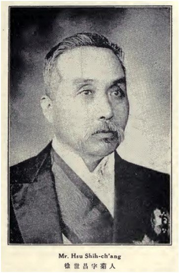

（万象特约作者：一一）

78年前的今天，收回外蒙古的第二任中华民国大总统的徐世昌逝世

徐世昌（1855年10月23日－1939年6月5日），生于今河南省卫辉市。清末民初北洋政府官僚。

徐世昌跟袁世凯是结拜兄弟，相互扶持。袁世凯当选大总统时，曾起用他为国务卿。1918年，63岁的徐世昌获段祺瑞控制的安福国会支持，选举为第二任中华民国大总统。因黎元洪为继任大总统，冯国璋是代理大总统，徐世昌才是正式的第二任大总统。

任职期间，五四运动爆发，被迫免去曹汝霖三人职务。命徐树铮率西北边防军第一师进入外蒙古，以武力迫使其正式取消自治，回归中国。第一次直奉战争中，直系获胜，控制了北洋政府，徐世昌被迫辞职，退隐天津租界。晚年，日本曾尝试邀他出任华北临时政府官职，被其拒绝。获民国政府颁褒扬令。

（徐世昌就任中华民国大总统）

**袁世凯的结拜兄弟**

1855年10月23日，徐世昌生于今河南省卫辉市。祖籍浙江宁波鄞县，因曾祖父、祖父在河南为官，才长居卫辉。徐世昌后来在卫辉城内贡院街修建了徐氏宗祠。1879年（24岁），徐世昌与袁世凯在河南开封结义为兄弟，得袁资助北上应试。

1882年（26岁），中顺天乡试举人。1886年（28岁），以天津籍中进士后，选入翰林院任庶吉士。1889年（32岁），翰林院散馆，授翰林院编修。

1897年（42岁），袁世凯小站练兵时，徐世昌兼任新建陆军参谋营务处总办，是袁世凯的幕僚之一。1905年（50岁），袁世凯创建新式警政，保举徐世昌为巡警部尚书，负责京师治安。并且是出洋考察五大臣之一。

1907年（52岁），东北改设行省，徐被任命为钦差大臣、东三省总督兼管奉天等地将军事务。其时东北处于日、俄争霸之中。徐世昌采取开商埠、借国债、连与国、修铁路等一系列措施；并在东北推行新政，以此来抵制日俄对中国东北的控制。1909年（54岁），袁世凯被摄政王载沣罢黜，徐世昌自请病退，调任邮传部尚书、津浦铁路督办。

（就任东三省总督的徐世昌）

**嵩山四友**

1911年5月（56岁），清廷设皇族内阁，徐世昌成为四名汉人内阁成员之一，任协理大臣。辛亥革命爆发，徐世昌力主起用袁世凯镇压革命。同年11月，袁出任内阁总理大臣，徐任军谘大臣、加太保衔。1912年3月，袁世凯任中华民国临时大总统，徐向清室请辞，隐居青岛。

1914年5月（59岁），袁世凯据新的《中华民国约法》，改责任内阁制为总统制，任命徐世昌为国务卿。其时袁世凯称呼徐世昌、赵尔巽、李经羲、张謇为“嵩山四友”。

1915年（60岁），袁公开洪宪称帝；10月，徐以局势难卜，退居河南辉县水竹村。1916年3月，袁世凯被迫取消帝制，恢复民国年号，起用徐世昌为国务卿。徐在公私两方面为袁效力。因要求讨袁护国军停战议和遭到拒绝，徐任职仅一月，力荐段祺瑞继任。

袁世凯死后，黎元洪继任总统，段祺瑞任总理。二人不久即发生府院之争，徐世昌以北洋军阀元老资格应邀抵北京，先调解黎元洪和段祺瑞之间的权力斗争，后又调解直系首领冯国璋和段祺瑞的矛盾。

**当选第二任大总统**

黎元洪去职后，代理总统冯国璋与国务总理段祺瑞不和，冯氏的总统任期届满，冯段二人相约共同下野。1918年10月（63岁），徐世昌经皖系操纵的安福国会选举为总统。

就职典礼上，徐宣誓：“惟是事变纷纭，趋于极轨，我国民之所企望者，亦冀能解决时局，促进治平耳。而昌之所虑，不在弭乱之近功，而在经邦之本计。不仅囿于国家自身之计划，而必具有将来世界之眼先。敢以至诚极恳之意，为我国民正告之。”说眼前最要紧之事，“佥曰南北统一，求统一之方法，固宜尊重和平”。内政之外，还当求自立于世界之道，国家权力之发展、国际地位之保持，亦为国家存亡之关键。

他标榜“偃武修文”，下令对南方停战，次年2月于上海召开南北“议和会议”，但无结果。1919年，五四运动发生时，徐被迫免去曹汝霖、章宗祥及陆宗舆的职务，以缓和全国舆论的反对。同年10月，命徐树铮率西北边防军第一师进入外蒙古，以武力迫使其在11月17日正式取消自治，回归中国。

在北洋军阀各派系的斗争中，徐世昌惯以元老身份和居间调和者的角色因势操纵。1920年7月，爆发直皖战争，皖系失败，徐依旧担任大总统。1922年（67岁），第一次直奉战争后，直系获胜，控制了北洋政府。曹锟、吴佩孚幕后操纵老国会指徐世昌总统为非法，迫其在6月2日去职。自此，徐世昌退出政界，居住天津英租界。

（徐世昌就任中华民国大总统时的照片）

**晚年获颁褒扬令**

徐世昌退出政界后，在天津“退耕堂”过隐逸生活，借助僚友门客编撰书籍20余种。徐世昌著有《欧战后之中国》（巴黎大学名誉博士论文）、《退耕堂政书》、《大清畿辅先哲传》、《书髓楼藏书目》、《东三省政略》等书。
徐世昌诗、书、画俱晓。书画作品颇有声誉，曾在中国、日本及国外画展中展出。位于安阳的袁林的墓碑"大总统袁公世凯之墓"九个大字为徐世昌所写。

徐世昌晚年，日本尝试邀徐出任华北临时政府官职，徐世昌拒绝任职。1939年6月6日，徐世昌病逝于天津，享寿84岁。先寄葬于天津桃园村英国公墓，后与夫人一起归葬于河南辉县百泉镇苏门山东侧，文革年代墓地被毁。

国民政府主席林森得知徐全节而终，于陪都重庆颁褒扬令：徐世昌，国之耆宿，望重群伦。比年息影津门，优游道素。寇临华北，屡思威胁利诱，逞劂阴谋，独能不屈不挠，凛然自守，亮风高节，有识同钦……

