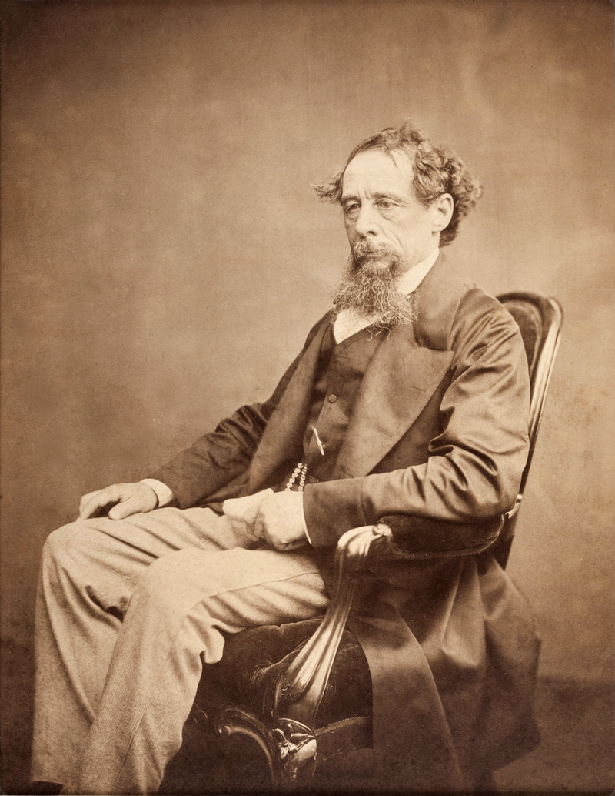
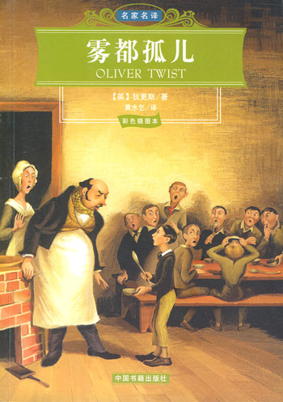
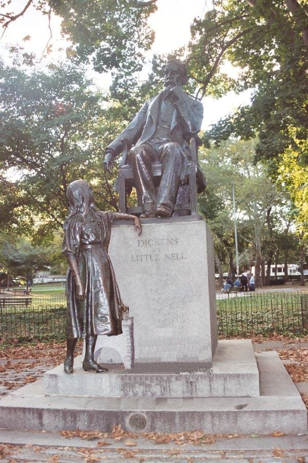

（万象特约作者：一一）

147年前的今天，1870年6月9日，雾都孤儿，维多利亚时代英国最伟大的作家狄更斯逝世

狄更斯（Charles John Huffam Dickens，1812年2月7日－1870年6月9日），维多利亚时代英国最伟大的作家，在其有生之年就赢得了空前的名声。狄更斯的作品中，以高超的艺术手法，描绘了包罗万象的社会图景，作品一贯表现出揭露和批判的锋芒，贯彻惩恶扬善的人道主义精神，塑造出众多令人难忘的人物形象。代表作有《大卫·科波菲尔》、《远大前程》、《雾都孤儿》、《圣诞颂歌》等。

“这是最好的时代，也是最坏的时代；这是智慧的年代，也是愚蠢的年代；这是信仰的时期，也是怀疑的时期；这是光明的季节，也是黑暗的季节；这是希望的春天，也是失望的冬天；我们应有尽有，我们也一无所有；我们正走向天堂；我们也直下地狱。”这段《双城记》的开场白，对很多中国人来说非常熟悉。

匹克威克外传

1812年2月7日，狄更斯出生于英国的朴次茅斯。10岁时，搬到伦敦附近的康登镇（Camden Town）。不久，父亲因债务问题而入狱，一家人随着父亲迁至牢房居住。狄更斯被送到一家鞋店作学徒，每天工作10个小时。或许是由于这段经历，备尝艰辛、屈辱，看尽人情冷暖，使得狄更斯的作品更关注底层社会的生活状态。

不久，获得一笔意外的遗产，家庭经济状好转。狄更斯并没有接受很多的正规教育，是靠自学成才。狄更斯后来成为一名《晨报》的国会记者，专门采访英国下议院的政策辩论，也时常环游英伦，采访各种选举活动。他开始在各刊物上发表文章，并最终收集成《博兹札记》出版，这是他的第一部散文集。

1836年（24岁），出版了《匹克威克外传》，全书透过匹克威克与三位朋友外出旅行途中的一连串遭遇，描写了当时英国城乡的社会问题。一开始这本书并没有引起太多的焦点，第一年只销售500册。到了1837年春天，《匹克威克外传》成为英国社会争相讨论的话题，出现了“匹克威克热”，街头出现了各种各样与匹克威克有关的商品。

查尔斯·狄更斯的出生地

大卫·科波菲尔

之后，狄更斯连续出版了多部广受欢迎的小说，包括了《雾都孤儿》、《尼古拉斯·尼克贝》和《老古玩店》。1841年（29岁），完成了《巴纳比·拉奇》后，狄更斯前往他所向往的美国。虽然他在那里受到了热烈的欢迎，狄更斯最终依然对那片新大陆感到失望。他在美国的见闻被收入进其在1842年出版的《美国纪行》。

1843年（31岁），出版了引起极大反响的小说《圣诞颂歌》，这部小说是他的圣诞故事系列的第一部。随后他又以自己的美国之行为背景，发表了另一部小说《马丁·翟述伟》。1844至1846年间，狄更斯游历了欧陆各国。

1849年（37岁），出版了自传题材的小说《大卫·科波菲尔》，这部小说的内容与狄更斯的个人经历有很大关系。狄更斯之后的小说显得更为尖锐并具批判性，其中比较著名的包括了《荒凉山庄》、《艰难时世》、《小杜丽》、《双城记》和《远大前程》等。

天才表演者

狄更斯不仅是一位多产的写作者，也是一位积极的表演者。他把公众朗读会（public readings）化作两小时独角戏剧表演。狄氏朗读／演剧会始于1853年12月，至其生命终了，十余年间行脚遍及大西洋两岸。他的精彩表演与写作相辅相成。

1870年6月9日（58岁），狄更斯因脑溢血，在罗切斯特附近的盖茨山庄与世长辞。临终时他的第一部侦探小说《艾德温·德鲁德之谜》也未能完成。在遗嘱里，他希望以“节俭、低调和完全私人的方式”就近安葬。但家人随即接到维多利亚女王御旨，令狄更斯葬于西敏寺的诗人角。他的墓碑上写道：“他是贫穷、受苦与被压迫人民的同情者；他的去世令世界失去了一位伟大的英国作家。”

（狄更斯和两个女儿）

远大前程

《大卫·科波菲尔》、《远大前程》、《雾都孤儿》、《尼古拉斯·尼克贝》和《圣诞颂歌》被认为是狄更斯最优秀的几部作品，特别是带自传体性质的小说《大卫·科波菲尔》被很多人视作是狄更斯的代表作。狄更斯的大部分作品都是他对社会的看法与批判。狄更斯是英国维多利亚时期社会阶层与贫穷的猛烈抨击者。狄更斯的文笔朴实，如诗一般美丽，但时常又语带幽默地讽刺英国的上流社会。

狄更斯的遗嘱规定不要为他设立任何纪念馆。然而，纪念狄更斯的博物馆遍及全球，例如在朴次茅斯的狄更斯故居博物馆；伦敦的维多利亚与艾伯特博物馆收藏了大量狄更斯的手稿；费城设立有一座真人大小的狄更斯雕像；澳洲雪梨的世纪公园有另外一座真人大小的狄更斯雕像等等。

（费城的狄更斯雕像）