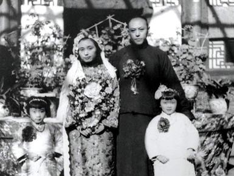
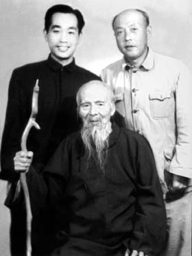
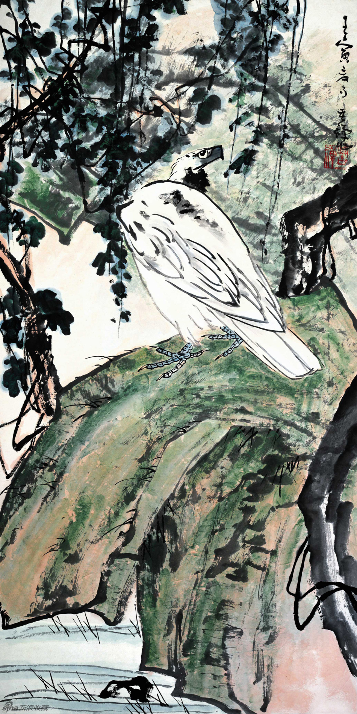
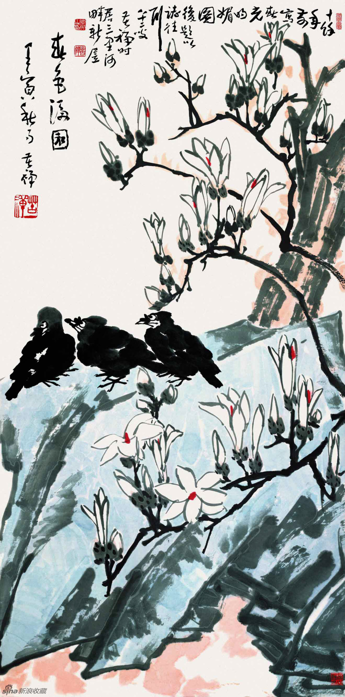

34年前的今天，和毛泽东有过同窗之谊、从教授到门房的一代写意花鸟画大师李苦禅在北京逝世

万象特约作者：一一

曾在传达室看门的一代写意花鸟画大师

李苦禅（1899年1月11日－1983年6月11日）山东省高唐县人，中国画家。继吴昌硕、齐白石之后，成为一代写意花鸟画大师。李苦禅主张“书至画为高度，画至书为极则”。

李苦禅是齐白石的第一个入室弟子，深得真传。齐白石曾赞道：“吾门下弟子不下千人，众皆学我手，英(指李苦禅)也夺我心，英也过予。” 解放后，在今中央美院当教授，曾经被剥夺了讲课的权利，给曾有一面之缘的毛泽东写信求助。文革后，在中央美院传达室看门。

李苦禅教育儿子说：“人，必先有人格，然后才有画格；人无品格，下笔无方”。

与毛泽东在一个车间

1899年1月11日，李苦禅生于山东省高唐县一户贫苦农民家庭，原名李英杰。1918年（19岁），结识了画家徐悲鸿，获授西画技法。1919年，李苦禅只身到北京求学，举目无亲，身无分文的他只好落脚于慈音寺，靠从舍粥棚里取粥度日。从此成为居士，法名苦禅。

同年，李苦禅考上了北大附设的“留法勤工俭学会”，半天学习法语和绘画，半天从事机械加工之类的实习。那时毛泽东也在其中，当时大家都喊他毛润之，并与李苦禅分在同一个车间。

（1942年李苦禅与夫人李慧文结婚）

齐白石的入室弟子

1922年（23岁），考入北平国立艺术专科学校西画系专学西画。1923年，拜齐白石为师，成为齐白石的第一位入室弟子。自此，他开始探索“中西合璧”的道路，以改革中国画。1924年在齐白石的精心培育下，他画艺大进。在国立艺专成立“九友画会”，与蒋雨浓、王青芳、白铎斋并称“京中四怪” 。

1931年（32岁），在杭州国立艺专任教。1934年秋，在上海举办个人画展。1941年7月（42岁），在北平中山公园举办画展，展出作品50余件。齐白石曾赞道：“吾门下弟子不下千人，众皆学我手，英(指李苦禅)也夺我心，英也过予。” 

求助毛主席

1946年（47岁），被徐悲鸿院长聘为北平国立艺专国画教授，并被推选为首届“中国美术作家协会”常务理事。1949年解放前夕，与何思源(北平市市长)、徐悲鸿等北平文化界名流合力斡旋，呼吁和平解放北平，以保护古都文化遗迹。

1950年（51岁），李苦禅受到不公正待遇，被剥夺了讲课的权利，遂上书毛泽东主席。他借着酒劲,挥笔上书给毛主席：现在我的事情，蒋介石不管了，我只好找你了。毛泽东致信徐悲鸿，嘱咐解决此事，并派秘书田家英登门代为看望李苦禅。他给徐悲鸿的信是这样写的：“有李苦禅先生来信，自称是美术学院教授，生活困难，有求助之。此人情况如何？应如何处理？请考虑示知为盼。”

（中央美院同事合影）

传达室的看门老头

1966年（67岁），“文革”开始，因被诬为“反动学术权威”而遭残酷批斗和查抄，被关入“牛棚”，受尽折磨。1970年，被强令下放到河北省磁县“五七”干校劳动改造。

1971年（72岁），因病回北京，被指令在中央美院传达室看门，不久即退休居家。1983年6月11日，因心脏病突发逝世。 享年84岁。

李苦禅作品欣赏

