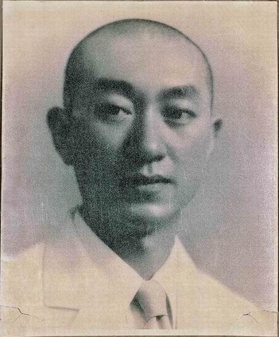
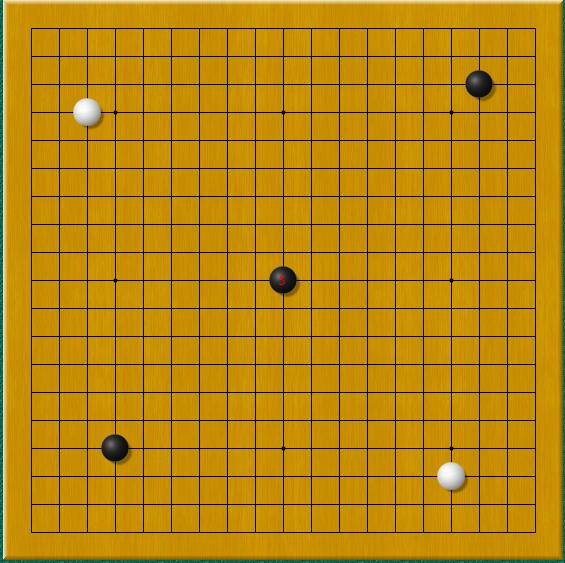

103年前的今天，从中国人成为日本人又变回中国人最终成为日本人的昭和棋圣吴清源出生于中国。

万象特约作者：一一

吴清源（1914年6月12日－2014年11月30日），名泉，字清源，以字行，出生于中国福建，现代围棋名家，日本退休职业棋士，又号“昭和棋圣”。七岁开始学棋，数年后已难逢敌手，有“天才神童”之称。后来获旅华日本棋手井上孝平五段赏识，引荐给日本围棋长老濑越宪作七段。其后远赴日本，称雄日本棋坛数十年，开创新布局，获棋坛誉为“现代围棋第一人”。

1939年到1956年，被称为“吴清源时代”。二战初期，在日军铁蹄横扫中国和东亚大陆的同时，棋士吴清源在日本本土上孤军奋战，仅凭个人之力，在震古铄今、空前绝后的十次十番棋中，战胜了全日本最顶尖的七位超级棋士，并把所有的对手打到降级，迫使败者改变交手身份以表示弱者不具备和强者公平竞争的能力——吴清源成为当之无愧的棋坛第一人，被誉为“昭和棋圣”。虽然吴清源加入了日本国籍，但日本人始终认为他是中国人。
之后的20余年，吴清源不仅在十番棋擂台上击败了当时所有的超一流棋手，而且还提出了新布局理论，革除了许多过去平庸的定式下法，为围棋理论的发展起到了举足轻重的作用。
抗战胜利后，吴清源重新加入中国国籍。1961年，吴不幸遭遇车祸，吴氏渐渐淡出一线比赛。1979年，吴清源再次加入日本国籍。
金庸在《随笔》里杂谈围棋，曾提到围棋圣手吴清源的名字。吴清源12岁即露头角，13岁在国内无敌手，15岁至日本，20岁创围棋新布局法。在日本，尽败日本高手，被誉为古今第一人。
2014年11月30日凌晨1时11分，在日本神奈川县小田原市内去世，享年100岁。

早年生活
1914年6月12日，出生于福建省闽候县（今属福州市），吴清源祖籍中国浙江杭州石门，其祖父吴维贞曾为官福建闽侯道台，亦热爱围棋，后来家道中落。七岁起跟爸爸学棋。北京当时几个围棋高手也让他受益，如顾水如、刘棣怀、汪云峰。但根据吴清源自传，他并没有拜顾水如为师。13岁时让先与当时的名手过惕生对局，半目获胜。青少年时期，在中国棋坛中已无敌手，当时的北洋政府总理段祺瑞曾经赞助他生活费一年至失势且曾对奕一局。
1927年（昭和二年），井上孝平五段去北京游访时，让二子与吴清源对弈，结果中盘大败，再改以让先三局，弈成一胜一和一打挂。井上回国后，对吴清源大加夸奖，称他有胜过传闻之才能，并一口咬定吴清源有三段的棋力。

曾与吴清源对奕过的美术商山崎有民将此棋谱寄给当时日本的围棋界的长老濑越宪作七段，濑越认为吴清源是难得一见的天才，在山崎居中牵线下，濑越决定请他来日收他为徒。1928年，濑越派高足桥本宇太郎专程去北京，办理吴清源来日的具体事宜，同时正式考察一下吴清源的棋力。结果桥本四段让先两局皆败。
1928年10月，吴清源14岁时，与母亲及长兄吴浣一起东渡，他到了日本后刻苦好学，棋艺越来越精进。从1929年至1932这三年时间，吴段位不高，执黑棋为多，以秀策流为主体，战绩辉煌，获得了“黑先无敌”的美誉。例如1932年的对局成绩是44胜5败1平，升为五段。

新布局革命

升入五段之后，吴清源执白增多，由于当时无贴子的规定，若仍然照昔日的小目定式，白棋无论如何会落后于人。吴清源开始打出三三或星的布局，一手占据角地，尽快向边展开。这种思路在吴清源看来是理所当然的，但以小目缔角为传统的日本棋界却受到巨大震动。
同一时期的著名棋手木谷实，布局总是投在低线位上，但战绩不佳，便不断地改为高线位上投子，开始“比角地更重视中央势力”的摸索阶段。吴清源和木谷实这两位年轻的俊杰，在各种棋战中都有意识地打破常规，在布局阶段即占据高位，使对手大惊失色，当时被称为“新布局”，在日本棋界掀起一场革命。
1933年（昭和八年），《时事新报》请二人作十番棋赛。在此十番棋中，吴清源执黑棋著出当时极为罕见的对角星布局，木谷实也著出一反传统的重视中央势力的下法。 弈至第五局，中途打挂时，木谷请吴清源到信州地狱谷温泉渡假。
到了温泉后的第二天早晨，吴清源信步踱入木谷的房间，只见他正面对作家安永一讲解围棋。一问方知木谷计划写围棋书，吴清源很感兴趣，就坐在一旁听讲，内容主要是有关新布局的观点，吴清源越听越觉得言之有理。待安永一告辞后，二人便就“新布局”之事，热烈地探讨起来。地狱谷温泉就这样变成“新布局革命”的发祥地。
二人在秋季大手合中使用新布局，胜率竟意外的高。大手合战绩公布，吴清源名列榜首，木谷紧跟其后为第二名。一时间，新布局名声大振。从幕府初期本因坊算砂开始，在300余年的发展过程中，形成以“小目”为基础的模式。“新布局”的诞生，使小目定式所束䌸的布局又得到解放，棋手布局的思维方法获得自由。
日本著名作家川端康成曾写“新布局的青春”一文，赞扬说：“木谷实、吴清源创造新布局的时代，不仅是二人盖世天才的青春时代，实际上也是现代围棋的青春时代。”

左为本因坊秀哉，右为吴清源

世纪之决战：名人对吴清源
1933年（昭和八年），读卖新闻主办了“日本围棋选手权战”，参加者为当时实力最强的16名棋士，棋战优胜者可获受先与秀哉名人对弈一局的荣誉。最后吴清源在决胜中打败桥本宇太郎，成为优胜者。比赛之前，各新闻报均以“不败的名人对鬼才吴清源的决战”的标题大肆宣扬。此时正值日本策划“满洲事件”，中日关系异常险恶，因此这盘棋从始至终笼罩着“中日对抗”的色彩。
布局中吴清源将黑棋第一、三、五三著，按三三、星、天元的顺序著出来，此举顿时引起轩然大波。这三手棋皆与日本传统布局格格不入，尤其是三三，在本因坊一门中被称为“鬼门”定为“禁手”，若坊门子弟下此手是要逐出师门的。社会上的棋迷们也分为截然两派，支持新布局的人连连喝采，仍占大多数的守旧派则认为岂有此理。直至木谷、吴二人合著，安永一主笔的《新布局法》问世，这种情况才有所缓和。
这局棋从1933年10月16日开始，直到次年1月19日宣告结束。从白六开始，一直进展到中盘，基本上旗鼓相当，黑棋未失先著效力。弈到黑159手时，黑棋略微优势，但是在关键时刻，秀哉打了出第160的妙手，吴清源终以二目败而终局。据说秀哉之所以取胜，是因为他的弟子前田陈尔帮他出了一好招，即第160那一子“妙手”。许多人认为，秀哉屡次提出暂停（打挂），回去和弟子们研究，把一局棋延长三个月，未免不公正。从此，日本棋院规定一日内不能结束的比赛，采用“封棋制”的规定，就是轮到下子的一方将要下子的位置画到棋谱上，交裁判保管，但对手无法得知，继续比赛时放置到棋盘的相应位置继续比赛。

镰仓十局
“吴清源时代”的到来基本上是与本因坊秀哉名人的引退联系在一起的。秀哉决定引退的那一年（1938年），将世袭数百年之久的“本因坊”家元（名衔）转给日本棋院拥有。秀哉退休后，名人（即九段）腾出，当时日本棋坛八段以上成为真空，七段位的，除了几位元老级棋士外，年轻的棋士只剩下木谷实和吴清源了。
为决定谁是日本棋界的王者，读卖新闻社主办了，“吴清源、木谷实擂争十局棋”。这就是日本围棋史上著名的“镰仓十番棋”。
1939年9月28日，木谷实于“镰仓十局”第一局执黑，占低位坚实取地。吴清源则执白构成大模样，黑棋陷入苦战。谁知吴清源在第120手时走出失著，遭木谷实猛烈反击，造成大劫。此时双方聚精会神下棋，忽然木谷实鼻孔流血侧身昏倒，而吴清源由于专注思考，竟没有注意到周围发生了什么事情，后来有的读者投书报社质问吴清源。
打劫的结果白棋净损七目，败局已无可挽回。不想，在收官的紧要时刻，木谷实也走出失著，吴清源再次挑起劫争，终于实现逆转，获两目胜。
“镰仓十局”至1940年10月第六局下完后，吴清源五胜一败，将木谷实的交手棋份降为“先相先”（即三局中两局执黑）。

十番棋霸主

继“镰仓十局”之后，1941年，吴清源与雁金准一八段再次进行“十番棋”角逐。雁金准一是当时棋界的长老，德高望重，有“力战之雄”的美称。这次决斗是应雁金氏的要求举行的，由于吴清源当时只是七段，交手棋份应为先相先，但雁金表示，想与吴清源以分先对弈。但是到第5局结束，吴清源4胜1负，遥遥领先。有关人士考虑到雁金先生的名声与健康，决定将以后的对局全部终止。
接着《读卖新闻》社又物色藤泽库之助六段与吴清源对垒。藤泽的棋风简朴坚实，被赞扬为“黑先无敌”。但他与吴清源相差两段（吴清源此时已升入八段），故按规定对局为藤泽让先（即始终执黑）。结果吴清源4胜6负，维持“让先”的地位不变，藤泽输了这一次比赛。
1940年战事爆发，吴清源的家人回国，透过女流棋士喜多文子介绍，1942年2月7日跟20岁的中原和子结婚。

中日战争的最后两年，吴清源为生活和信仰所驱使，颠沛流离于日本各地，完全脱离了棋艺生涯。1947年，《读卖新闻》社派人寻访吴清源，希望他与桥本宇太郎八段进行“十番棋”。第一局吴清源执黑先行，但以五目告负。第2局吴清源执白仍不见起色，弈至中盘白棋已呈必败无疑之势，但桥本宇太郎突然于中盘多次下出错著，吴清源终于饶幸获一目胜。从第3局开始，吴清源终于恢复了本来面目，势如破竹，至第八局结束，6胜2负将桥本降级至先相先。

1947年8月，濑越宪作向日本棋院提出吴清源退出申请书，此后日本棋院授与吴“名誉客员”称号，但当时吴清源并不知此事。
1948年，《读卖新闻》社于1948年举办吴清源对岩本薰的十番棋。战至第6局时5胜1负，将岩本降了格。
1950年吴清源对桥本宇太郎的第二次十番棋计划。由于第一次十番棋吴清源将桥本降了格，所以这一次的交手棋份仍规定为先相先，结果吴清源5胜3负2平。
1949年，藤泽库之助在棋士升段大赛中由八段晋升九段，成为秀哉去世后，日本仅有的九段。由于战前吴清源曾将他打败过，因此日本棋院考虑将吴清源升为九段。于是决定举行“吴清源对六七段选拔十盘棋”，集中10名高段棋手(4名六段、6名七段)，让他们轮番向之挑战，作为吴清源的“九段升段试验比赛”，由于日本棋院没有以低段检验高段的往例，此举亦引起一番争论。按照规定，吴清源除对高川格、前田陈尔两位七段执黑外，对其它8名六七段高手均执白棋，而且当时没有贴目的规定。结果：吴清源8胜1负1平，被日本棋院赠授九段，时年36岁。
1951年《读卖新闻》举办“吴对藤泽十番棋”，吴清源7胜2负1平，将藤泽降为先相先。1952年，吴清源与藤泽库之助再次进行十番棋，交手棋份为先相先。弈至第6局，吴清源5胜1负，将藤泽击退到定先的地位。
1953年，吴清源对坂田荣男的“十番棋”，当时的坂田八段在各项棋战中都取得超群的成绩，预示着他的全盛时期即将到来。在这场举世注目的棋战中，吴清源以6胜2负的成绩将坂田降格到定先。
自1952年起，每年举办吴清源与“本因坊”无贴目的三盘棋对局。到1955年，吴清源与高川格在“三番棋”中，共角逐12局，吴清源11胜1负。因此吴清源又成为高据本因坊之上的超级棋士。在人们的印象中，高川格不是吴清源的敌手。但是纵观日本棋坛，已经找不出能与吴清源分庭抗礼的人，因此《读卖新闻》只得将高川格作为吴清源“十番棋”的最后压轴战。结果吴清源在第8局结束时，已经6胜2负，将高川本因坊降格。
吴清源自战前的“镰仓十番棋”开始独霸擂台，连续15年的升降十番棋里，将日本所有一流棋士与之对局的交手棋份一一降级，不是降为相差一段的先相先，就是降为相差二段的定先。这16年，是他的全盛时代，因此被称为“吴清源时代”。直至后来无人可战，升降十番棋不得不结束。此后，吴被称为“十番棋之王”、昭和棋圣。

遭遇车祸

1952年中国围棋社邀请吴清源访问台湾，其兄吴浣当时是第一届理事。原本中国围棋社欲授与“棋圣”之称，但吴自认承受不起而婉谢，后改授“大国手”。此行在台北与年仅十岁的林海峰下测试棋，后收之为徒。
1961年8月，吴清源正在过马路时被摩托车撞飞，右脚和腰皆骨折，住院两个月，并留下头痛的后遗症。时值第一期名人战期间，吴清源最终排名第二，但之后几期状况持续下滑。读卖新闻向吴清源提议引退，吴清源与读卖自此解除合作关系。吴清源至此时才得知早就被日本棋院除籍，他对此事一直保持“因非自愿而不承认”的态度。

1979年，吴清源再次加入日本籍。1984年，吴清源在日本大仓酒店举办引退仪式，正式宣告隐退。1985年，吴清源实现了战后第一次访问中国大陆。1986年，吴清源获香港中文大学荣誉博士。

2014年11月30日凌晨1时11分，在日本神奈川县小田原市内去世，享年100岁。

棋风和评价

吴清源从青年时代起，就一贯信奉速度重视主义，棋讲究布局的速度，在角上能用一手棋，就仅用一手。
局部的处理方法也很明快，对局部不过分追究，并且手法轻妙，所以很少有以厚势为背景强力推进的棋。
吴清源的棋风是在追求棋盘上的自由，对定式的态度是“没有”，他下出新手新定式的原因就是由于对老定式“毫无兴趣”。

晚年的吴清源潜心于“21世纪围棋”的研究。吴清源对21世纪围棋的构想中，十分崇尚调和、和谐。他认为围棋是一种艺术，又是一种生命的哲学。中国的《易经》讲究阴阳调和，围棋也不能脱离这个道路，对弈的最终目的，是从中领略圆满调和的“道”，追求棋艺和人生的共同完美。

“随机应变的好棋，那没有丝毫破绽的灵活转身，使我一下就入了迷。其魅力究竟是什么东西呢？妙在何处呢？我认为先生的下法，好像总是在侦察什么东西似的。”，“由于吴先生的全盛时期，是站在必须打败不贴目的黑棋的立场上，所以也只有采取这种不留余地的疾风骤雨般的快速战法。虽然吴先生从青年时代、新布局的时代起，就是快速的棋风，而在全盛时期则更进一步，达到了玄妙的境界，再加上那出类拨萃的才能，因此，当时和吴先生对局的人，一定会有无法抵抗的感觉。”——赵治勋

获得诺贝尔奖的作家川端康成正执笔“吴清源棋谈”时曾访问吴清源。吴说：“我认为，围棋是一种和谐的状态。它的重点不在于竞技或争胜负，而是调和。由一枚一枚讲究均衡的棋子最后所构成的一盘棋，便是建立在和谐的基础上。”，“其实围棋之道就像中国的阴阳五行，做得不好就会相克， 做得好就相生相容，‘21世纪围棋’就是要相生相容。”

