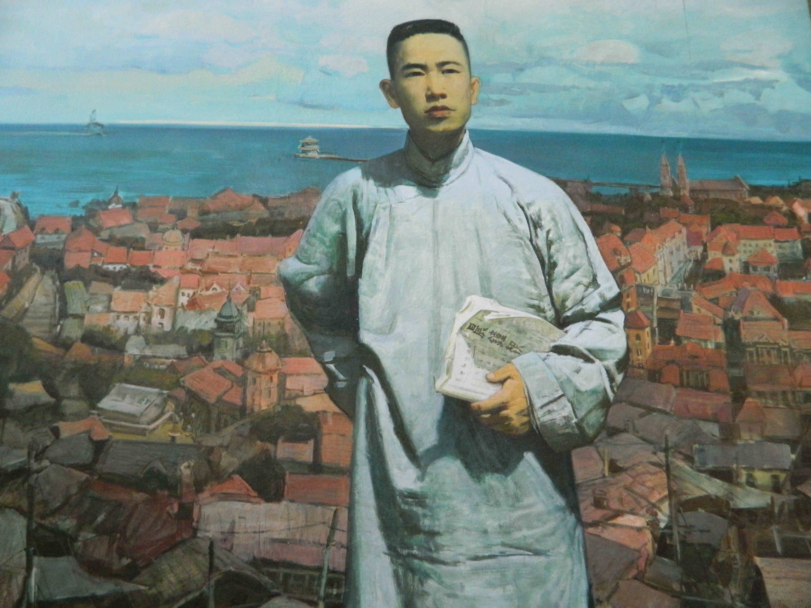
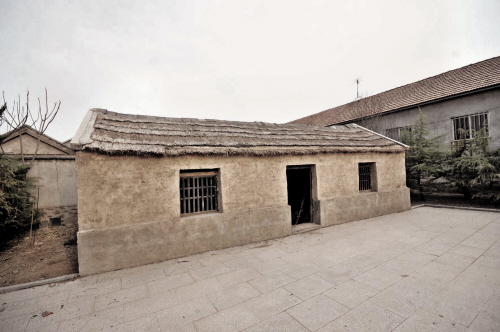
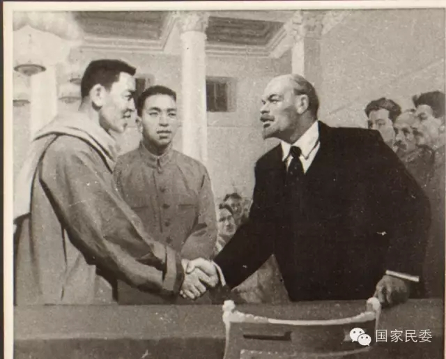

119年前的今天，收到过列宁接见、被毛泽东称为“好同志”的中国共产党创始人王尽美出生于山东。

（万象特约作者：一一）

119年前的今天，被毛泽东称为好同志，尽善尽美唯解放的王尽美生于山东

王尽美（1898年6月14日－1925年8月19日），原名王瑞俊，今山东省诸城县人。中国共产党创始人之一，参加了共产党的第一次代表大会，是山东党组织最早的组织者和领导者。曾写诗“尽善尽美唯解放”，故改名为王尽美。王尽美曾经受过列宁接见，并积极响应党的决议加入国民党。在党的创建和早期革命活动中，做出了卓越贡献。

毛泽东在青岛视察工作时，说:“你们山东有个王尽美，是个好同志。”1961年8月21日，董必武曾写《忆王尽美同志》的诗：“四十年前会上逢，南湖舟泛语从容。济南名士知多少，君与恩铭不老松。”

尽善尽美唯解放

1898年6月14日，王尽美生于山东莒县北杏村（今属诸城市）。1918年夏（20岁），考入济南山东省立第一师范学校预科班。1919年，参加五四运动，为山东大专中学学生联合会负责人之一。

（王尽美故居）

1920年3月（22岁），为北京大学马克思学说研究会外埠会员。同年秋，与山东省一中学生邓恩铭等人发起成立励新学会，出版《泺源新刊》（一师学生自治会主办）半月刊。

1921年春，与邓恩铭发起创建济南共产主义小组。7月，赴上海出席中国共产党第一次全国代表大会。写诗：贫富阶级见疆场，尽善尽美唯解放。潍水泥沙统入海，乔有麓下看沧桑。为此，他把自己的名字改为王尽美。后任中共山东区支部书记，中国劳动组合书记部山东分部主任。

受到列宁接见

1922年1月（24岁），赴莫斯科参加远东各国共产党和民族革命团体第一次代表大会，受到列宁的接见。会后在各国代表团举行的联欢晚会上,他兴致勃勃地用中国乐器三弦,弹奏了中国传统乐曲《梅花三弄》等曲子。那优美的旋律沁人心脾,令人心旷神怡,吸引了在座的每位代表。

加入国民党

7月，在上海出席中共二大。会后与邓中夏一起负责中国劳动组合书记部的领导工作，参与了制定《劳动法大纲》。1922年11月，在山海关领导建立党组织，先后领导山海关、秦皇岛等地的罢工运动，并为开滦五矿总同盟罢工指挥部的成员之一。1923年2月，在山海关被逮捕，关押在临榆县。工人纠察队队员将临榆县政府包围，进行请愿，临榆县县长下令将其释放。后重回山东。

1923年10月（25岁），王尽美根据党的决议，以个人身份加入国民党。1924年1月，赴广州参加中国国民党第一次全国代表大会。11月，任中共山东地方执行委员会书记。年底，受孙中山约见。孙中山以个人名义委派他为国民会议宣传员特派员，在山东宣传和筹备召开国民会议。

英年早逝

1925年1月（27岁），赴上海出席中共四大。2月，抱病（肺结核）组织青岛国民会议促成会，同时与邓恩铭共同领导胶济铁路工人罢工。3月1日去北京参加国民会议促进会全国代表大会。4月回山东后病情恶化。1925年8月19日，在青岛病逝，时年27岁。

