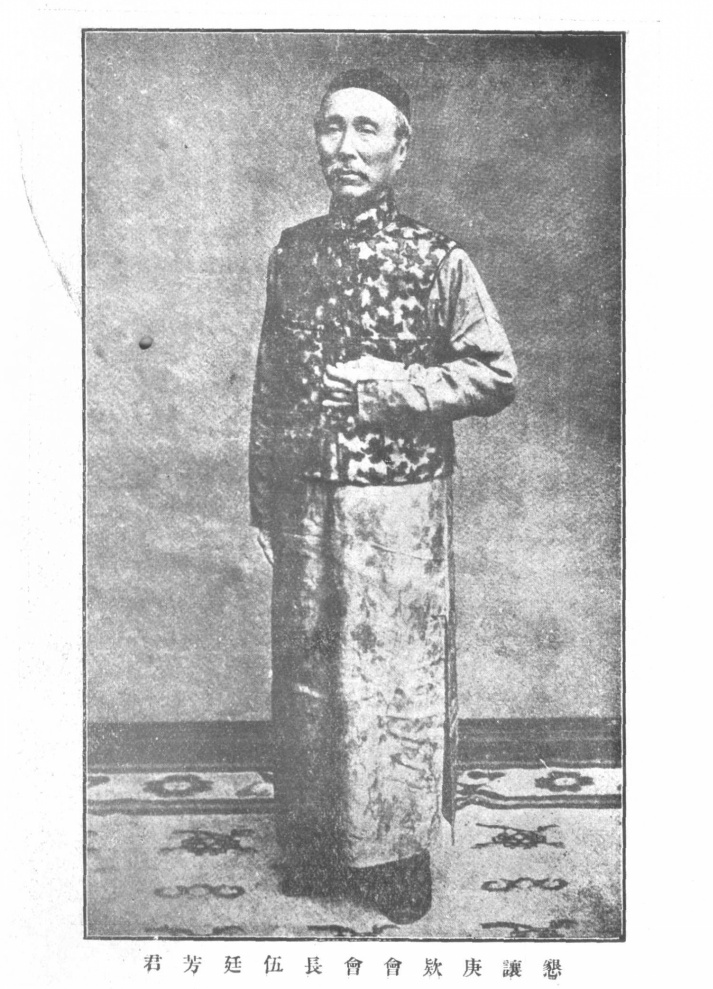
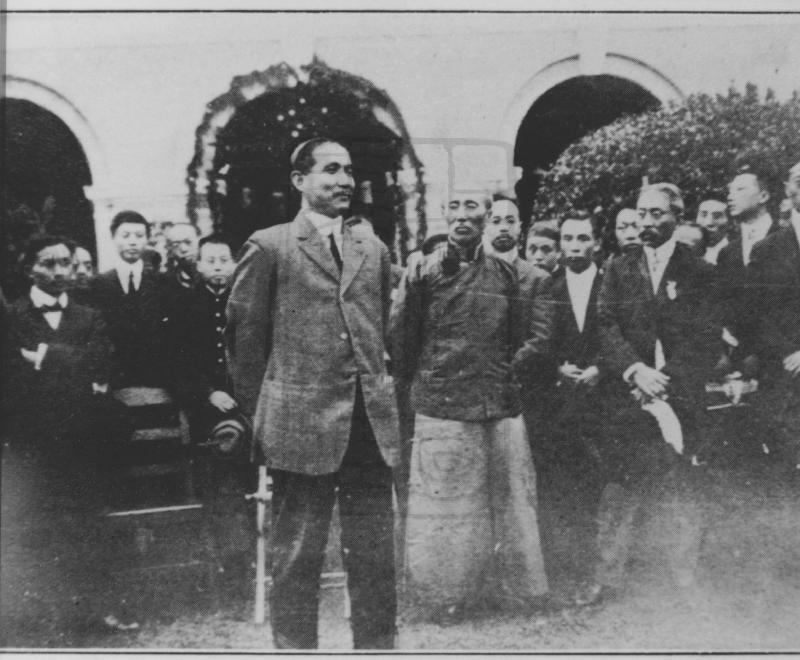

（万象特约作者：一一）

95年前的今天，被英国人歧视，创造了多个中国第一的伍廷芳逝世

95年前的今天，签订近代中国第一个平等条约的外交部长伍廷芳逝世

伍廷芳，（1842年7月9日－1922年6月23日），生于南洋的英属马六甲，祖籍广东新会。清末民初外交家、法学家。伍廷芳的人生可分为三个阶段，每个阶段都很精彩，创造了多个中国历史的第一。

在香港期间，曾创办了中国第一份中文报纸，成为香港第一位华人大律师，第一位华人太平绅士，香港立法局第一位华人议员。后来因为被英国海军中将歧视，愤而北上大陆发展，成为李鸿章的幕僚。

在为清政府效力期间，他曾担任马关条约换约全权大臣；创办中国历史上第一条官方铁路——唐胥铁路；担任驻美公使，抗议排华法案，签订近代中国第一个平等条约《中墨通商条约》；拟订中国最早的商业法；提出废除凌迟等酷刑；并按欧美等国办法起草诉讼法，建议使用陪审团制度。

辛亥革命后，积极参加革命，在南北议和中代表南方政府。袁世凯时期辞职，后出任段祺瑞总理政府的外交总长。应孙中山的号召，南下广州，出任护法军政府的外交部部长兼财政部部长、广东省省长；更曾一度任代行非常大总统。

（广州越秀山伍庭芳、伍朝枢之墓，中为孙中山所书伍庭芳墓表，右为伍庭芳，左为伍朝枢墓）

第一位华人大律师

1842年7月9日，伍廷芳生于英属马六甲，籍贯广东新会。3岁时，随父亲回中国广州。13岁时，遭绑架，说服绑匪逃脱。14岁时，以伍才之名，往香港求学，在圣保罗书院就读。1860年（18岁），与黄胜利用报社废弃的中文铅字，一同创办中国第一份中文报纸《中外新报》。1861年（19岁），毕业后，任香港的高等审判庭、地方法院等的翻译。

1864年（22岁），结婚。1871年（29岁），调任港府巡理署译员。1874年（32岁），与妻子自费赴英国留学，在英国伦敦大学学院攻读法律，同时在四大讼务律师学院之一的林肯律师学院接受大律师培训。1876年，通过大律师资格考试成为大律师，同期同学包括后任英国首相的H·H·阿斯奎斯。1877年毕业，获得法律博士（LLD）学位。

第一位华人太平绅士

1877年3月（35岁），乘船回国，在船上结识候任香港总督轩尼诗。5月18日，伍廷芳成为第一位获准在香港担任律师的中国人。10月，伍廷芳到天津会见李鸿章。伍廷芳拒绝了担任驻英使馆三等参赞的邀请，选择回香港继续当律师。

1878年12月16日，获港督轩尼诗委任为首名华人太平绅士。成为香港立法局第一位华人议员。1881年12月20日，英国皇孙艾伯特维克托王子及乔治王子访问香港，伍廷芳被队司令海军中将嘉兰威廉伯爵多次奚落后，愤而离开香港北上大陆发展。

第一条官方铁路

1882年10月底（40岁），伍廷芳到天津任法律顾问，成为李鸿章的幕僚。其间曾参与1885年中法新约、1886年长崎事件、1895年马关条约等的商议，担任马关条约换约全权大臣。曾任中国铁路公司总办，创办中国第一条经政府批准兴建使用的铁路——唐胥铁路。

1897年（55岁），伍廷芳经香港到达美国，就任驻美公使。上任后，不断为华人争取利益，抗议排华法案。1899年12月，签订近代中国第一个平等条约《中墨通商条约》。1902年，伍廷芳回中国，任法律修订大臣。之后至1906年期间，拟订了中国最早的商业法；提出废除凌迟等酷刑；并按欧美等国办法起草诉讼法，建议使用陪审团制度。

1907年12月（65岁），伍庭芳再次出使美国，与美国总统罗斯福成好友，又拜访科学家、发明家爱迪生，邀请其到中国游玩。1909年5月，开始南美洲之行，先后到巴拿马、厄瓜多尔、秘鲁、古巴等国。1910年3月，回国进京辞职，上《奏请剪发不易服折》，后称病住在上海。

孙中山的外交部部长

1911年（69岁），辛亥革命后，伍廷芳支持革命，上《奏请监国赞成共和文》、《致清庆邸书》。并在12月的南北议和中，代表南方政府，出任民军总代表。1912年1月1日，中华民国建立后，任南京临时政府司法总长。4月，袁世凯掌权后，伍廷芳离职，再寓居上海。

1916年6月6日（74岁），袁世凯死后，伍廷芳出任段祺瑞总理政府的外交总长。1917年，发生“府院之争”，伍廷芳反对加入协约国，并提出辞职。段祺瑞被黎元洪解除职务后，伍廷芳一度出任代理国务总理。

后来黎元洪迫于张勋的压力，要伍廷芳签署解散国会的命令。伍廷芳拒绝后，应孙中山的号召，辞职南下广州，出任护法军政府的外交部部长。1919年，任广东省省长。1921年，孙中山就任非常大总统，伍廷芳任外交部部长，兼财政部部长、广东省省长；更曾一度任代行非常大总统。1922年6月23日，病逝广州，享年80岁。

