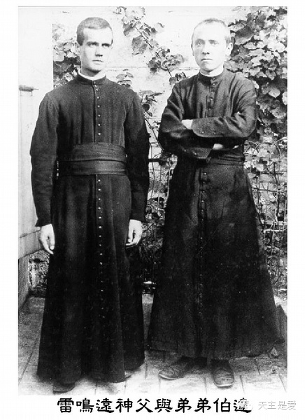
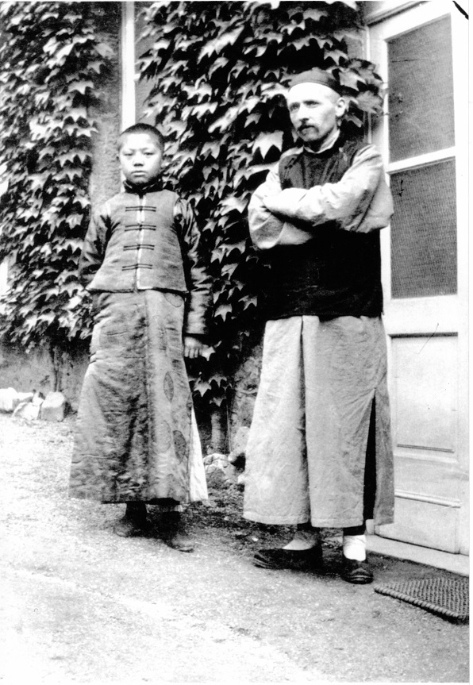
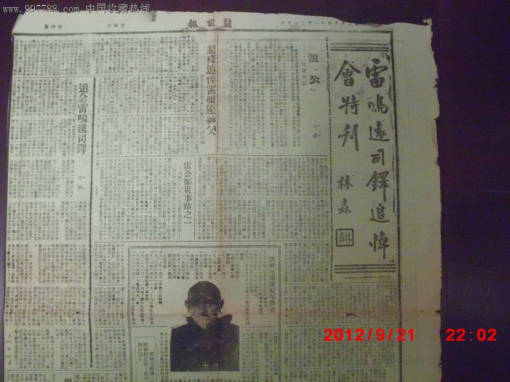

0624雷鸣远

（万象特约作者：东西望）

77年前的今天，1940年6月24日，雷鸣远病逝

雷鸣远（1877年——1940年），原籍比利时人，后加入中国籍，天主教神父。

他不远万里来到中国，一心传教，入乡随俗，宛如一个地道的中国人。他坚持“中国归中国人，中国人归基督”，被赶回欧洲。后加入中国籍，再次来到魂牵梦绕的中国。在抗日期间，他组织战地服务团、救护队，积极抢救伤兵，救济难民，教育失学儿童。

因服务于民国军队，曾被八路军俘虏。释放不久后，不幸去世。民国政府颁布褒扬令，公开追悼，蒋介石亲自为其书写挽联。雷鸣远的名言是：“我为爱中国而生，我为爱中国而死。”

（蒋介石给雷鸣远书写的挽联）

**一心来中国的洋神父**

1877年8月19日，雷鸣远生于比利时根特城一个虔诚的天主教家庭。父亲是佛兰芒人，母亲是有一半法国血统的英国人。他是家中长子，洗名文森（Vincent）。11岁时，阅读1840年在中国武昌殉教的董文学神父传记后，立志前往中国传教。

1895年（18岁），在巴黎加入董文学神父所属的遣使会。在神学院就读期间，1900年中国发生义和团运动，比利时传教士韩默理主教在内蒙古殉教，更促成雷鸣远决定前往中国传教。

**中国归中国人**

1901年（24岁），雷鸣远随北京教区的樊国梁主教乘船来华。1902年，在北京成为神父，随后被派往武清县小韩村等地传教。1903年，雷鸣远主持重建在义和团运动中被损毁的小韩村教堂。雷鸣远到达中国传教后，他努力学习中国文化，读中国书，能说一口流利标准的国语，用毛笔写漂亮的行书。

1912年（35岁），从北京教区分出天津教区，传教成绩奇佳的雷鸣远便升任这个新教区的副主教。1915年10月10日，雷鸣远和中国天主教徒在天津创办《益世报》。雷鸣远批评各个外国修会代表本国利益，来控制中国天主教的作法，提出“中国归中国人，中国人归基督”的口号，积极推动教廷任命中国籍主教。因此受到遣使会的排挤。

（雷鸣远与少年英千里）

**留不住的欧洲**

1916年（39岁），天津发生老西开事件，这是由于法租界扩张所引起的市民抗议事件。雷鸣远支持天津市民，在《益世报》发表大量反对法租界扩张的文章，与法国籍天津教区主教杜保禄发生冲突。1917年，被遣使会会长罗得芳降职，调往浙江省宁波教区。1920年4月（43岁），被送回欧洲。

在欧洲期间，雷鸣远从事中国留学生的传教工作。他向教廷上万言书，举荐6位中国主教的人选（海门教区朱开敏、蒲圻教区成和德、汾阳教区陈国砥、宣化教区赵怀义、台州教区胡若山、安国教区孙德桢）。终于在1926年10月28日，首批六位中国主教在罗马圣伯多禄大殿，由教宗庇护十一世亲自祝圣。在参加祝圣典礼时，雷鸣远喜极而泣达两小时之久。

**是中国人就要抗日**

1927年（40岁），雷鸣远申请中国国籍获准，再次回到中国，在河北省中国籍主教孙德桢领导的安国教区传教。他创立耀汉小兄弟会（1928年）和德来小姊妹会。1933年7月（56岁），他终于脱离遣使会，第二年加入自己创立的耀汉小兄弟会。

雷鸣远站在中国人的立场，极力主张抗日。1933年（56岁），热河长城抗战时，他带领教徒前去抢救伤兵；1937年（60岁），抗日战争全面爆发以后，雷鸣远率领教友共六百余人，组织战地服务团、救护队，在太行山和中条山一带抢救伤兵，救济难民，教育失学儿童。

**中国人归基督**

1940年（63岁），雷鸣远服务的政府军鹿钟麟部与八路军发生冲突。3月9日，雷鸣远被八路军俘虏，关押在太行山山区的山西省辽县（今左权县），被当作国民党间谍受到审讯，40多天后，经国民政府交涉，被释放。

1940年6月24日，在到达重庆后不久，雷鸣远因黄疸病逝世于歌乐山。7月18日，中华民国国民政府发布1287号褒扬令，公开褒扬。11月29日，重庆市召开了追悼雷鸣远大会。

**雷鸣远的鸡汤格言**

全牺牲、真爱人、常喜乐。

中国归中国人，中国人归基督。

有一百分力量不出九十九分。

不会笑的人是愚蠢。以喜乐精神迎接困难，困难已被克服一半。

做，就有办法；不做，永远没办法。

工作，时常工作；积极，永远积极。

人生不如意事，常十之八九，打得通的才是好汉。

我为爱中国而生，我为爱中国而死。

