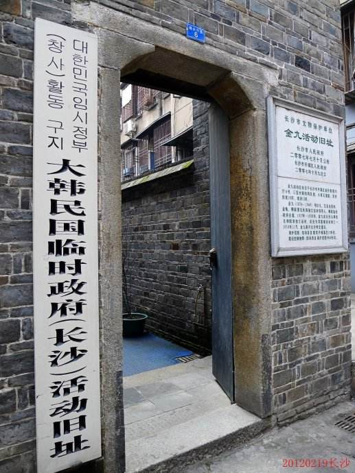
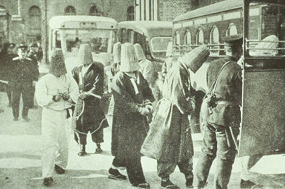
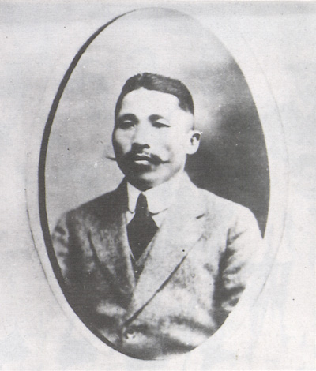
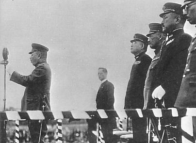
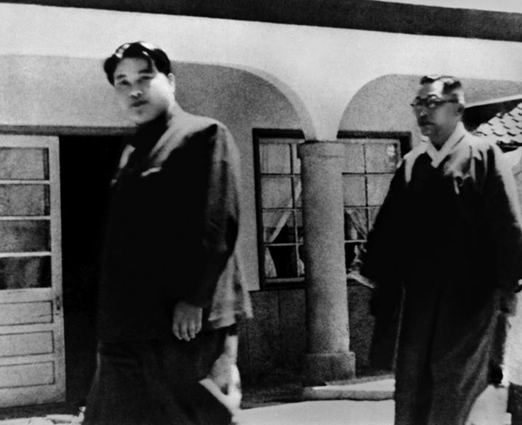
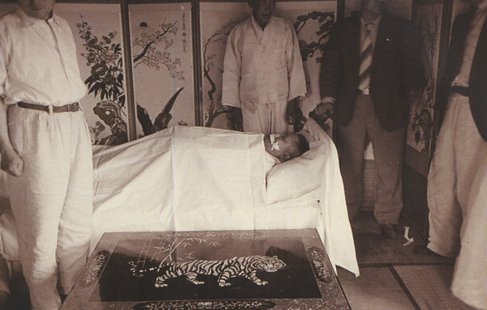

0626金九

68年前的今天，为皇后报仇，刺杀日本天皇，流亡中国27年的韩国国父金九被暗杀

金九小传：为韩国流亡中国27年，杀日本人不择手段，坚持南北统一的韩国国父

万象特约作者：一一

金九（1876年7月11日—1949年6月26日），韩国历史上的传奇人物，为韩国光复在中国流亡27年，被誉为“韩国国父”。

为皇后报仇，杀日本人泄愤，被判死刑；又刺杀朝鲜总督未遂，被判无期。在韩国独立运动后，流亡中国，组织大韩民国临时政府，先任警务局长，后长期任主席。

派人刺杀日本天皇未遂；在上海虹口公园成功炸死日本大将，名动天下。直到抗日胜利后，回国。坚持朝鲜南北统一，反对分裂，不幸被暗杀身亡。 如果他能活着，或许今天朝鲜的局势会大有不同吧。

 

为皇后报仇的英雄

1876年7月11日，金九出生在朝鲜黄海道海州白云房的一个农民家庭。9岁，进入私塾里学习汉文和韩文。1891年（15岁），应考科举落榜。

1893年（17岁），加入了抵制基督教，反对西方文化，支持农民权益的新兴宗教组织——东学党。1894年，东学党发起起义。1895年，他在海州支援当地的东学农民运动，对抗日本军。后渡过鸭绿江，藏身至中国东北。

（1894年12月，被逮捕东学党的全琫准）

1895年（19岁），中日甲午战争后，朝鲜王朝高宗的明成皇后因支持俄国，被日本人杀害。1896年，金九声称为明成皇后报仇，杀死了日本陆军中尉土田让亮，并因此入狱，被判处死刑。后得到高宗特赦，减刑出狱。该事件使他成为名噪一时的英雄。

（杀死明成皇后的凶手在汉城新报社门前合影）

暗杀朝鲜总督

1899年（23岁），出狱后在黄海道各地设立学校，担任教师。1903年（27岁），信奉基督教，成为新教监理宗的会友。1910年（34岁），参加维新组织新民会。

1911年（35岁），朝鲜总督日本人寺内正毅在视察途中，遭遇暗杀未遂。日本随即逮捕了105人，称为105人事件，金九被捕，被判无期徒刑。1913年10月，其中99人宣布无罪，金九等6人服刑。1915年2月（39岁），日本大正天皇即位，获赦出狱。

（105人事件中，金九被逮捕）

在中国的韩国临时政府

1919年3月1日（43岁），韩国独立人士在京城府（今首尔）塔洞公园宣读《独立宣言书》，向世界宣布韩国的独立，举行了大规模反日游行示威。之后，三一运动的独立浪潮席卷整个朝鲜半岛。随后，被日本人的残酷武力镇压。

1919年4月13日，金九流亡到中国上海，在上海霞飞路（今上海淮海中路321号）参与成立大韩民国临时政府。临时政府选举在美国的李承晚为国务总理。金九任警务局长。

（1919年的金九）

刺杀日本天皇和大将

1927年（51岁），原朝鲜王朝的皇太子李垠到上海，金九计划劫持他反日，未能成功。1928年，组织韩国国民党，任总裁。组成秘密结社韩人爱国团，开始用武力恐怖手段进行抗日活动。

1932年1月8日，昭和天皇正乘马车出樱田门外进行阅兵，遭投掷手榴弹袭击未遂。暗杀者李奉昌是韩人爱国团成员，被控大逆未遂罪，判处死刑。

（樱田门刺杀事件，李奉昌（中）被逮捕）

1932年4月29日，指挥尹奉吉在上海虹口公园对天长节与一二八事变祝捷典礼会场投掷炸弹，炸死日军大将白川义则等人。尹奉吉当场被捕，后被枪决。此事给国内外带来了巨大影响，也极大鼓舞了中国人民的抗日士气。

（虹口公园爆炸案，左一为被炸死的日军大将白川义则）

流亡中国27年

此后金九避难嘉兴，曾藏身于湖上游船，并在南湖游船上召开韩国临时政府国务会议，商议抗日复国大计。

1937年（61岁），中国全面抗战爆发，大韩民国临时政府西迁到长沙。1938年5月6日，金九在长沙黄兴路西侧的楠木厅开会时遭枪击，被送往湘雅医院抢救，转危为安后在岳麓山上修养。

1940年（64岁），大韩民国临时政府迁至重庆。金九当选为临时政府国务委员会主席，组建韩国光复军，开展军事活动。

反对朝鲜分裂被暗杀

1945年8月15日（69岁），日本投降，朝鲜光复，归国。反对莫斯科美、英、苏三国外相会议声明，反对朝鲜信托统治。1948年 2月10日，发表《向三千万同胞泣诉》声明，反对韩国独自建立政府。

1949年（73岁），反对韩国独自实施大选的联合国决议，提出应由南北协商建立统一政府。进入朝鲜与金日成进行政治协商，但失败。

（1948年，金九与金日成）

1949年，国会举行总统选举，败于李承晚。6月26日，在京桥庄被陆军步兵少尉安斗熙暗杀。死后以国民葬方式（类同于国葬，但不是以政府而是以全国人民名义）安葬于孝昌公园。

1962年，韩国总统朴正熙追授大韩民国建国勋章，并追尊其为韩国国父。

（金九遗体）