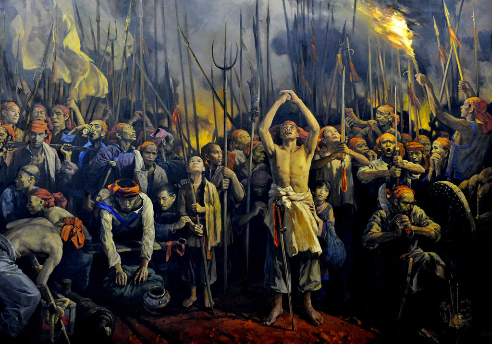
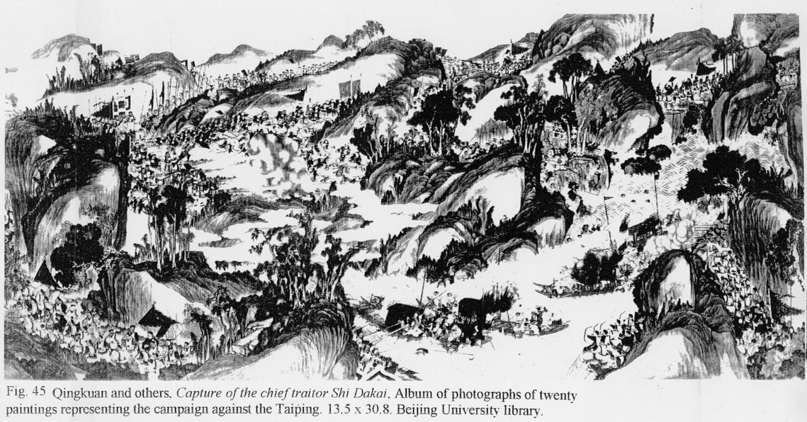

0627石达开

154年前的今天，没能飞跃大渡河，最传奇的太平天国翼王石达开被凌迟处死

石达开（1831年－1863年），绰号石敢当，广西贵县（今贵港）客家人，太平天国名将。

石达开是太平天国有传奇色彩的人物之一，16岁出山，19岁统帅千军，20岁封王，32岁在大渡河被擒，在成都被凌迟处死。他生前用兵神出鬼没，死了一年后，曾国藩还问：“石达开真的死了？”，仍心有余悸。

在他死后数十年中，不断有人打着他的旗号从事反清运动，辛亥革命党人曾通过诗歌，小说，绘画等各种媒介宣传他的事迹，以激励民气，号召志士，鼓吹革命。有关石达开的民间传说、歌谣遍布大半个中国。

（成都科甲巷（石达开被处死之处）石达开纪念碑，碑上诗刻为后人伪托石达开之名而作）

**无人可敌的石敢当**

1831年，石达开出生于广西贵县北山里那邦村。幼年丧父，从小挑起家计重担，奔走江湖，广交四方豪杰，颇有声望。16岁时，洪秀全、冯云山慕名来访，邀请加入了拜上帝会。

1850年（19岁），率四千余人参加金田起义，封为左军主将。1851年12月（20岁），太平天国在永安建制，石达开晋封“翼王五千岁”。之后，石达开随太平军转战数省，战功卓著。

1852年（21岁），西王萧朝贵在湖南长沙阵亡后，太平军在长沙城下陷入清军反包围，形势万分危急。石达开率部西渡湘江，开辟河西基地，缓解了太平军的缺粮之危，并取得“水陆洲大捷”。然后跳出反包围圈，夺岳阳，占武汉，自武昌东下金陵，二十八天挺进一千八百里，战无不胜，攻无不克，时人号之“石敢当”。

**苦心经营的安徽**

1853年3月（22岁），太平天国定都金陵，改号天京，石达开留京辅佐东王杨秀清处理政务。定都之后，诸王广选美女，修王府，唯石达开洁身自好，从不参与。

1853年秋，石达开奉命指挥西征，他采取稳扎稳打的策略，逐步扩大太平天国的范围，亲自指挥攻克庐州（今合肥），迫使新任安徽巡抚江忠源自尽。

石达开到安徽后，建立起省、郡、县三级地方行政体系，使太平天国真正具备了国家的规模。1854年初，石达开在安徽民众的赞颂声中离开安徽，回京述职。

**功亏一篑的大破湘军**

1854年夏秋（23岁），太平军在西征战场遭遇湘军反扑，节节败退，石达开再度出任西征军主帅。1855年初，在湖口、九江两次大败湘军。湘军水师溃不成军，统帅曾国藩投水自尽，被部下救起。同年秋天，石达开又挥师江西，四个月连下七府四十七县。

1856年3月（25岁），石达开在江西樟树大败湘军。湘军统帅曾国藩所在的南昌城已经陷入太平军的包围，对外联络全被切断。石达开却被调回天京参加解围战，大破江南大营，解除了清军对天京三年的包围。曾国藩因此逃过一劫。

**心有余悸的天京事变**

1856年9月，“天京事变”爆发，东王杨秀清被杀，上万东王部属惨遭株连。石达开赶回时，为时已晚。而且由于石达开反对滥杀无辜，遭北王韦昌辉猜疑，石达开被迫逃出天京，京中家人与部属全部遇难。

石达开在安徽举兵，上书天王，请杀北王以平民愤。天王只好下诏诛杀韦昌辉。11月，石达开奉诏回京，被军民尊为“义王”，管理政务。他不计私怨，追究屠杀责任时只惩首恶，不咎部属，北王亲族也得到保护和重用，人心迅速安定下来。

天京事变后，石达开主持朝政，但洪秀全却忌惮石达开，不肯授予他“军师”的实权。局势稍见好转后，又任用多名亲属，对石达开有谋害之意，石达开再次逃出天京，前往安庆，从此再未返回。

**孤军作战的远征**

1958年（27岁），石达开进军浙江，并联合杨辅清进军福建，欲开辟浙闽根据地，与天京连成一体。清廷急调各路兵马增援，命曾国藩重任湘军统帅，领兵入浙。石达开决定放弃浙江，撤往福建，后又转战到江西。

1859年春（28岁），石达开自江西进入湖南，发动“宝庆会战”（今湖南邵阳市）。面对湘军的重兵驰援，石达开孤军作战，未能攻克宝庆，被迫退入广西。

10月，攻克广西庆远府。因粮食短缺日益严重，部下思乡情切，不少部队脱离。1860年，应陈玉成所请，命童容海、彭大顺等将率五、六万有意离去的部众攻打湖南，成为人数最多的一支脱离部队。

**过不去的大渡河**

1861年9月（30岁），石达开从广西北上，于1862年初经湖北入四川，转战川、黔、滇三省。1863年5月，太平军到达大渡河，当晚天降大雨，河水暴涨，无法行船，清军得以赶到布防，石达开陷入绝境。

四川总督骆秉章遣使谈判，石达开决心舍命保全三军，太平军自行遣散四千人逃生。石达开被押往成都。1863年6月27日，石达开着天国衣冠，在成都公堂受审，举止沉着，陈词慷慨，而后从容就义，临刑之际，神色怡然，身受凌迟酷刑，至死默然无声，观者无不动容，叹为“奇男子”。

（生擒逆首石达开战图）

