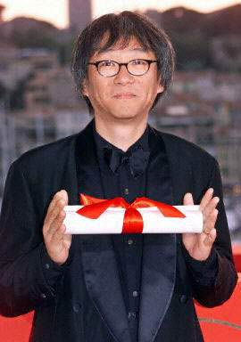
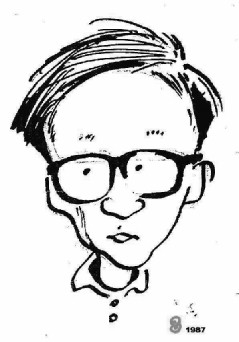

（万象特约作者：一一）

10年前的今天，蔡琴前夫、从资深码农成为最好中文电影导演的杨德昌在美国逝世

杨德昌（Edward Yang，1947－2007），电影导演及编剧，祖籍广东梅州市梅县区，1岁时移居台湾。1986年发行的作品《恐怖分子》获第23届台湾金马奖最佳影片奖等多个海内外大奖。1991年独立发行的作品《牯岭街少年杀人事件》获第28届台湾金马奖最佳作品奖。2001年作品《一一》获得戛纳电影节最佳导演奖（注：万象特约作者名字来历）。2007年获得台湾金马奖终身成就奖。其作品深刻、理性，有强烈的社会意识，被称作“台湾社会的手术刀” ，在世界影坛享有盛誉。

杨德昌祖籍广东，出生于上海，成长于台北，受电影教育于美国，却拍出了最好的中文电影。杨德昌的电影主要描写时下的台北城市生活，与侯孝贤的乡土情怀形成鲜明对比，惟一例外的是杨的代表作《牯岭街少年杀人事件》，故事发生在戒严时期的台北眷村，影片中的校园部分都在建国中学取景，重现数十年前的压抑封闭，突出凝重的时代感。这部电影也预示着台北和眷村人会在社会的成长和变革中失去自己的纯真年代，并在面对突如其来的现代纷乱时表现出种种束手无策，这是工业文明发展所必须经历的痛楚，也是杨德昌关于台北城市生活的电影的灵感。

杨德昌最欣赏的大陆导演是田壮壮。“I have a lot of respect for Tian Zhuanzhuang.
He’s his own man, and I appreciate his courage in standing up to authority.”

少年时代

1947年11月6日，杨德昌出生在上海，祖籍广东梅县人。1949年2月，一岁多的杨德昌随父母迁台，自
此成长在台北。小学时候的杨德昌功课并不大太好，和老师关系冷淡。1959年杨德昌考上建
国中学初中夜间部，次年插班入日间部。在60年代初的台湾，杨德昌度过了他略显孤寂的少

年时代（可参见《牯岭街少年杀人事件》），直到高中才有所转变。1962年杨德昌又考上建
国中学高中部，因军乐队进行曲而接触到歌剧《阿依达》，古典音乐中的情绪、组织结构、
节奏等，影响了他日后对编剧的写作。

受哥哥的影响，杨德昌自小酷爱漫画，经常在墙壁上涂鸦乱画。他接触的漫画从本省漫画家
到手冢冶虫的日本漫画系列，并尝试自己编画，中学时他自编自画的漫画故事已经在班上传
阅。可以说，杨德昌深受手冢冶虫漫画作品中对于人性光辉的信念，以及悲剧结局中对人性
肯定的影响。
1965年，通过大学联考，杨德昌以班上第45名的成绩（全班只有53人）考上了位于台湾新竹
的国立交通大学，后来成为杰出校友 的他就读于控制工程系并于1969年毕业。

小时候的杨德昌也随父亲去看电影，喜欢尤敏、丁皓，迷过国语片，但后来失望。杨德昌对
于电影的兴趣属于逐渐浓厚增强，从小时候看的《血战勇士堡》（Escape From Fort
Bravo）﹐到中学时喜欢大卫·里恩的《阿拉伯的劳伦斯》（Lawrence of Arabia）和《汤
姆·琼斯》（Tom Jones）﹐直到后来喜欢上、并且看了很多遍后才终于明白的费里尼《八
又二分之一》。

资深码农

大学时候的杨德昌，虽然本专业是电子工程，但他受国文老师所教授的诸子百家影响，其中
管子之言“能者作智，愚者守焉”激起他的创作意识，年轻的他迫切想要出去台湾以外的地
方闯荡、出国接触西方思潮，于是还没毕业时的杨德昌即主动提出希望出国体验外面的世界
。

1970年杨德昌赴美，从佛罗里达大学(University of Florida，简称UFL)电子工程与计算机
系硕士毕业后，就前往美国南加州大学(University of Southern California，简称USC)学
习电影课程。

杨德昌后来以电脑工程师身份往美国华盛顿大学(University of Washington, Seattle，简
称UW)从事计算机微处理器与软件设计，并在那里工作了7年。在西雅图，杨德昌从德国新电
影得到很大启示――尤其德国新电影四杰之一赫尔佐格的《阿基尔，上帝的愤怒》，因为他
证明精彩的电影可以一个人做而不必倚赖巨大投资，或者更直观的说让杨德昌明白了电影原
来可以这样拍。

 回台从影（1980年-1982年）
1981年春天杨德昌回台，在詹宏志策划监制、余为彦执导的《1905年的冬天》中担当编剧
制片助理和演员。而从《1905年的冬天》里，亦可隐隐窥见杨德昌在编剧上强烈的社会触
和人物在特定社会背境中的兴趣，影片入围了当年戛纳电影节“一种关注”单元。

开始正式从事电影工作之前的杨德昌后来在张艾嘉策划推动的电视连续剧《11个女人》中
导演，杨德昌在执导的上、下集《浮萍》中探索情感，形式相当平稳，在十一集中有相当
错的评价。

杨德昌时代

初露锋芒——《光阴的故事》

1982年由台湾中央电影公司陶德辰策划，陶德辰、杨德昌、柯一正、张毅四人合作拍摄了四段式影片《光阴的故事》（In Our Time 1982）。影片用四段人生不同阶段的故事来表现人际关系与男女关系的演变、人的成长和台湾30年来社会形态的变迁，由此突破了台湾70年代以来政治宣传片和琼瑶爱情剧占据电影市场的局面，开创关注社会和家庭生活的充满情趣的实验电影时代。《光阴的故事》因此被称作台湾新电影的开山之作。以新人身份参与拍摄的杨德昌凭借第二段《指望》一鸣惊人，自此杨德昌也走上了台湾新电影的舞台。

社会变迁中的女性处境——《海滩的一天》

1983年的作品《海滩的一天》，获得美国休斯敦国际影展评审团推荐金牌奖、第二十八届亚太电影展最佳摄影奖。杨德昌兼任导演和编剧，通过两个女人（分别由张艾嘉与胡茵梦饰演）的一场对话，交代出30年来整个台湾社会的面貌，在欧洲片的外观中流露出中国式的感情，用精密细致的手法具体概括了当时台湾中产阶级的整个人际关系面貌，对爱情、婚姻、亲情、事业等各方面都做了相当深刻的探讨，复杂的结构方法和开放式的结局都是台湾电影前所未有的创举，也奠定了杨德昌日后作品的基调。

关注台北都市文化转型——《青梅竹马》

1985年，由杨德昌执导、侯孝贤和蔡琴担任男女主角的《青梅竹马》，作为台湾新电影代表作之一的影片表现了杨德昌对台北社会生活、都市文化的个人观察，作品获得瑞士洛迦诺国际电影节国际影评家协会奖。可以说杨德昌对于台北的现代主义式关注，始自《青梅竹马》，之后关注台北的都市生活和城市文化也成了杨德昌作品的一个明显特征，自此杨德昌的视线就完全集中在时下的台北（《牯岭街少年杀人事件》除外），与其好友侯孝贤的乡土情怀形成鲜明对比。

异化都市生活的梦魇——《恐怖分子》

1986年的作品《恐怖分子》获第23届台湾金马奖最佳影片奖和第四十届瑞士洛迦诺国际电影节银豹奖，国际影评人奖和英国电影协会最具创意和想象力奖、第32届亚太电影节最佳编剧奖。同年11月6日，在台北第二区济南路69号屋（屋主正是杨德昌本人），杨德昌、侯孝贤、陈国富、赖声川、吴念真、焦雄屏等54名台湾青年电影人签订了“台湾电影宣言”。

青春是及其伤身的——《牯岭街少年杀人事件》
1989年，杨德昌成立“杨德昌电影”独立制片公司，开始独立电影创作工作。
1991年，其独立制片公司出品了《牯岭街少年杀人事件》（A Brighter Summer Day）。《牯岭街少年杀人事件》是杨德昌集十年大成的经典之作，长达4个小时。杨德昌用自己稳健的影像描绘了20世纪60年代灯光昏黄的台北夜市，影片结构严谨、细节生动，有着庞杂但是清晰的人物关系、繁芜但不凌乱的叙事编排。

杨德昌说：“《牯岭街少年杀人事件》不是一个单纯的谋杀案件，促成杀人事件的是整个环境，凶手是整个环境，甚至小明自己都是凶手。”影片以杨德昌中学时发生在台北市立建国高级中学(Taipei Municipal Chien-Kuo Senior High School)夜校生的一起少年情杀事件为题材。影片中的校园部分都在建国中学取景，重现数十年前的压抑封闭，突出凝重的时感。

《牯岭街少年杀人事件》获第二十八届台湾金马奖最佳作品奖、最佳编剧奖，并获最佳导演提名。同时获第三十六届亚太电影节最佳作品奖、第十三届南特三大洲最佳导演 奖、第四届东京国际电影节评委会特别奖。1992年杨德昌又凭借该片获得了新加坡国际电影节最佳导演奖。当年，他还曾为亚洲合作电影台湾编《夜来香》当制片人。

儒者的困惑——《独立时代》

1994年，杨德昌编导的《独立时代》（A Confucian Confusion）获第三十一届台湾金马奖最佳编剧奖和最佳导演、最佳作品提名，被评为1994台湾十大华语片之一。

杨德昌说，从文化角度审思，儒家文化并不鼓励创新，于是中国人不擅长找答案，而通常要
等别人告诉我们答案。

没有未来的都市——《麻将》

一部展现台北国际化的影片，影片语言特色很生活化，剧本沿袭杨德昌一贯的复杂化特点，人物众多，但是都很有特色，情节多线发展，深刻的描绘了失落的都市和幻灭的人群。

里面一些对白很精彩：                    

“人只有两种，一种是骗子，一种是傻子”
“人们都不知道自己该干什么，他们需要你告诉他们该干什么，因为他们害怕承担责任，你告诉他们干什么，他们即使做错了也可以说他们是被骗了”。

生命的奥秘——《一一》

2000年，杨德昌执导的电影《一一》被法国媒体形容为“把生命的诗篇透过电影传颂吟唱”。 该影片获得当年戛纳国际电影节最佳导演奖的殊荣。

未完成作品——《追风》

2000年之后，杨德昌把精力投入到了动画片《追风》的筹备上面，武侠动画《追风》的故事背景设置在一千年前的开封，以成龙为人物原型。
2007年，杨德昌于美国因病逝世。

感情生活

在早年的感情生活里，杨德昌常被女生认为不实际，活在电影里，活在幻想世界里。杨德昌与著名女歌手蔡琴的婚姻广为人知，不仅仅因为二人的知名度，还在于这是一段“无性婚姻”。他们一度合拍电视广告，为洗衣粉代言，配合默契并且看似幸福，然而这段以浪漫甜蜜开始的幸福并没有能持续多久。相较之下，之后杨德昌和彭铠立的婚姻就非常低调，大概也有饱受外人指责非议的缘故——无论如何蔡琴的支持者都不会少于杨德昌。
蔡琴
1984年，在拍摄《青梅竹马》时杨德昌结识了蔡琴。当时这部影片的男主角是侯孝贤，而女主角正是蔡琴。1985年5月5日，情投意合的二人走进了婚姻殿堂。在之后的将近十年间，也就是1985年到1995年，人们很容易在杨德昌作品里发现蔡琴的影子，从《恐怖分子》结尾的歌声到《独立时代》的美工。 1995年8月5日，蔡琴和杨德昌结束了10年的婚姻，后来爆出二人无性婚姻的事实，一时间闹得沸沸扬扬。杨德昌对这段婚姻的结论是“10年感情，一片空白。”而蔡琴则答：“我不觉得是一片空白，我有全部的付出。”

彭铠立
1995年，杨德昌和蔡琴摊牌，钢琴家彭铠立走进了人们视线。一次关于巴赫的话题让杨彭两人产生了情感火花，同喜欢古典音乐的二人很快走到了一起。2000年，杨德昌和彭铠立的儿子出生，作为古典音乐迷的彭铠立在电影《一一》中，也给丈夫在电影音乐方面提供了不少帮助，譬如影片中的钢琴曲目多数出自她手，而类似角色似乎正是之前蔡琴所默默承担的。2001年，杨德昌和彭铠立把事业开拓进了网络领域，经营动画的铠甲娱乐网站于10月24日成立。 2005年，杨德昌携彭铠立出现在了戛纳国际电影节上。

