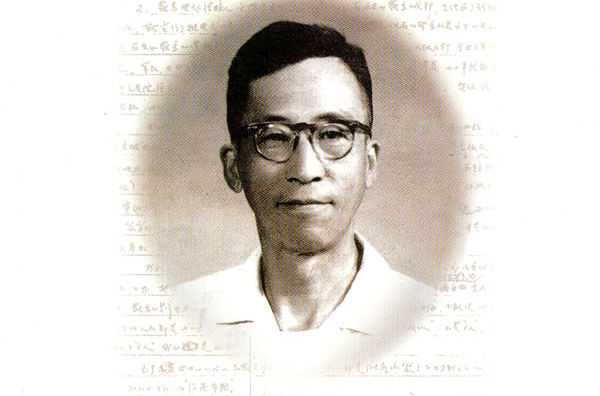
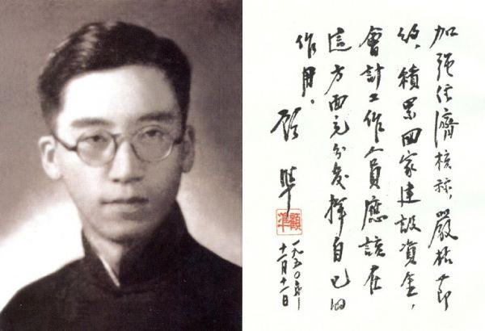
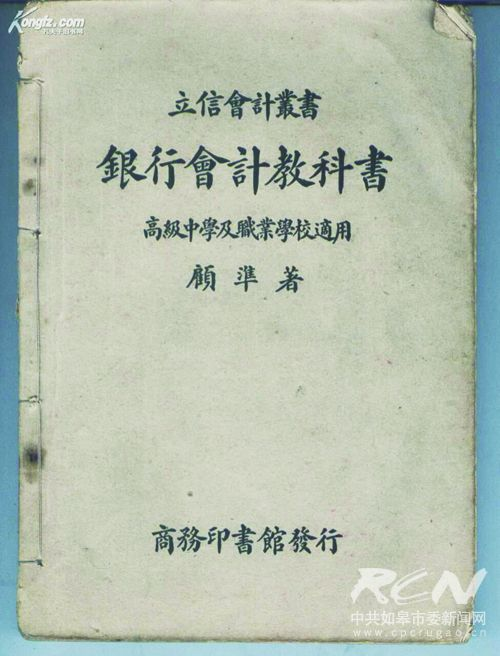
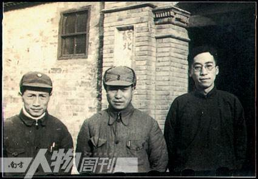
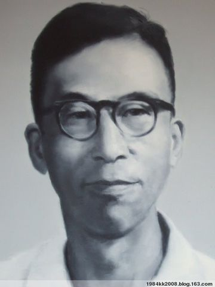
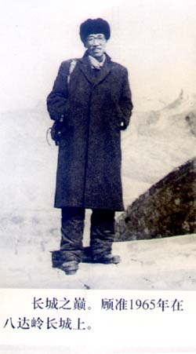

0701顾准

（万象历史特约作者：东西望）

102年前的今天，1915年7月1日，第一个提出社会主义市场经济的会计奇才顾准出生

顾准（1915年7月1日—1974年12月3日），上海人，中国当代学者，经济学家。提出中国社会主义市场经济理论的第一人。

自学会计学，16岁登台当老师，被赶下台，第二年再次上台。19岁写出《银行会计》，为国内第一本银行会计教材。他出版了不少会计书，被誉为“奇特的少年天才”。

热心投入革命，参与社会主义建设。进入经济研究所写成《试论社会主义制度下商品生产和价值规律》，提出应以市场价格的自由涨落来调节生产。这是非常大胆和超前的观点，成为提出社会主义市场经济理论的第一人。

他坚持独立思考，特别关注民主问题，坚持民主社会主义的理想，追问“娜拉走后怎样”的问题，写成《希腊城邦制度》、《从理想主义到经验主义》。国内知名的自由主义人士都将顾准视为前辈。

会计界奇特的少年天才

1915年7月1日，顾准出生于上海，祖籍苏州。家里兄弟姐妹10人，他排行第五，随母亲姓。1927年（12岁），在黄炎培所办的中华职业学校毕业后，进入立信会计事务所当练习生，逐步掌握了会计学。

16岁时，走上立信会计补习夜校的讲台，却被学生轰下了台。一年后再次上台才站住了脚。1934年（19岁），完成第一部会计学著作《银行会计》，为国内第一本银行会计教材。在上海工商界崭露头角，被誉为“奇特的少年天才”。

以后，在会计方面陆续出版的有《初级商业簿记教科书》、《簿记初阶》、《股份有限公司会计》、《中华银行会计制度》、《所得税原理与实务》、《中华政府会计制度》等。

上海的财政局长

1934年2月（19岁），顾准和几个青年组织秘密的马克思主义学习小组——进社。12月，与进社的成员汪璧结婚。1935年，加入中国共产党，不久流亡到北平。1936年2月，一二九运动后，全国掀起了抗日救国高潮，顾准自北平回到上海，先后担任过上海职业界救国会党团书记，江苏省职委宣传部长、江苏省委副书记。与经济学家孙冶方相识。

1940年8月（25岁），顾准离开上海到苏南抗日根据地。1943年3月（28岁），在延安中央党校学习。1946年1月（31岁），回到华东后，先后担任中共中华分局财委委员，淮阴利丰棉业公司总经理，苏中区行政公署货管处处长，山东省财政厅厅长。

1949年5月（34岁），随军回到上海，后曾担任上海市财政局局长兼税务局局长，华东军政委员会财政部副部长，上海市财经委员会副主任等职，为建国后上海的财税工作作出了贡献。

（1945年的顾准（右一））

社会主义市场经济第一人

1952年（37岁），“三反”运动中（“三反”是指在国家机关和企业中进行“反贪污”、“反浪费”、“反官僚主义”），他受到了撤销党内外一切职务的处分。1953年后，曾先后担任中央建筑工程部财物司司长，洛阳工程局副局长。

1956年（41岁），进入经济研究所（现属中国社会科学院）任研究员后，写成《试论社会主义制度下商品生产和价值规律》，提出应以市场价格的自由涨落来调节生产。这是非常大胆和超前的观点，这使得他成为在中国第一个提出社会主义条件下市场经济理论的人。

他的观点启发了当时的著名经济学家孙冶方，他在上世纪50年代提出了价值规律问题；还影响了吴敬琏等经济学家，他们在30年之后为建立市场经济所作的论证，为改革开放起到了推动作用。

娜拉走后怎样？

1957年（42岁），担任中国科学院资源综合考察委员会副主任，在随后的反右运动中被划为右派分子。1962年，重返经济研究所。1965年（50岁），再被划为“极右派”。文化大革命中受迫害，1968年4月（53岁），他的妻子汪璧因不堪迫害自杀。

他遭受迫害期间，仍坚持独立思考，特别关注民主问题，坚持民主社会主义的理想，追问“娜拉走后怎样”（《娜拉》是易卜生的作品，也译作《傀儡家庭》；鲁迅曾演讲认为：娜拉走后，不是堕落，就是回来）的问题，写成《希腊城邦制度》、《从理想主义到经验主义》。 

他通过自己对马恩全集及相关哲学著作的研读，就达到了现代思想研究中一个比较公认的结论，即基督教、黑格尔哲学以及马克思主义之间具有不可割裂的亲缘关系。国内知名的自由主义人士都将顾准视为前辈，一来他批评建国前三十年僵化的计划经济体制，二来反思理想主义乌托邦及其造成的灾难。

1974年12月3日（59岁），因患肺癌病逝于北京。1980年2月，召开追悼会，并葬于八宝山革命公墓。

.jpg)

（顾准和家人(摄于20世纪50年代)）