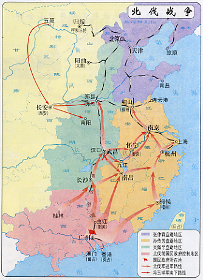
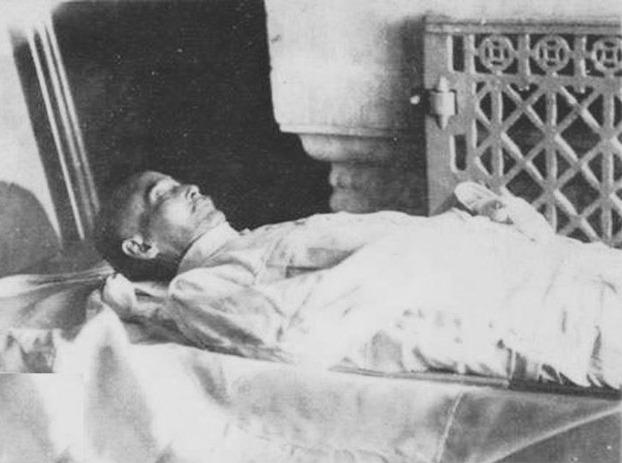
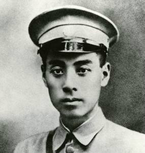
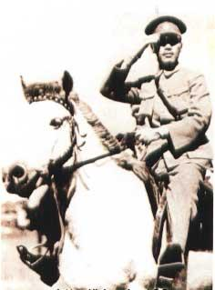
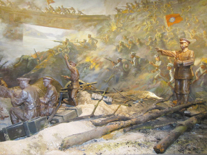
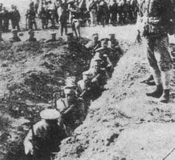
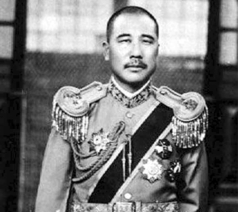
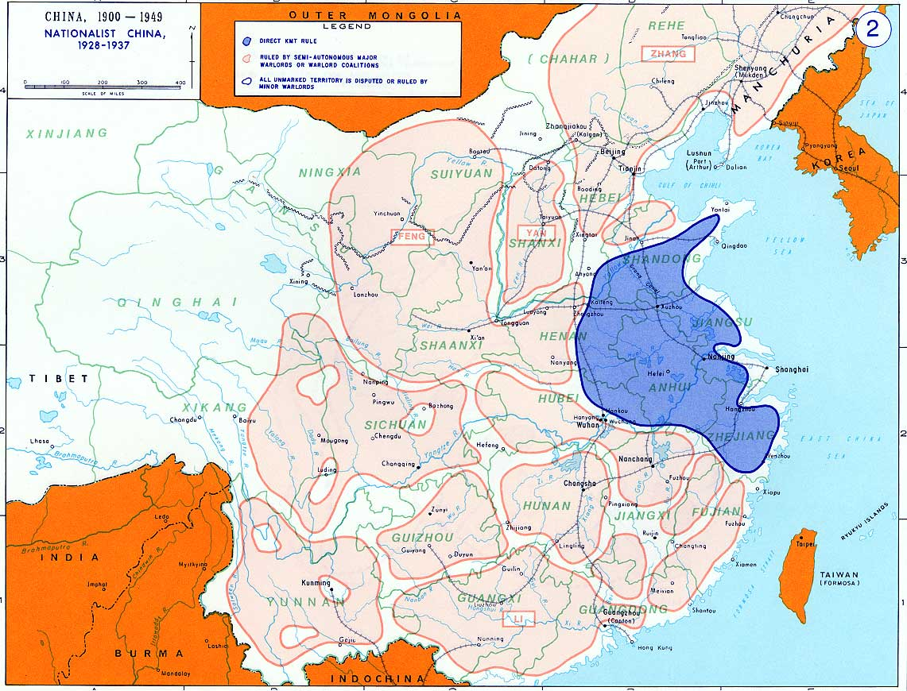

91年前的今天，蒋介石就职国民革命军总司令并誓师北伐，中国历史上第二次由从南向北统一全国的北伐战争开始。

万象特约作者：一一

北伐战争，是由中国国民党领导下的国民政府以国民革命军为主力，蒋介石为总司令于1926年至1928年间发动的统一战争。1926年7月9日，国民政府成立国民革命军从广东起兵，在连克长沙、武汉、南京、上海等地以后，国民政府内部因对中国共产党的不同态度而一度分裂，汪精卫和蒋介石决裂，北伐陷于停顿。宁汉合流后，国民革命军继续北伐，并在西北的冯玉祥和山西的阎锡山加入下，于1928年攻克北京，致使北洋奉系的张作霖撤往东北并被日本刺杀于皇姑屯，其子张学良宣布东北易帜。 至此北伐完成，中国实现了形式上的统一。
北伐结束后，南京国民政府正式统治全中国，成为中国在国际上唯一代表政权。但实际上，国民政府内外仍有不同势力割据，造成日后发生中原大战等连串内斗冲突。北伐期间，中国共产党与国民政府决裂，开始对抗国民政府，导致十年内战。
国民政府的北伐，是中国历史上仅有的两次由从南向北统一全国的例子（另一次是明朝对元朝的北伐），虽然它所达成的统一在很多方面来说都只是属于形式上的，当时更有“军事北伐，政治南伐”的说法。

北伐契机

自辛亥革命失败后，孙中山先生及其领导的革命党人，继续从事民主革命活动，1919年，孙中山将中华革命党改组为中国国民党。在共产国际和苏联代表的帮助下，中国国民党和当时崛起于政治舞台的中国共产党实现了合作，拉开了轰轰烈烈的大革命帷幕。1924年1月，中国国民党在广州举行第一次全国代表大会，实行联俄容共政策，与苏联和中国共产党合作。在苏联帮助下，国民党组建了以蒋介石为校长的黄埔军校，为中国革命培养了大批军事政治人才。在打败陈炯明后，1925年，孙中山在广州改组大元帅府为国民政府，以黄埔军校组建国民革命军。1925年3月12日孙中山在北京逝世。

1925年7月1日，广州国民政府正式成立，由汪精卫任政府主席，并取消各地方部队名称，统一称作国民革命军，计划北伐。10月1日，国民革命军举行东征，击败陈炯明残部，广东革命根据地基本上统一。

1925年10月，吴佩孚、孙传芳指挥直系军阀于长江流域争夺北洋政府领导权，向张作霖的奉系军阀发动反奉战争。 北洋各军阀在长江流域实力削弱，无力顾及国民政府，为国民革命军北伐创造契机。

交战双方
北洋军
吴佩孚部盘踞两湖、河南京汉路沿线，兵力号称二十万。孙传芳部由闽、浙、苏、皖、赣军阀组成，号称“五省联军”，兵力亦约二十万。奉系军阀张作霖窃据北京政府，盘踞京、津、直隶、热河及东北三省，兵力约四十万。盘踞山东的张宗昌也有十余万兵力。 
国民革命军
国民革命军8个军10万余人（战争过程中发展到40多个军近百万人），蒋介石任总司令，李济深任总司令部参谋长，白崇禧任参谋次长代理参谋长，邓演达任政治部主任，郭沫若任政治部副主任。
国民革命军总司令部在以V.K.布柳赫尔（化名加伦）为首的苏联军事顾问建议下，根据敌我双方军事力量对比和军阀之间的矛盾，制定了集中兵力、各个击破的战略方针，首先消灭吴佩孚军，然后歼灭孙传芳军，最后消灭张作霖军。

北伐准备
1926年1月，中国国民党第二次全国代表大会在广州召开，会议提出“对内当打倒一切帝国主义之工具，首为军阀”的口号。2月的北京，中国共产党召开特别会议，提出进行北伐推翻军阀的政治主张。
1926年7月4日，在广州，国民党中央临时全体会议通过《国民革命军北伐宣言》，陈述了进行北伐推翻北洋政府的理由。

1926年7月9日，蒋介石就职国民革命军总司令并誓师北伐。

打击吴佩孚
北伐战争第一阶段从1926年5月开始，目标是进逼湖南的吴佩孚。在统一部署下，第四、第七军入湘，协助唐生智部稳定了湘南局势。嗣后，北伐大军相继入湘，分成左，中、右三路，向湘北吴军发动进攻。
在此期间，吴佩孚率部协同张作霖军在直隶南口（今属北京）等地将国民军击败后，调兵南下，在湖北咸宁地区汀泗桥和贺胜桥地区设置坚固阵地。北伐军第七、第八军主力全线击破汨罗江吴军防线后，又在汀泗桥、贺胜桥打败吴军主力，进围武昌，一部绕道攻克汉阳、汉口，并相继占领武胜关、平靖关、鸡公山和九里关。

国民革命军攻占汉阳、汉口后，武昌已成孤城。10月10日辛亥革命纪念日，攻城部队在吴俊卿部接应下攻占武昌城，歼敌2万余人，生擒守城司令、第8师师长刘玉春和湖北督理兼中央第25师师长陈嘉谟。吴佩孚的主力部队已被消灭。

打击孙传芳

正当国民革命军席卷湘、鄂，吴佩孚军濒于崩溃之际，孙传芳决定从苏、浙、皖调兵10万入赣，会同其驻赣部队2万余人进攻湘、鄂；并令福建督理周荫人部进袭广东，威胁国民革命军后方。国民革命军总司令部为达到占领江西的预定目标，决定对江西转取攻势。
由于孙传芳军控制南浔铁路主要干线，便于机动，国民革命军总司令部三次攻打南昌失利，于是决定集中兵力，先破南浔铁路各要点之敌，尔后再取南昌，并决定从武昌增调第4军入赣作战。国民革命军入赣部队分三路于11月1日开始总攻。在截断南浔铁路后，孙传芳见败局已定，乘船逃回南京。南昌守军待援无望，弃城溃逃，被歼万余人。11月8日，国民革命军占领南昌。

在攻打江西同时，何应钦亦率部攻占福建。1927年3月，在周恩来领导的上海工人武装起义支持下，北伐军先后占领上海和南京。孙传芳势力遭到毁灭性打击。

宁汉分裂

1927年4月12日，蒋介石在上海发动“四一二”反革命政变，逮捕并屠杀中国共产党员和国民党左派。4月18日，蒋在南京另立南京国民政府，与武汉国民政府对峙，宁汉分裂。 北伐军攻克上海、南京后，孙传芳不甘心失败，与张宗昌组成直鲁联军，反攻南京。奉系军阀张作霖也派兵进入河南，威胁武汉。

“四一二”事变后处于分裂状态中的宁汉两方，各自为战。武汉方面以唐生智为总指挥，组成三个纵队进军河南，在漯河、临颍击败奉军主力，6月1日与冯玉祥部会师郑州。南京方面亦组成三路军，北伐陇海路，5月下旬克蚌埠，6月初占徐州，后与直鲁军相持于鲁南。7月下旬，直鲁军反攻，占领徐州，蒋中正组织反攻未果，遂于8月12日辞职。嗣后，直鲁军进迫南京，在龙潭战役中为南京军所败，丧其主力，双方复相持于津浦路。同年冬，何应钦指挥第一路军反攻，十二月再克徐州。

国民革命军联军总司令冯玉祥于5月1日就任国民革命军第二集团军总司令职，率部东出潼关加入北伐行列，与武汉军会师郑州，开封，随后进入豫东与直鲁军作战，曾取得两次兰封战役的胜利，并肃清豫境吴佩孚残余势力。山西阎锡山亦于6月宣布就任国民革命军北方军总司令职，派部进入直隶，占领张家口、石家庄，后因奉军反攻，阎军除傅作义部坚守涿州外，余均退回晋境。

国共分裂

7月15日，武汉国民政府领袖汪精卫召开“分共”会议，公布《统一本党政策案》，正式与中国共产党决裂。8月1日，周恩来、贺龙、叶挺、刘伯承等发动南昌起义，自此第一次国共合作彻底破裂。

8月14日，蒋介石下野。8月19日，武汉政府宣布迁都南京。9月初，汪精卫亲抵南京，宁汉合流。不久汪精卫又鼓励唐生智与张发奎分别于10月爆发宁汉战争、11月爆发广州张黄事变，但南京国民政府皆获得战争之胜利，迫使唐生智、张发奎等出国流亡。

二次北伐

1928年4月7日，蒋介石在徐州誓师北伐。9日，各路北伐军发起全线总攻。北伐军行至山东时，日本一度出兵山东，暗助军阀张宗昌，杀害交涉员蔡公时，史称“五三惨案”。此时蒋中正与冯玉祥在济南以南的党家庄车站会晤，决定绕过济南，继续北伐，同时命令济南驻军一律撤出。避免再发生冲突。另一方面则从外交交涉，分别向日军司令，日本外交部严重抗议，并要求日军同时撤出济南，同时请求英美协助调停。
1928年6月4日，张作霖当夜撤离北京，退出山海关外，张的专列在到达沈阳附近的皇姑屯（京奉铁路和南满铁路交叉的三洞旱桥），被日本关东军埋下的炸药炸毁，张作霖身负重伤，稍后死亡。6月8日，国民革命军开入北京。
1928年12月29日张学良在东北通电东北易帜，宣布效忠南京中央政府，北伐至此宣布成功。
国民政府的北伐，是中国历史上仅有的两次由从南向北统一全国的例子（另一次是明朝对元朝的北伐），虽然它所达成的统一在很多方面来说都只是属于形式上的，当时更有“军事北伐，政治南伐”的说法。

