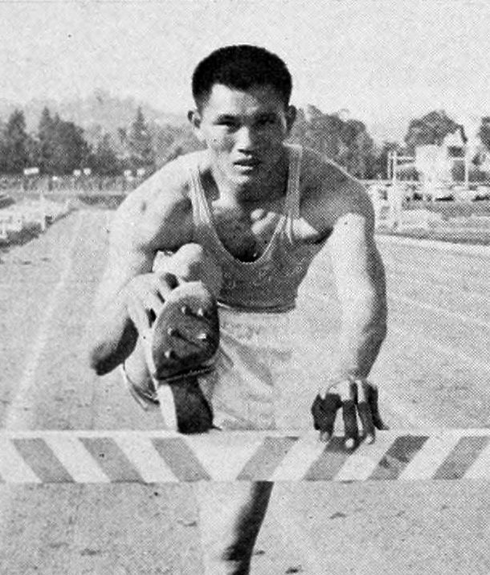
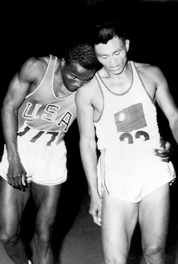
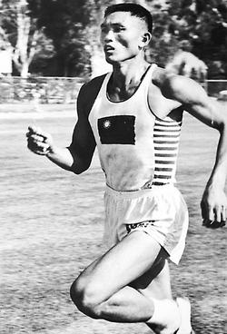

（万象特约作者：一一）

84年前的今天，中国奥运奖牌第一人，当了神棍的杨传广生于台湾

杨传广（1933年7月10日-2007年01月27日)，台湾台东人，马兰部落的阿美族人。十项全能运动员，绰号“亚洲铁人”。获得1960年罗马奥运会银牌，成为中国奥运奖牌第一人。

他创造了9121分的十项全能世界纪录，成为打破9000分的第一人。从此计分方式因此而改变，再也没人能达到这个分数。

离开体育后，曾短期从政。回家修建庙宇，并亲自担任庙祝与乩童的工作长达20多年。他先后被蒋介石召见7次，是台湾体坛第一人，曾获颁中华民国二等景星勋章。

蝉联亚运会十项全能金牌

1933年7月10日，杨传广出生于日本统治下的台湾省台东县，是马兰部落的阿美族人。1951年（18岁），从台东农校毕业后，进入联勤田径队，在国军运动会以7.32米的跳远成绩得到冠军。

1954年（21岁），在马尼拉亚运会，以5454分获得第一个十项全能金牌。当地报纸以“ASIAN IRON MAN”称呼他，这就是“亚洲铁人”称号的由来。4年后，1958年（25岁），在东京亚运会，打破亚运纪录再度蝉联十项全能金牌。

惜获奥运会十项全能银牌

之后进入加州大学洛杉矶分校（UCLA），在德瑞克教练的门下，与1956年墨尔本奥运会的银牌得主拉福·强森（Rafer Johnson）一起练习。

1960年（27岁），罗马奥运会十项全能比赛，杨传广虽然有七个项目领先强森，不过由于铅球一项落后太多，以58分的微差距败北，获得银牌。杨传广成为中国奥运奖牌第一人。

而在最后一个项目1500米，两人抵达终点后，强森累倒在杨传广身上，两人相互扶持的场景，令人感动。赛后甚至有观众高喊著：“给他们两人都拿金牌吧”！

无法达到的世界纪录

1963年1月26日（30岁），在美国国际田径邀请赛上，杨传广打破撑竿跳世界纪录，同时以9121分刷新十项全能运动世界纪录，成为十项全能史上打破9000分的第一人。十项全能运动的计分方式也因此而改变。

直至2001年，罗曼·谢布尔勒才再次突破9000分关卡。现今世界纪录保持者阿什顿·伊顿，在2015年创下9045分（1984年标准）。但也无法达到杨传广的9121了，虽然按1984年标准仅为8206分。

被“下药”的东京奥运会

1964年（31岁），杨传广参加东京奥运会，赛前是金牌呼声最高的选手，事后却只获得第五名。杨传广表示，赛前他在同团射击选手马晴山给他喝一杯果汁后，即感到身体不适，导致比赛失利。

不过也有部分的体育界人士认为杨传广的失败与十项全能的计分方式改变有关，而非政治因素。在本届奥运失利后，杨传广曾任教练与总监督，培养出古金水、李福恩等好手。之后逐渐淡出体育界。

当庙祝的台湾体坛第一人

1983（50岁），杨传广接受当时执政党国民党的推荐，当选为平地山胞立法委员，一时传为佳话。1986年，结束了短短的三年任期，未再或提名。1989年，转投入民进党参与台东县长的竞选失利，从此远离政治。

由于个人宗教信仰的影响，杨传广在家乡盖庙，并亲自担任庙祝与乩童的工作长达20多年。杨传广先后获时任总统蒋介石召见7次，是台湾体坛第一人。2005年9月13日，获颁中华民国二等景星勋章。

2007年1月27日下午17时30分，因脑部中风的病情恶化，在加州寓所与世长辞，享年74岁。

