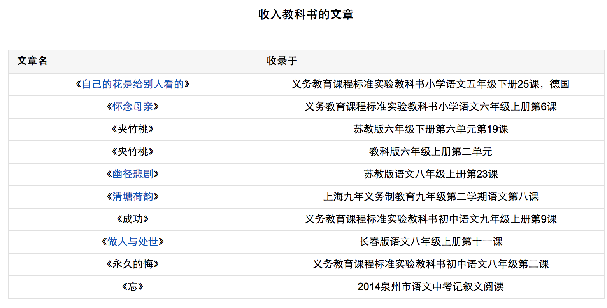
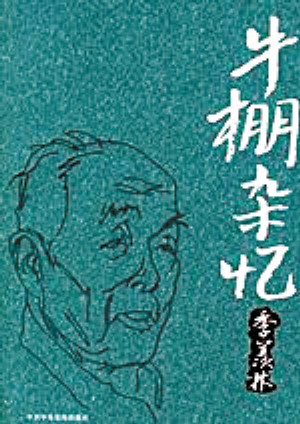
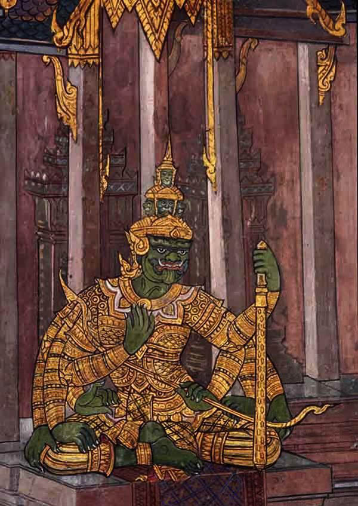

0711季羡林

（万象特约作者：东西望）

8年前的今天，2009年7月11日，季羡林逝世

季羡林（1911年—2009年），山东省临清市，国际著名东方学大师，语言学家、翻译家，梵文、巴利文专家，是世界上仅有的精于吐火罗文的几位学者之一。

他翻译完成的印度史诗《罗摩衍那》。为全世界迄今除英译本之外，仅有的外文全译本。他有大量文学作品收录到中小学生教科书。

他被誉为国学大师、学界泰斗、国宝。李敖却认为：“他只是个老资格的人，根本轮不到他做大师。”在清华大学期间，写下的日记，如“说实话，看女人打篮球……是在看大腿。附中女同学大腿倍儿黑，只看半场而返。”，读来令人捧腹。

清华大学的高材生

1911年8月6日，季羡林出生于山东聊城临清市康庄镇一个农民家庭。1923年（12岁），考入济南正谊中学。1926年，进入山东大学附设高中。1928年，因日本占领济南，辍学一年。1929年（18岁），受叔父母之命，与只有小学文化水平的彭德华（22岁）结为夫妻。

1930年（19岁），考入清华大学西洋文学系，专修德文，师从吴宓、叶公超，学东西诗比较、英文、梵文；选修陈寅恪的佛经翻译文学、朱光潜的文艺心理学、俞平伯的唐宋诗词、朱自清的陶渊明诗等。1934年（23岁），大学毕业，任山东济南中学高中语文教师。

德国十年学梵文

1935年（24岁），清华大学与德国签订了交换研究生的协定，报名应考被录取。前往德国哥廷根大学，师从瓦尔德施米特学梵文、巴利文和佛学。

1941年（30岁），获哲学博士学位。师从艾密尔·西克学吐火罗语、《十王子传》、《大疏》、《梨俱吠陀》等。

（季老在《留德十年》谈到的德国恋人伊姆加德）

北京大学最年轻的教授

1946年（35岁），回国后，经陈寅恪推荐，季羡林被聘为北京大学教授，创建东方语言文学系，任主任。时为北大历史上最年轻的正教授。

1956年（45岁），被任为中国科学院哲学社会科学部委员，成为中国共产党党员。为全国政协委员，以中国文化使者的身份先后出访印度、缅甸、东德、前苏联、伊拉克、埃及、叙利亚等国家。1957年，出版《中印文化关系史论丛》。

（季羡林的夫人彭德华）

《牛棚杂忆》中

1957年（46岁），反右运动期间，参与批斗右派份子。1964年，北大社会主义教育运动中，同部分教职员工和学生一起反对北大校长陆平。1965年秋，在京郊南口村任该村社教队副队长。

1966年文革初期（55岁），积极参与文化大革命运动。1967年夏秋之交，加入周培源等为首的北大造反派组织井冈山兵团，反对聂元梓新北大公社，被推选为东语系勤务员。 同年11月30日深夜被抄家，找到“反革命”证据，被打倒。

1968年春（57岁），在北大劳动改造。5月4日，在煤厂大批斗。次日被拉往十三陵附近的北大分校劳动改造。不久关入牛棚。1969年春节前，回家。同年在延庆新华营接受贫下中农的再教育。1970年春节回校，担任门房工作。

印度史诗《罗摩衍那》

1973年—1977年，翻译完成印度史诗《罗摩衍那》。为全世界迄今除英译本之外，仅有的外文全译本。

1978年复出（67岁），续任北京大学东方语言文学系主任，并被任命为北京大学副校长、中国社会科学院·北京大学南亚研究所所长。

1999年（88岁），应圣严法师之邀，赴台访问，并祭拜胡适墓园，撰写《站在胡适之先生墓前》一文。2008年1月，季羡林获印度公民荣誉奖。2009年7月11日上午9时，病逝于301医院，享年98岁。

《清华园日记》

季羡林大三大四时写的《清华园日记》

1932.9.11 “我的稿子还没登出，妈的。”

1932.9.23 “早晨只是上班，坐得腚都痛了。”

1932.12.21 “说实话，看女人打篮球……是在看大腿。附中女同学大腿倍儿黑，只看半场而返。”

1933.4.29 “因为女生宿舍开放，特别去看了一遍。一大半都不在屋里。”

1934.3.13 “没作什么有意义的事——妈的，这些混蛋教授，不但不知道自己泄气，还整天考，不是你考，就是我考，考他娘的什么东西？”

1934.5.17 “我今生没有别的希望，我只希望，能多日几个女人，和各地方的女人接触。”

不同的评价

季羡林被许多人奉为“国学大师”、“学界泰斗”、“国宝”。季羡林说：“三顶桂冠一摘，还了我一个自由自在身。身上的泡沫洗掉了，露出了真面目，皆大欢喜。”

季羡林被授予2006年“感动中国”人物，颁奖词中称：“季羡林先生为人所敬仰，不仅因为他的学识，还因为他的品格。……他的书，不仅是个人一生的写照，也是近百年来中国知识分子历程的反映。”

李敖在接受南都周刊专访时，曾经评论季羡林并不足以称为国学大师：“他不是国学大师！他是个很弱很弱的教授，他就是语文能力还不错。别人全死光了，他还没死，所以他就变成国学大师了！这些桂冠，他三个都不及格的，根本轮不到他！……季羡林只是个老资格的人，根本轮不到他做大师。”

