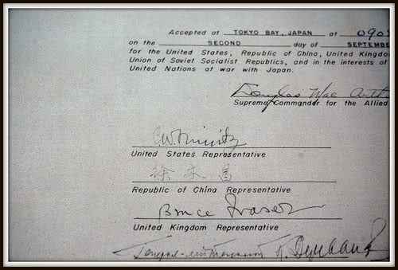
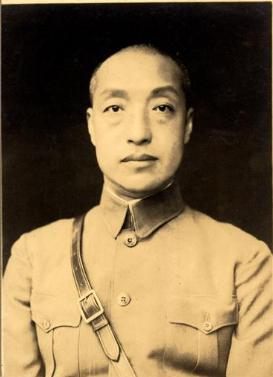
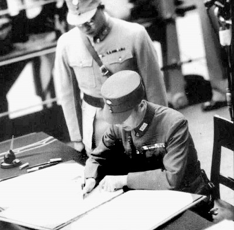

58年前的今天，抗战四巨头，代表中国接受日本投降的徐永昌逝世

万象特约作者：一一

徐永昌（1887年12月15日－1959年7月12日），山西崞县人，民国时期著名军事家，陆军一级上将。中原大战中担任晋绥军总指挥。抗日战争中，徐永昌任军令部长，与军政部长何应钦、军训部长白崇禧、政治部长陈诚并称为军委会四大巨头。

他在日记详细记载了抗战8年中他参与的全部重大活动，如娘子关的丢失责任；汪精卫投日对国家无损，对汪个人大损；22次会战的全过程；皖南事变爆发时蒋的惊讶等等。

1945年9月2日代表中国政府于密苏里号军舰上接受日本政府投降，排在美国之后第二个出场，并留下了一段掷地有声受降感言：“今天是要大家反省的一天！今天每一个在这里有代表的国家，也可同样回想过去，假如他的良心告诉他有过错误，他就应当勇敢地承认过错而忏悔。”

（徐永昌在日本投降书上的签字）

来自清朝的职业军人

1887年12月15日，徐永昌出生于山西崞县。1908年（21岁），入读武卫左军随营总堂，毕业后授副军校（中尉），任武卫左军路前营左哨副哨长。辛亥革命爆发时，驻守北京宝泉局。1914年（27岁），考入陆军大学第四期。1916年，赴山东参与居正、吴大洲的民军，进行倒袁运动。

1917年冬（30岁），任直隶军官教育团教官。1924年10月，任冯玉祥的国民军第三军第一混成旅旅长。1925年8月，任国民军第一师师长兼陕西警备司令。1926年9月，冯玉祥在五原誓师，改编为国民联军，协助国民革命军北伐。

阎锡山的得力干将

1927年（40岁），徐永昌因与冯玉祥主张不合，率部入山西，归入阎锡山属下，后也参加国民革命军北伐。1928年1月，任国民革命军第十二路军总指挥；6月，任河北省政府委员；10月，任绥远省政府第一任主席。1929年8月，调任河北省政府主席。

1930年4月（43岁），中原大战爆发后，任阎锡山的副司令兼前敌总司令；9月，被任为晋绥警备总司令。1931年8月，国民政府任命徐永昌为山西省政府主席。

军委会四巨头之一

1937年3月，任国民政府军事委员会办公厅主任。7月7日，芦沟桥事变发生，任军事委员会委员长保定行营主任，指挥第一战区抗日军事。1938年1月，军事委员会改组，奉命出任国民政府军令部部长，期间运筹帷幄，贡献良多，于1943年10月获颁青天白日勋章。

徐永昌与军政部长何应钦、军训部长白崇禧、政治部长陈诚并称为军委会四大巨头。他在日记详细记载了抗战8年中他参与的全部重大活动，如娘子关的丢失责任；汪精卫投日对国家无损，对汪个人大损；22次会战的全过程；皖南事变爆发时蒋的惊讶等等。

代表中国接受日本投降

1945年8月（58岁），日本宣布无条件投降，国民政府特派徐永昌代表中华民国参与9月在日本东京湾美舰密苏里号的受降典礼。

1945年9月2日，东京湾盟国总受降仪式在“密苏里”号战舰甲板上举行，在日方投降代表重光葵、梅津美治郎签字完毕后。作为盟军最高统帅麦克阿瑟签字后，按照战胜国的顺序，第一个出场的是美国代表尼米兹上将，第二个出场的是中国代表徐永昌上将，第三个出场的是英国代表福拉塞上将，第四个出场的是苏联代表狄里夫扬柯中将。在同盟国四大战胜国签字之后，澳大利亚、加拿大、法国、荷兰、新西兰等国高级将领依次签字。

中国政府的代表是军令部部长、陆军上将徐永昌，他郑重地在日本投降书签下了自己的名字，并留下了一段掷地有声受降感言：“今天是要大家反省的一天！今天每一个在这里有代表的国家，也可同样回想过去，假如他的良心告诉他有过错误，他就应当勇敢地承认过错而忏悔。”

终老台北

1946年（59岁），被选为制宪国民大会代表。1947年，当选第一届国民大会代表；任陆军大学校长；1948年12月，徐永昌任中华民国国防部部长。1949年夏天，任行政院政务委员。政府迁台，率陆军大学师生迁移台北。

1952年（65岁），任总统府资政；10月，晋升陆军一级上将。1954年11月，兼任光复大陆设计研究委员会副主任委员。1959年7月12日，徐永昌在台北市病故，享寿72岁。著有《徐永昌日记》（1989年出版）。

