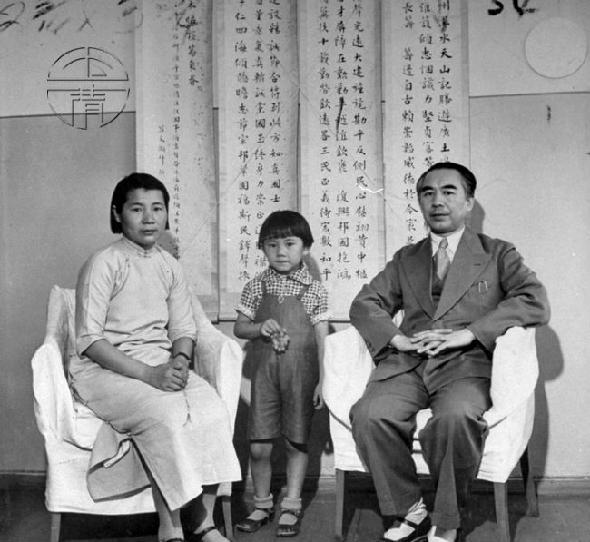
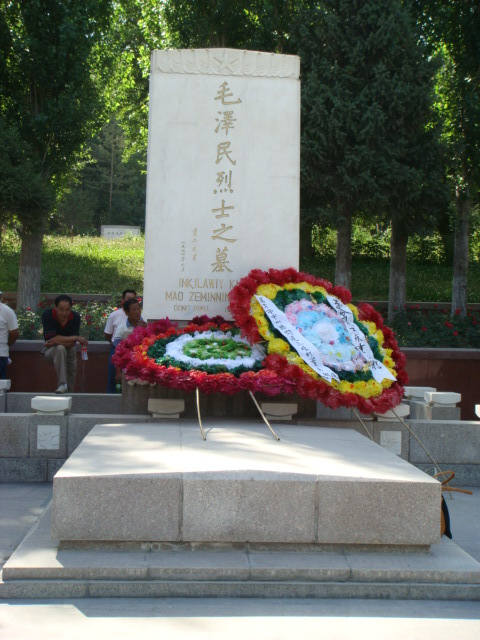
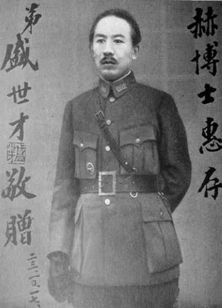

0713盛世才

47年前的今天，差点加盟苏联，杀人无数的新疆王盛世才病逝

盛世才（1897年1月8日－1970年7月13日），辽宁省开原盛家屯村人，满族，中华民国陆军将领。1933年至1944年，为新疆军事、政治首长，有“新疆王”之称。

他在新疆屡立战功，称为常胜将军。借助苏联的力量，打败敌对势力，成为新疆王。虽未宣布独立，但完全脱离中华民国，悬挂盛氏政权的“六角星旗”。他曾经提出成立突厥斯坦苏维埃共和国，脱离中华民国，加盟苏联，却被拒绝。

10年间，东北义勇军、苏联归化军、共产党、国民党等都曾遭他清洗，人称其“十年督办，十万人头”，因政治镇压有名有姓被杀害的就达上万人。被迫离开新疆后，无数人找他寻仇。他亲家11口在兰州被人灭门，震惊全国。逃到台湾后，蒋介石特意安排了一排士兵保护他，才免罪横死。

投笔从戎留学日本

1897年1月8日，盛世才出生于辽宁省开原盛家屯村，满族人。幼时在西丰县初小，沈阳第五高小，辽宁省立农林中学学习。1915年（18岁），盛世才毕业于上海吴淞中国公学政治经济科。1917年，得亲友帮助赴日本明治大学读政治经济学。

1919年（22岁），盛世才回国参加五四运动，决定投笔从戎，进入云南讲武堂（广东）韶关分校第二期步兵科学习，结识教官的郭松龄。1921年毕业后（24岁），加入奉系第八旅郭松龄部任排长。

1923年（26岁），经郭松龄推荐，奉系张作霖保送他到日本陆军大学公费留学深造。1925年12月，郭松龄发动滦州兵变，联和冯玉祥，讨伐张作霖。盛世才公费留学的资格被取消。但盛世才获得孙传芳、蒋介石等人支持，继续留在日本陆军大学学习。1927年，毕业后回国，就职于国民革命军总司令部，任上校参谋、军官团教官等职务。

新疆的常胜将军

1930年，金树仁在新疆招募军事人才，盛世才主动报名，转道苏联到达迪化（今乌鲁木齐），担任上校参谋。1931年，甘肃军阀马仲英从河西走廊进攻新疆。盛世才任参谋长，剿灭入侵部队，并将马仲英打成重伤。

1932年，哈密暴动，马仲英派部将马世明攻占了吐鲁番。盛世才打败马世明，攻下吐鲁番，缴获大批军械弹药。1933年1月，马世明再次进攻迪化，迪化岌岌可危。盛世才回师迪化，经过苦战，再次获胜，解了迪化之围。从此盛世才得到“常胜将军”称号。

政变上位的新疆督办

1933年4月12日，部分军人联合白俄归化军、东北义勇军发动军事政变，驱逐了金树仁。政变发生时，盛世才正在外地剿匪，得到消息后星夜兼程，进驻迪化近郊拥兵观望。4月14日，临时省政府推举盛世才为新疆临时督办。

1933年6月，南京中央政府派参谋本部次长黄慕松飞抵迪化，名为“宣慰”。盛世才借召开临时紧急会议为名，召集各地政变领袖，趁机一网打尽，并软禁黄慕松。南京政府因为鞭长莫及，只好任命盛世才为新疆督办。

借助苏联成为新疆王

1933年12月10日，盛世才故伎重施，邀东北义勇军首领郑润成等人前来开会，以“意图谋反”的罪名将其逮捕，后将其杀害。1933年12月，伊犁的张培元进兵迪化。盛世才借助苏联的力量，击败张培元，使之自杀。1934年1月，马仲英统率主力7000余人围攻迪化，形势一度极其危急。在盛世才的请求下，苏军再度入疆，击败马仲英部。

至此，盛世才在苏联的帮助下，坐稳了督办的宝座。1934年3月，盛世才被任命为新疆省政府主席，号称“伟大领袖盛督办”。国民政府授予他陆军中将加上将衔。他的妻子邱毓芳风头强劲，有“新疆的宋美龄”之称。

建立统一战线

在掌握军政大权后，盛世才着手进行改革工作。1936年4月，他陆续提出六大政策，即：反帝、亲苏、民平（民族平等）、清廉、和平、建设。为此，盛世才专门写了《六大政策教程》一书，设制了六星旗到处悬挂。

1937年4月，由于盛世才与苏联的密切关系，中国共产党派出驻新疆代表，建立统一战线。1938年初，毛泽民到新疆工作。他先后任省财政厅厅长、民政厅代理厅长等职，废除了新疆五花八门的旧币，发行了新币。

要求加入苏联

1937年9月到1938年1月，盛世才在新疆大抓所谓的“托派”分子，共逮捕了2000余人处死。其中还包括盛世才的二妹夫，中国共产主义青年团创始人俞秀松。8月，盛世才秘密前往莫斯科，与斯大林多次会见。

1939年，盛世才软禁了曾写了《盛世才与新新疆》的杜重远，随后又炮制“阿山案”、“回案”、“崔荣昌案”、“六星社案”等一系列案件，一大批人受到牵连。

1941年1月，盛世才曾向苏联提议：成立突厥斯坦苏维埃共和国，加盟苏联，脱离中华民国。由于当时苏联与德国开战，需要中国的同盟关系，斯大林拒绝了这一提议。

四弟妹谋杀亲夫

1942年3月19日，盛世才四弟、新疆陆军机械化旅旅长盛世骐在家中离奇中枪身亡。盛世才宣称是盛世骐妻子陈秀英与苏联军官通奸，“阴谋杀害亲夫”，以此为理由逮捕省内各级官员几百人。

盛世才与苏联，中国共产党开始交恶。1942年9月，软禁陈潭秋、毛泽民等人，一年后秘密处决。10月，要求苏联撤走全部人员。1943年，盛世才加入中国国民党，取消了六大政策，六角星旗亦换为中国国民党的青天白日旗。

10年新疆王的结束

然而不久，盛世才又不满国民党势力渗入，想要将其逐出新疆。1944年8月11日，盛世才逮捕国民党新疆省党部书记长黄如今、建设厅厅长林继庸等人，制造了“八一一黄林案”。整个迪化又处于恐怖之中。

盛世才又致电斯大林表示愿意加入苏联共产党、归顺苏联，遭到拒绝。1944年8月29日，国民政府派朱绍良接任新疆省政府主席，盛世才被调为农林部长，结束了“新疆王”10年的统治生涯。

十年复仇一日雪

盛世才生性多疑，在他统治新疆期间，称其“十年督办，十万人头”，因政治镇压有名有姓被杀害的就达上万人。无数人控诉盛世才的罪行，并发起“讨盛运动”。国民政府迫于舆论压力，将盛世才撤职查办。

盛世才的岳父邱宗浚在盛世才调离新疆后，举家移居兰州。1949年5月16日深夜，邱宗浚一家十一口人全部被杀死，墙上血书一行：十年复仇一日雪。是为震惊全国的邱宅大血案。破案后，主谋竟是盛世才当年的下属。

逃到台湾

盛世才随同国民政府到台湾，先后受聘为总统府国策顾问、国防部上将高级参谋、行政院设计委员等闲职。不断有被迫害的人士要求当局清算盛世才的罪恶。因仇家太多，他住在台北市南京东路五段的一个小巷子里，蒋介石特别派了一个排的步兵保护他。

1970年7月13日，盛世才因脑溢血逝世于台北市。

