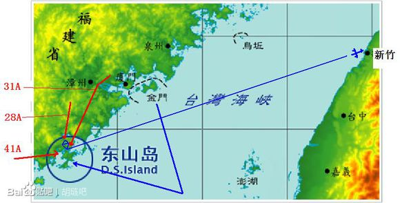
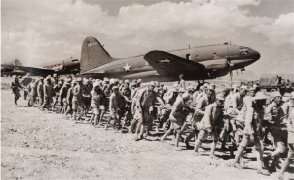
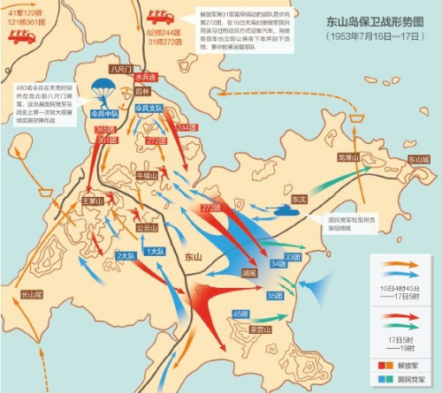

64年前的今天，国民党最后一次用成建制部队反攻大陆的东山岛战役打响

（万象特约作者：一一）

64年前的今天，1953年7月16日，国民党最后一次反攻大陆的东山岛战役打响

1953年7月16日，朝鲜停战协定签署前，中华民国陆军二级上将胡琏率1万多国民党军队，对位于福建和广东二省交界处的东山岛突然发起了突击作战，称为东山岛战役。此战役以人民解放军击败国民党军队，成功守住东山岛而结束。

东山岛战役被看作国共两党的最后一场激烈的战斗。当时，国民党军队出动军舰13艘，兵力1.3万人，在飞机、坦克的掩护下和伞兵部队配合作战。驻岛部队1000多人，援军从厦门、泉州、汕头三个方向火速施援。在两天一夜的激烈战斗中，我军共歼敌3379人，击落敌机2架，击毁坦克2辆，缴获大量军用装备。

英勇的东山岛人民自发支前，奋勇擒敌，涌现了许多可歌可泣的动人故事。战后毛泽东说：东山保卫战的胜利，不光是东山的胜利，也不光是福建的胜利，而是全国的胜利。

战前态势

此役是美国中央情报局（CIA）的化身——西方公司（Western Enterprises Inc.）计划的。毕业于西点军校的“独眼龙”汉弥顿中校（Edward Smith Hamilton）草拟的作战计划中包含中华民国陆军、伞兵支队、中华民国海军陆战队、政战人员等，再加上中华民国海军、中华民国空军的配合。

1953年2月初，国防部即开始计划突击东山岛，到7月初才完成，代号为“粉碎计划”，由金门防卫司令部成立联合任务指挥部，由司令胡琏中将担任指挥官。此役的目的，在于以实战验证三军联合作战的能力，尤其是对于伞兵的运用。

国防部在战前研判中认为，在开战36小时候后，东山岛120公里范围内，解放军可以增援1万2千人，如时间延长，北起厦门南迄汕头，解放军将可以动员5万5千人的部队。所以，最初的战术计划，就是不论成败以作战36小时为限。

东山岛上当时驻守有解放军福建军区公安第80团及1个水兵连共1200人，团长游梅耀是闽西籍老红军，抗战时曾当过陈毅的副官。驻军在岛上构筑了工事并制定了在东山岛遭到攻击时的增援方案。东山岛为福建沿海最南端的岛屿，是福建省内第二大岛。

战斗第一日

国民党军队闽海两栖突击部队，以扫荡东山岛为目的之突击行动，在极机密准备完成后，从金门发航。

7月15日夜，驻金门国民党军队第19军第45师等1万余人从金门出发，驶向东山岛，此前，国民党军队空军炸断了解放军增援东山岛的必经之路“九龙江大桥”。

国民党军队航行出料罗湾后，被解放军海岸观察哨发现，福建军区遂立刻通知沿海部队做好战斗准备。当晚，九龙江大桥即被民工修复，使得汽车又能顺利通行，此点为胡琏所始料未及。

战斗第二日

7月16日拂晓，国民党军队在东山岛登陆。在登陆过程中，由于码头处于在制高点上的解放军守军重迫击炮的射程之内，国民党军队损失了部分运载兵员的舰船。第31军第272团火速增援。

除了解放军核心阵地外，以八尺门地区的战斗尤为激烈，因为八尺门是增援东山岛的必经渡口。解放军方面当时驻守八尺门的为1个水兵连不足100人。当日，国民党军队向八尺门地区空降了425名伞兵。水兵连且战且退至渡口，凭借码头的围墙作为屏障继续阻击国民党军队，使国民党军队3个小时尚未攻占八尺门，为解放军增援部队的到达争取了时间。

战斗第三日

7月17日凌晨，解放军第31军第272团全部登陆东山岛，第28军和第41军先头部队也已经登上东山岛。在兵力还不占优势的条件下立即向国民党军队发起进攻。17日，解放军31军91师指挥所上岛，双方力量对比彻底转变。到7月17日上午，国民党军队见预定作战目标已经不能达成，遂决定收缩兵力。

临近中午，解放军各部队向国民党军队发起全面进攻，重新夺回东山岛主控权。国民党军队伞兵精锐死伤惨重。由于当时没有海空军力量支持，解放军无法拦截国民党军队从海上撤退，至17日黄昏，解放军歼灭了国民党军队掩护部队，取得东山岛战役的胜利，成功守住东山岛。

战后总结

7月23日，叶飞向华东军区、中央军委报告了东山岛战役的胜利。陈毅说：“东山战斗胜利的意义不在于战果数量多少，而在于把敌人的计划彻底粉碎，不仅是军事上的很大胜利，而且是政治上的很大胜利。”

毛泽东评价说：“东山战斗不光是东山的胜利，也不光是福建的胜利，这是全国的胜利。”并致电叶飞：“你们头脑要冷静，不要轻敌，现在美帝蒋介石就是看中你们福建。”“我们还要准备比东山更大规模的战斗，把敌人消灭在水上。陆上来了，消灭他在陆地上，不要怕。”

影响

东山岛战役后，蒋介石不再派出编制部队反攻大陆，而解放军指挥官叶飞则是一雪金门战役的前耻，成功打胜了号称“解放军版本的金门战役”。而国民党军队反攻大陆军事作战行动至此告终。挖掘工事坚守与机动增援从此成为解放军沿海防御战术。

此次战役是国民党伞兵运用与三军联合作战的实战测试。然而在国民党军队的主力战斗机仍使用二次大战研发的P-51与P-47螺旋桨战斗机时，解放军却已经从1950年开始换装米格15喷射战斗机，随着空优的丧失，使国民党军队不再进行突击作战。不过，经此次实战验证后，对于大规模伞兵运用与三军联合作战，还是有了实务上的战术经验，促使国民党军队在重新掌握空优后，设计出国光计划的全面反攻大陆计划，不过随着时局的变化，这个计划最终还是成了一纸空文。

