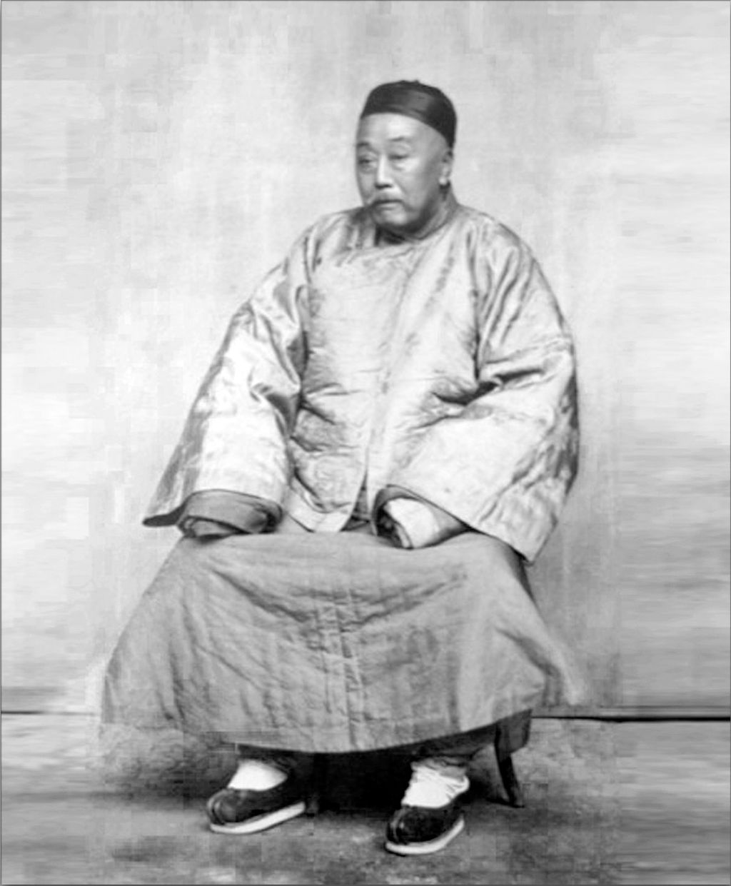
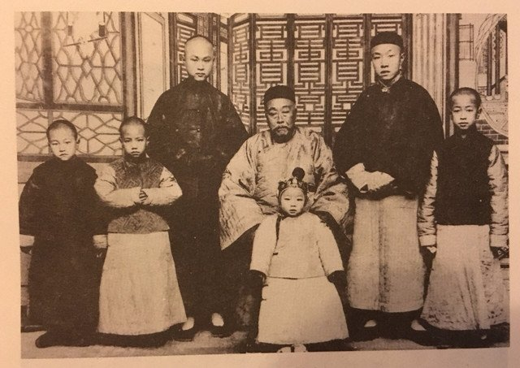
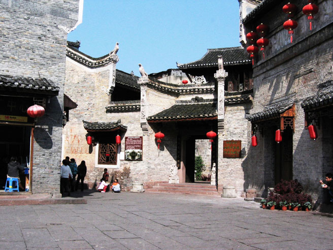

0722陈宝箴

（万象特约作者：东西望）

117年前的今天，一门五杰，擒获太平天国幼主的陈宝箴去世

陈宝箴（1831年－1900年7月22日），今江西修水县义宁镇，客家人。

青年时期入京，恰逢八国联军火烧圆明园，他悲愤不能自己，拍桌恸哭。回家后，参加对太平天国作战，设计擒获天国幼主洪天贵福，深得曾国藩赏识。

陈宝箴十分支持戊戌变法，令湖南成为了变法的重要场地。因推荐维新人员，被革职。两年后，猝然去世，享年69岁。另说被慈禧太后密旨赐自尽，自缢而死。

陈宝箴一家才人辈出，陈宝箴、陈三立（子）、陈衡恪（孙）、陈寅恪（孙）、陈封怀（曾孙）四代出五位杰出人物，后人称之“陈氏五杰”。

亲眼得见火烧圆明园

1831年，陈宝箴生于江西修水县义宁镇，客家人。1851年（21岁），乡试中举人，随父办乡团抵御太平军，义宁团练名噪一时。1860年（29岁），进京参加会试落榜，暂留北京，结交四方雅士。

陈宝箴在京期间，正值第二次鸦片战争，英法联军进逼北京，咸丰皇帝逃到热河。1860年10月18日，八国联军火烧圆明园时，陈宝箴正在酒楼饮酒，一见火光，满腔悲愤不能自己，拍桌恸哭，举座动容。

2.jpeg)

献策俘获太平天国幼主

1861年（30岁），陈宝箴回家探望母亲后，投入“果健营”，在湖南龙山、湖北来凤之间防守太平军。其时石达开大举来犯，两军相持数月不下，粮食耗尽。陈宝箴前往永顺募粮，援粮到后，石达开引兵退去。

1862年（31岁），慕名前往安庆拜谒两江总督曾国藩，被奉为上宾，赞为“海内奇士”。陈宝箴返回江西后加入席宝田军，途中见数县饥民遍野，便修书上陈江西巡抚沈葆桢，信中写到“赈济不能救人，救人不能生活，都是白饶”。

1864年（33岁），湘军攻陷南京城，太平天国破，幼主洪天贵福出逃，陈宝箴献策席宝田，派兵埋伏在广昌、石城之间，果然擒获天国幼主洪天贵福与重要人物十余人。事后席宝田论功欲保举他当知府，但是他没有接受，而留在了曾国藩身边。

东山再起的按察使

1868年（37岁），曾国藩调任直隶总督，宝箴就任湖南知府。当时贵州有苗乱，已经用兵数年，宝箴新官上任，隔年平定苗乱，功升道员。

1875年（44岁），署理湖南辰沅永靖兵备道，治凤凰厅，管理有方，致使当地民气为之一变。1880年（49岁），再授河北道（属河南省之河北道，治武陟）。1882年（51岁），拔擢为浙江按察使，不久因“王树汶案”遭弹劾罢官。

1886年（55岁），由两广总督张之洞出面，奏调陈宝箴到广东缉捕局任职，管理治安。1888年（57岁），郑州黄河大决口，朝廷派礼部尚书李鸿藻视察河工抢修情况，陈宝箴前往襄助谋划。1889年（58岁），湖南巡抚王文韶上疏力荐陈宝箴，隔年调到湖北， 历任湖北按察使与布政使。

（陈宝箴在凤凰的故居）

中日甲午战争的爱国者

1894年（63岁），中日甲午战争一触即发，清廷授陈宝箴直隶布政使，召入京城，商讨兵略，提出“固畿辅”、“择军将”、“严津防”、“简军实”、“筹急款”等《兵事十六条》。见光绪帝为战事心力憔悴，就奏请光绪读康熙帝的《御纂周易折中》，以期在大变之中稳定心智。

1895年（64岁），清廷战败后，李鸿章与日本签订《马关条约》割地赔款，宝箴痛哭“殆不国矣”，上疏痛心疾首指陈利害得失。李鸿章归国后，宝箴不愿意拜见他。宝箴说：“像李公这等勋旧大臣，明知不可战，就该当仁不让上书直谏，用生命、用职位表达事情的严重性，争久了，皇帝总会听进去。今天却因为害怕朝中议论畏罪塞责，以中国之大，宗社之重来孤注一掷，大臣怎能只关心自己的进退？”

（《马关条约》签字时的情景）

救苦救难的湖南巡抚

甲午战争后，陈宝箴受兵部尚书荣禄举荐，授湖南巡抚。宝箴在湖南任官多年，熟知地方民情，曾对人说：“我想为湖南服务的心，就像以前廉颇想为赵国服务一样。”

当时湖南正逢大旱，赤地千里，饥民遍野，共有二十多个州县受灾，其中又以浏阳、醴陵、衡山最为严重。情势紧急，陈宝箴直接离津赴任。离津前发电报请求各省援助，得黄金五六十万两，大赈灾情惨重的三个州县。

初步勘察后，颁布严禁贩米出境令，以确保粮米供应。此举引起米商不满，在洞庭湖畔聚集千余艘米贩舟船要强行出湘，宝箴派遣总兵带军队赶往阻拦，当场诛杀为首聚众滋事者，以铁腕手段平哗变、安民心。由于措施得当，救灾及时，使得百数十万人逃脱死亡的命运。

戊戌变法的支持者

陈宝箴十分支持戊戌变法，令湖南成为了变法的重要场地。当时曾在湖南参与变法活动的人有黄遵宪、江标、徐仁铸、欧阳中鹄、熊希龄、梁启超、唐才常、谭嗣同、皮锡瑞及其子陈三立等。

陈宝箴积极参与维新。他曾命湖南各州县订购《湘学报》，又赞助长沙的时务学堂，亲临讲演于南学会。1898年，戊戌政变，因推荐刘光第、杨锐，以“招引奸邪”之罪革职。移居于江西南昌西山晴庐。

1900年7月22日，猝然去世，享年69岁。另说被慈禧太后密旨赐自尽，自缢而死。陈宝箴一家才人辈出，陈宝箴、陈三立（子）、陈衡恪（孙）、陈寅恪（孙）、陈封怀（曾孙）四代出五位杰出人物，后人称之“陈氏五杰”。

