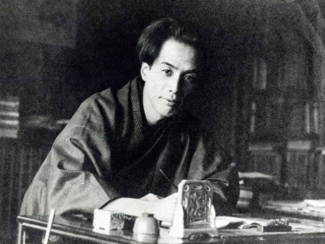
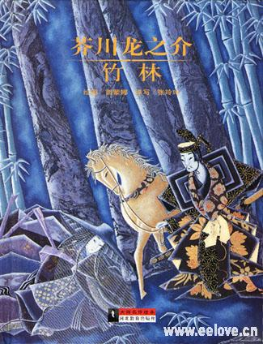
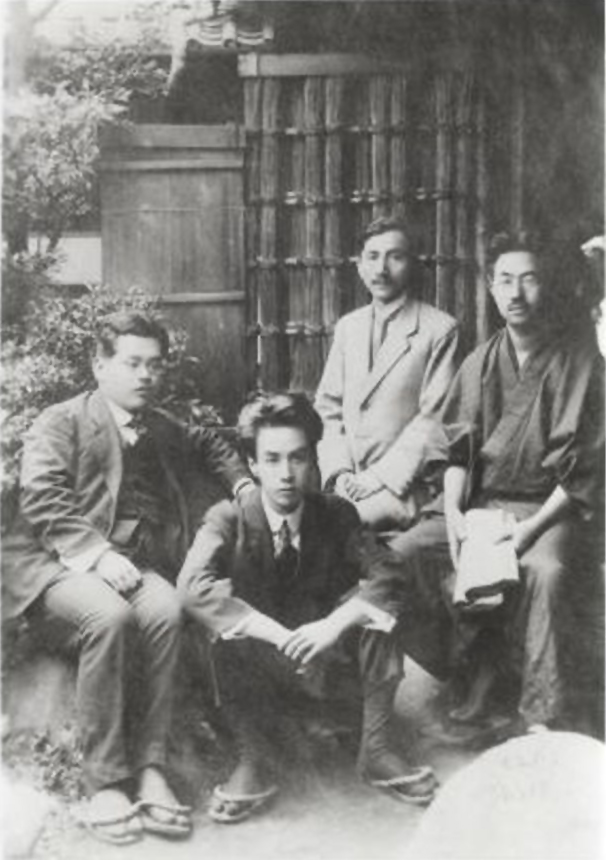
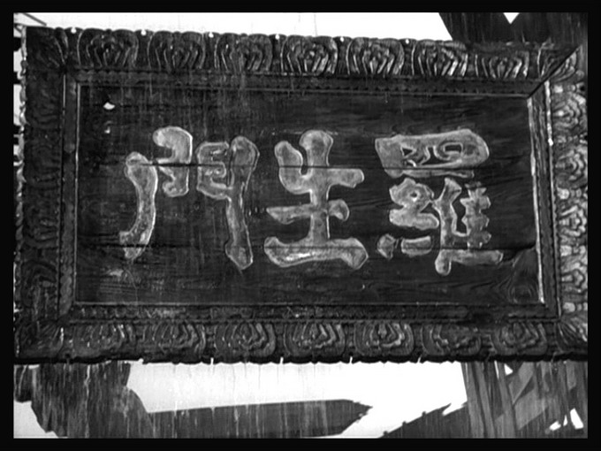

90年前的今天，《罗生门》作者芥川龙之介服毒自杀。

（万象特约作者：一一）

芥川龙之介（1892年3月1日－1927年7月24日），俳号“我鬼”，日本知名小说家。他的名作很多，以极短篇为主。

日本著名导演黑泽明，将芥川的作品《竹林中》与《罗生门》合而为一，改编为电影《罗生门》，在国际上获多个大奖，使日本电影走向世界。此后，“罗生门”成为对于扑朔迷离的、各方说法不一的事件的代名词。

一生为多种疾病、忧虑所苦，年仅35岁就服毒自杀。鲁迅评价其作品: "所用的主题最多的是希望之后的不安，或者正不安时之心情。"室生犀星评价其人: "这个作家好像从书籍之间变出来的，在世上只活了三十几年，谈笑一通，马上又隐身于自己出来的书籍之间，不再出来。"

喜爱文学的穷苦孩子

1892年3月1日，芥川龙之介出生于日本东京。父亲以贩卖牛奶为生。他出生7个月后，由于母亲精神异常，被送到母亲的娘家抚养。11岁，母亲离世后，他过继给舅舅，芥川为母亲娘家姓。

芥川一家喜好文学与戏剧，充满浓厚的江户文人气息，龙之介深受熏陶。11岁时，与同学发行手抄杂志，并自己写作、编辑，自绘插图。1913年（21岁），他进入东京帝国大学，学习英国文学，期间开始写作，完成了处女作《老年》，两年后又发表了短篇小说《罗生门》，但并未受到重视。

失败的初恋

1915年，芥川龙之介热烈地爱上了青山女子学院英文科的才女吉田弥生，不久二人双双坠入爱河而不能自拔。可他们的恋爱却遭到了养父的极力阻挠，最后，在家庭的压力下，他的初恋也以失败告终。初恋的挫折对他是一次沉重的打击，对他以后的生活产生了巨大的影响。

1916年（24岁），芥川毕业，以英文教学和报纸编辑维生。他在《新思潮》杂志发表短篇小说《鼻子》，夏目漱石读到后非常赞赏。他也开始创作俳句。1918年（26岁），他发表《地狱变》，讲述一个日本战国时期的残酷故事。

1918年2月2日， 同中学同学山本文子结婚，二人婚后育有三子。

压抑彷徨的竹林中

1921年（29岁），龙之介作为大阪每日新闻报社的记者前往中国四个月，并与胡适会面。7月，返抵日本，写成《支那游记》一书。这次的任务非常繁重，他染上了多种疾病，一生为胃肠病、痔疮、神经衰弱、失眠症所苦。

1922年（30岁），他发表了《竹林中》，讲述一件案子调查采集各方的证词与说法。《竹林中》中各方的证词某些地方重合却有很大矛盾，但是又都能自圆其说。整个作品弥漫着压抑、彷徨、不定向的气氛。反映了作者本人迷茫的思想。

自此以后，由于病情恶化，芥川龙之介常出现幻觉。当时的社会形势也右倾，言论自由受到政府打压，这使得他的作品更加压抑，如《河童》。

恍惚不安的服药自杀

1925年（33岁），在文化学院文学部担任讲师。1927年（35岁），由于胃溃疡，失眠，神经衰弱的复发，再次入住汤河源疗养。姐夫卧轨自杀，芥川为二姐一家债务奔走导致身心俱疲。

7月24日，因“恍惚的不安”而服毒自尽，年仅35岁。

走向世界的罗生门

芥川龙之介在他短暂的一生中，写了超过150篇小说。他的极短篇小说篇幅很短，取材新颖，情节新奇甚至诡异。作品关注社会丑恶现象，但很少直接评论，而仅以冷峻的文字和简洁有力的语言来陈述，让读者深深感觉到其丑恶性。《竹林中》、《罗生门》、《蜘蛛之丝》、《地狱变》、《杜子春》、《鼻子》、《南京的基督》等皆是经典之作，时常被选入课文、小说选集，或改编为戏剧。

1950年，日本著名导演黑泽明，将芥川的作品《竹林中》与《罗生门》合而为一，改编为电影《罗生门》，在国际上获得包括戛纳影展金棕榈奖在内的多个大奖，使日本电影走向世界。此后，“罗生门”成了对于扑朔迷离的、各方说法不一的事件的代名词。

芥川龙之介经典语录

最聪明的处世术是，既对世俗投以白眼，又与其同流合污。

所有神的属性中，我最同情的是：神不能自杀。

撒谎是人之本性，在大多数时间里，我们甚至都不能对自己诚实。

自由和山巅上的空气相似，对于弱者都是吃不消的。

人生像一盒火柴，特别重视它感觉很荒唐，如果不重视它那就很危险。

要使复杂的人生简单化，除暴力之外没有别的办法。

发现民众的愚蠢，并不值得夸耀。但是，发现我们自己也是民众，倒的确值得夸耀。

