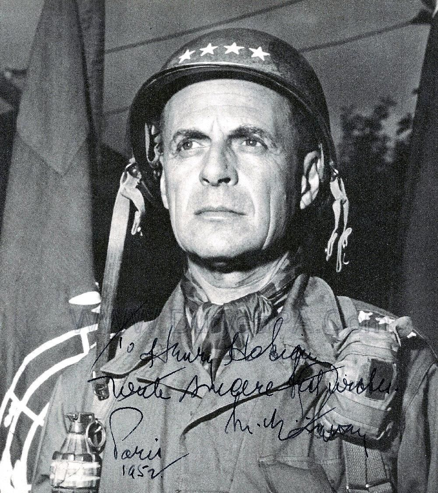
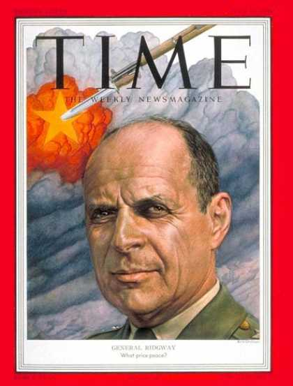
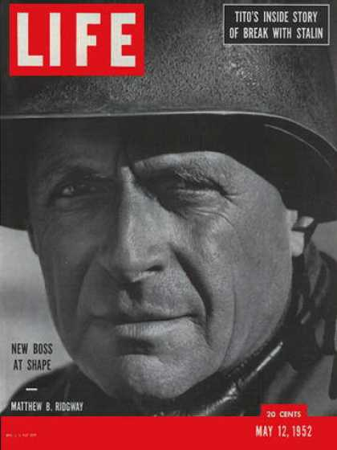

（万象特约作者：一一）

24年前的今天，用“磁性战术”打败志愿军挽救联合国军、胸前总是挂着两个手榴弹的李奇微逝世

24年前的今天，胸挂手榴弹，挫败志愿军的美军总司令李奇微逝世

李奇微（英语：Matthew Bunker Ridgway，1895年3月3日－1993年7月26日），是美国陆军上将。

毕业于西点军校，早年曾在中国服役。美国最早的空降师之一。朝鲜战争中，临危受命，担任联合国军总司令。他标志性的造型是胸前挂着两个手榴弹。

他曾采用“磁性战术”的方法，赢得了第五次战役的胜利，挽救了正在败退的联合国军，阻止中国人民志愿军的攻势，而闻名于世。

曾到中国的美军参谋长

1895年3月3日，李奇微生于美国弗吉尼亚州门罗堡。1917年（23岁），毕业于西点军校，被授予陆军少尉军衔。第二年，回到西点军校，担任西班牙语教员。先后在中国、尼加拉瓜、巴拿马、玻利维亚、菲律宾、巴西和美国各地服役。其中，曾在中国天津的第15步兵团任职。

1930年（35岁），李奇微出任菲律宾总督顾问。几年后，进入堪萨斯州利文沃思堡指挥和参谋学校学习，先后担任第6军助理参谋长、第2军副参谋长、第4军助理参谋长。

（左二为李奇微）

二次大战中的空降师

1939年，第二次世界大战爆发后，任美国陆军参谋长的乔治·马歇尔，将李奇微调到了战争计划处（War Plans Division）。1942年8月，李奇微晋升为准将，受命指挥第82空降师。第82师被选中成为美军最早的两个空降师之一。

1943年，李奇微协助策划了在西西里岛的空降作战。一年后，又协助策划了“霸王行动”中的空降作战。诺曼底登陆时，他随部队一起伞降在法国，连续战斗了33天。1944年9月，李奇微被任命为第18空降军军长，率部进入德国。

1945年，晋升为中将。二战结束后，在菲律宾修养一段时间后，受命指挥地中海战区的美国部队，头衔为：“地中海盟军副最高指挥官”。40年代末，他担任了加勒比地区美军司令，后来又出任副总参谋长。

（1945年4月2日，封面人物：李奇微）

朝鲜的联合国军总司令

1950年6月，朝鲜战争爆发。9月15日，以美军为主的联合国军进入朝鲜。10月25日，中国人民志愿军赴朝作战。12月6日，中朝军队收复平壤，并把联军赶回到三八线附近，初步扭转了朝鲜的战局。

1950年12月，沃尔顿·沃克中将因车祸丧生，李奇微接过了美国第8集团军的指挥权。1951年4月，麦克阿瑟的兵权被解除，李奇微成为了联合国军总司令。

挽救失败的磁性战术

李奇微发现志愿军后勤补给薄弱，每次穿插攻势只能维持7天时间，即所谓的“礼拜攻势”。  李奇微就对美军战术进行了针对性改良，采用了一种叫做“磁性战术”的方法。具体是首先根据志愿军进攻主要是夜间发动的特点，主力白天撤退，担任掩护的摩托化部队和坦克部队则在黄昏后开始撤退，每天最多只退20公里，20公里的距离恰好是志愿军一夜徒步前进的路程。志愿军的攻击部队在夜间穿插时根本捕捉不到美军，天明后又正好进至美军的预设阵地前，反而遭美军强大的空地一体优势火力打击，徒有伤亡难有进展。7天一过，当志愿军随身携带的补给消耗完，美军随即开始反击。采用这种方法，联合国军取得了第五次战役胜利。

李奇微把第8集团军从失败、濒临崩溃的困境中解救出来，并最终阻止了中国人民志愿军的攻势。 除了战术细节方面的改进，李奇微还非常注意对士气的鼓励。他以身作则，或者是乘轻型飞机，或者是乘吉普车，深入到一线，了解战况。李奇微最典型的标记就是胸前挂着两颗手榴弹。

1951年7月10日，双方终于同意停火，坐到了谈判桌前。

（1951年7月16日封面人物：李奇微）

阻止美国陷入越战

1952年5月，马克·克拉克接替李奇微担任联合国军总司令，而李奇微则接替艾森豪威尔，担任欧洲盟军最高司令。此后，李奇微接替科林斯，担任美国陆军总参谋长。

当时艾森豪威尔总统让他评估美国与法国联合对越南进行军事干预的可行性，结果李奇微拿出了一份详尽的计划，表明美国需要为此付出巨大的投入，从而使艾森豪威尔打消了出兵干预的念头。使美国卷入越南战争的时间推后了数年。

退役后郁郁寡欢

1955年，李奇微提前从美国陆军退役。第二年，李奇微出版了他的自传：《马修·B·李奇微回忆录》。

1971年，儿子因车祸丧生后，李奇微性情大变，变得日益郁郁寡欢。1993年7月，李奇微在匹兹堡郊区的家中去世，享年98岁。

