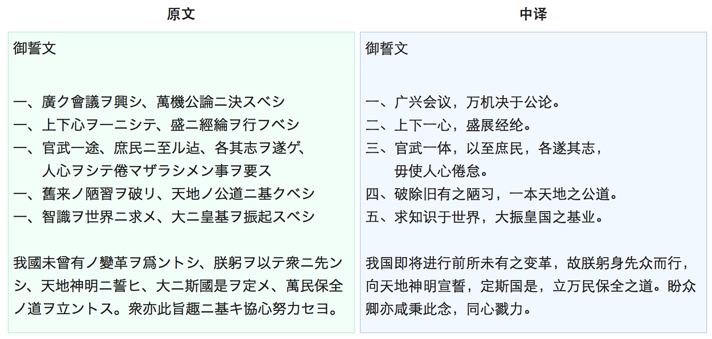
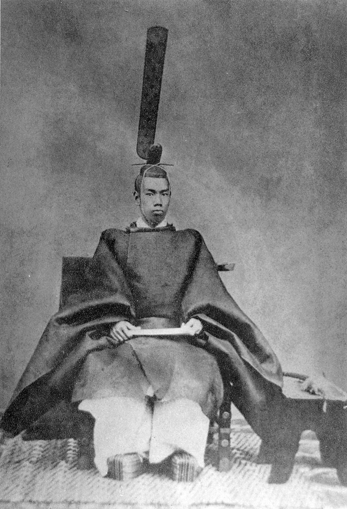
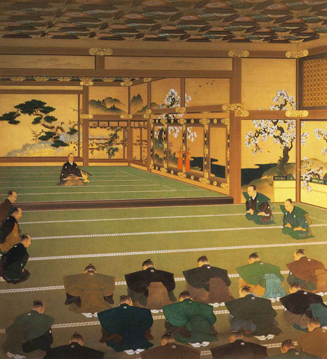
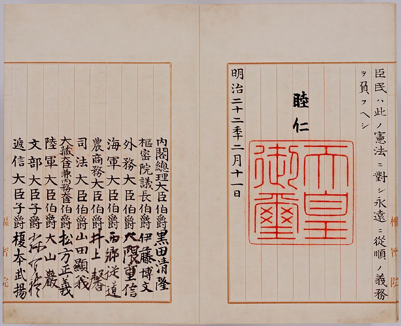
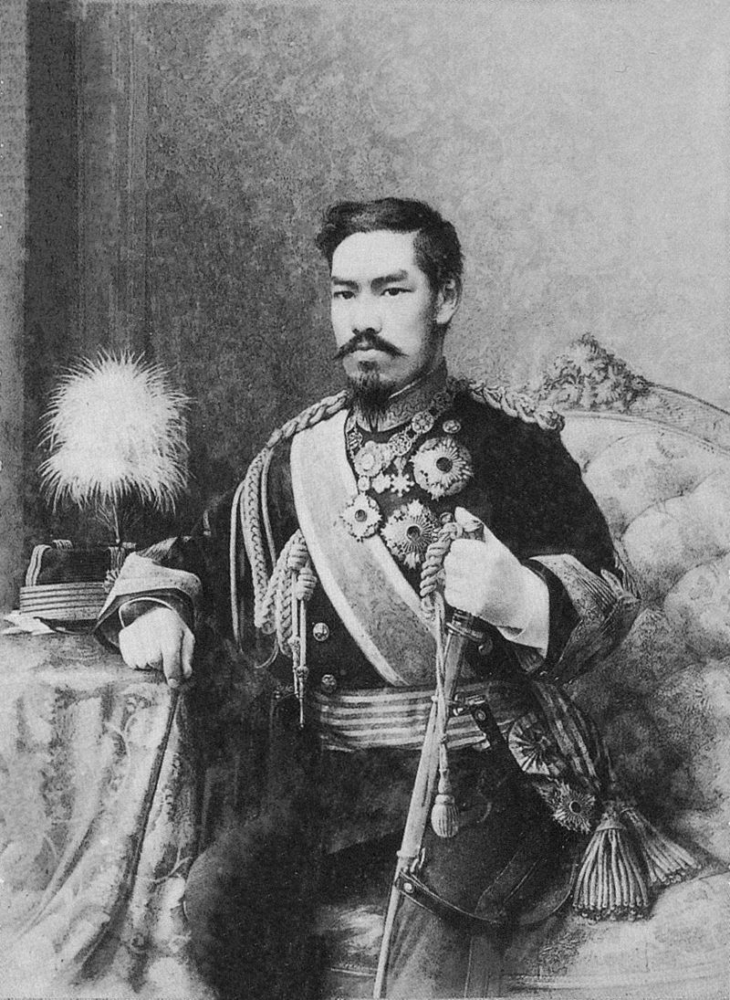
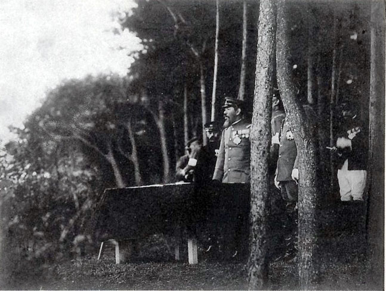
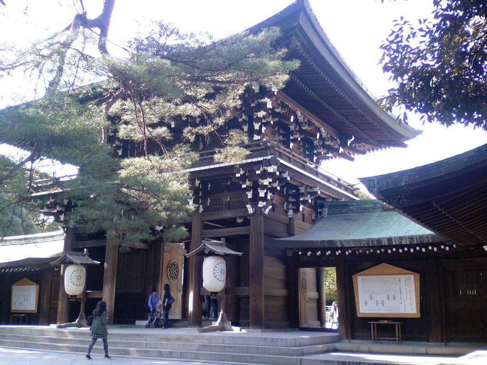

（万象特约作者：一一）

105年前的今天，得名于《易经》、通过改革让日本反超中国成为东亚第一强国的明治天皇逝世

105年前的今天，帮助日本反超中国成为亚洲第一的明治天皇病逝

明治天皇（1852年11月3日－1912年7月30日），日本第122代天皇（1867年－1912年在位）。

他本是天皇的庶子，并无继承权，因皇后无子，过继为嫡子，得以继位天皇。本来毫无权力的天皇，正赶上倒幕派打败江户幕府，重新得到大权。

颁布5条国家纲领，维新图强。用14年的时间，制定并颁布完成日本第一部宪法，亲任日本军最高指挥官。经过“江华岛事件”、“甲午战争”、“八国联军侵华”、“日俄战争”等一系列重大事件之后，日本取代清朝成为亚洲第一强国。

他去世后，日本政府为他建立明治神宫，将其神化，实施政教合一，天皇成为神道教的头号祭司。日本则逐渐走向军国主义、帝国主义的道路。而明治天皇的名字成了日本兴盛和崛起的标志。

（维新图强的《五条御誓文》）

被立为太子的二儿子

1852年11月3日，明治天皇出生于日本京都。母亲16岁被召入宫中为典侍（相当于妃子），得到孝明天皇的宠幸而有孕，回到娘家中山邸产下明治，是孝明天皇的第二子。明治在娘家长大，5岁才被接到皇宫。

1860年7月（8岁），因皇后无子，明治得到皇后喜爱，纳为嫡子，立为储君。9月28日，封为亲王，并赐名“睦仁”。

（1872年的明治天皇）

拿回政权的明治天皇

1867年1月30日（15岁），孝明天皇驾崩，继为天皇。在倒幕派的努力下，经过戊辰战争，推翻德川幕府的统治。1867年11月9日，江户幕府第15代将军把政权交还天皇，结束了持续265年江户幕府统治。12月9日，宣布王政复古，建立君主专制政权。

1868年8月27日，举行即位典礼，改元“明治”，所以称为明治天皇。“明治”取自《易经·说卦传》中“圣人南面而听天下、向明而治”。1868年9月3日，颁布诏书，将“江户”改名为“东京”。1869年2月6日，册立皇后，称为昭宪皇后。1869年10月13日，开始迁都东京。

（戊辰战争中的武士）

维新图强的五条国家纲领

亲政不久，颁布《五条御誓文》作为国家纲领，展开维新图强大业。翻译成中文如下：

一、广兴会议，万机决于公论。
二、上下一心，盛展经纶。
三、官武一体，以至庶民，各遂其志，毋使人心倦怠。
四、破除旧有之陋习，一本天地之公道。
五、求知识于世界，大振皇国之基业。

我国即将进行前所未有之变革，故朕躬身先众而行，向天地神明宣誓，定斯国是，立万民保全之道。盼众卿亦咸秉此念，同心戮力。

（大政奉还）

日本的第一部宪法

1875年4月14日（23岁），颁布《渐次立宪政体树立之诏》，开始准备立宪。1881年10月12日，颁布《国会开设之敕谕》。1889年（37岁），历时14年，正式颁布《大日本帝国宪法》，俗称“明治宪法”，得以确立天皇的最高政治权力。明治在位期间，亲任日本军最高指挥官。

“明治宪法”生效了58年。一直到第二次世界大战后，日本无条件投降，盟军占领日本，同时制订新宪法。1947年5月3日，新宪法经议会通过后，正式施行，“明治宪法”被废除。根据新宪法，天皇是国家名义上的主人，只能扮演“纯粹仪式上的角色”，也就是国家的精神领袖。

日本帝国的大崛起

1875年9月（23岁），日本与韩国发生“江华岛事件”（日本称“江华岛事件”，韩国称“云扬号事件”）。日本派出军舰云扬号航行到朝鲜西海岸测量海图，遭到朝鲜江华岛炮台守军炮击，双方发生交火，最后日本方攻陷炮台，日韩双方签订《江华条约》又称《江华岛条约》。这是朝鲜和外国签订的第一个不平等条约，日本取得了自由勘测朝鲜半岛海口、领事裁判权、贸易等权利，成为日本日后侵略韩国的开始。

1894年（42岁），日本与清朝发生甲午战争，清朝败给日本，与日本签署《马关条约》，台湾割让给日本，李氏朝鲜不再是清朝的藩属国。1895年，日本接收台湾成为殖民地。又历经八国联军（1900年）、日俄战争（1904年），朝鲜半岛也成为日本殖民地，库页岛南部则纳入日本版图。日本资本主义迅速发展，形成日本帝国主义。

（1909年的明治天皇）

神道教的头号祭司

1912年7月30日（60岁），明治天皇因糖尿病（尿毒症）去世。明治天皇去世后，灵柩由火车运送到京都府，葬于京都市伏见桃山陵。1914年，昭宪皇太后去世。不久，日本政府建立明治神宫，把明治天皇神化，并实施政教合一，天皇成为神道教的头号祭司。

（明治神宫）

明治天皇在位45年，颁布一系列维新举措，实行了明治维新。日本实现了社会、经济、军事等多方面的发展，取代清朝成为亚洲第一强国，并逐渐走向军国主义、帝国主义的道路。他的名字是日本兴盛和崛起的标志。

（明治天皇晚年画像）