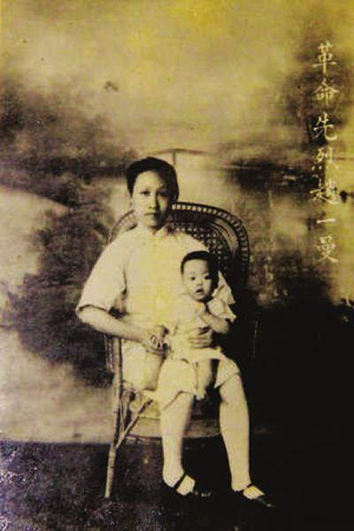
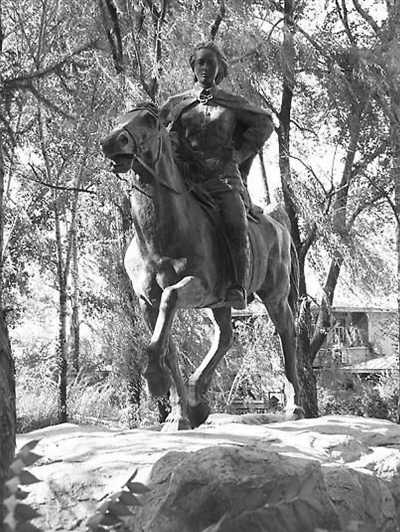

81年前的今天，黄埔军校唯一一批女学员之一、抗日烈士赵一曼牺牲。

81年前的今天，改名换姓，不知身份的抗日密林女王赵一曼牺牲

万象特约作者：一一

赵一曼（1905年10月25日－1936年8月2日），四川宜宾人，著名的抗日女英雄。

原名李坤泰，地主家的大家闺秀，在姐夫的介绍下，投身革命，改名李一超。不久，考进武汉黄埔军校，成为黄埔军校历史上唯一的一批女学员之一。

后赴莫斯科中山大学学习，一年后因怀孕回国。918事变后，离开3岁的儿子，主动请缨前往东北抗日，改名赵一曼，被称为“骑白马的密林女王”。几年后不幸被捕牺牲，车中潦草写下给儿子的著名遗书。

由于没有亲友知道赵一曼的名字，以至于牺牲时，没有人知道她的真实身份。解放后，电影《赵一曼》上映。在牺牲近20年后，她的身份才得以确认，儿子和丈夫得知后，百感交集。

黄埔军校的女学生

1905年10月25日，赵一曼出生于四川省宜宾县白花镇的一个地主家庭。原名李坤泰，家中六女三男，她排行第七。她投身革命后，改名李一超，去东北抗日时，又改名赵一曼。当时没有亲友知道赵一曼的名字，以至于后来牺牲时，没有人知道她的真实身份。

1924年（19岁），在大姐夫的介绍下，加入社会主义青年团。1926年2月（21岁），考入宜宾女子中学（现宜宾第二中学）。1926年5月，“五卅”运动一周年时，正是抵制洋货的高潮。赵一曼组织党团员在学生中宣传，抵制英国煤油轮船靠拢宜宾码头。结果学生们遭到了武装镇压，由此引发了全城罢工、罢市、罢课。

1926年夏，宜宾特别支部成立，她由团员转为共产党员，同时担任宜宾妇联和学联党团书记。10月，赵一曼考进武汉黄埔军校，不久入武汉中央军事政治学校学习，成为黄埔军校历史上唯一一批女学员之一。

不要孩子要去抗日

1927年9月（22岁），被派往苏联进入莫斯科中山大学学习，途中结识湖南人陈达邦（任弼时夫人的哥哥）。1928年4月，两人结婚，不久怀孕。12月，回国，回到宜昌产下一子，陈达邦则继续留在中山大学学习。

1930年（25岁），赵一曼带孩子到上海中央机关工作，抱孩子寄养在陈达邦大哥家。1931年（26岁），“九一八”事变后，赵一曼主动请缨，留下3岁儿子，前往东北进行抗日活动，并改名为赵一曼。

（赵一曼与宁儿（陈掖贤））

没能虎口脱险的密林女王

1932年（27岁），任满洲总工会秘书，组织部长。1933年10月，任哈尔滨总工会代理书记。1934年7月，赴哈尔滨以东的抗日游击区，任中共珠河中心县委委员、妇女会负责人、铁北区委书记。

1935年（30岁），任东北抗日联军第3军第1师第2团政委，被称为“骑白马的密林女王”。1935年11月，在与日军作战中，腿受伤在昏迷中被俘。日军为得到情报信息，将她送到哈尔滨市立医院进行监视治疗。1936年6月，她说服看守的警察和护士，帮助她成功逃出医院。几天后，在奔往抗日游击区的途中，不幸被日军追上，再次被捕。

1936年8月2日（31岁），赵一曼被绑在大车上，在珠河县城（今黑龙江省尚志市）“游街示众”后，被杀害于珠河县小北门外，年仅31岁。

写给儿子的遗书

赵一曼临死前，给儿子留下一封潦草的遗书，全文如下。
宁儿：
​	母亲对于你没有尽到教育的责任，实在是遗憾的事情。母亲因为坚决地做了反满抗日的斗争，今天已经到了牺牲的前夕了。母亲和你在生前是永久没有再见的机会了。希望你，宁儿啊！赶快成人，来安慰你地下的母亲！我最亲爱的孩子啊！母亲不用千言万语来教育你，就用实行来教育你。在你长大成人之后，希望不要忘记你的母亲是为国而牺牲的！
​			一九三六年八月二日

​			你的母亲赵一曼于车中

李一超=赵一曼之谜？

赵一曼死后，没有人知道他的真实身份。1950年，东北电影制片厂摄制的电影《赵一曼》上映，由石联星主演，获第五届卡罗维发利电影节最佳女演员奖。

1953年，赵一曼的大姐向周恩来写信，打听妹妹李一超在上海中央机关工作后的下落，但经多方打探，并无消息。1955年，赵一曼的大姐写信给陈达邦的妹妹（任弼时的妻子），告诉她：经过李一超的战友和东北革命烈士纪念馆确认，赵一曼就是陈达邦的妻子李一超。

赵一曼的儿子宁儿陈掖贤知道后，非常激动，把母亲留给自己的遗嘱一字一划地抄了下来，并把“赵一曼”三个字刻到自己的手臂上。1957年，当陈达邦从苏联回国后，得知赵一曼就是自己的妻子时，更是百感交集。

