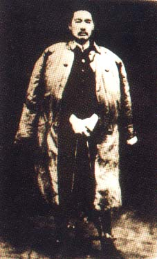
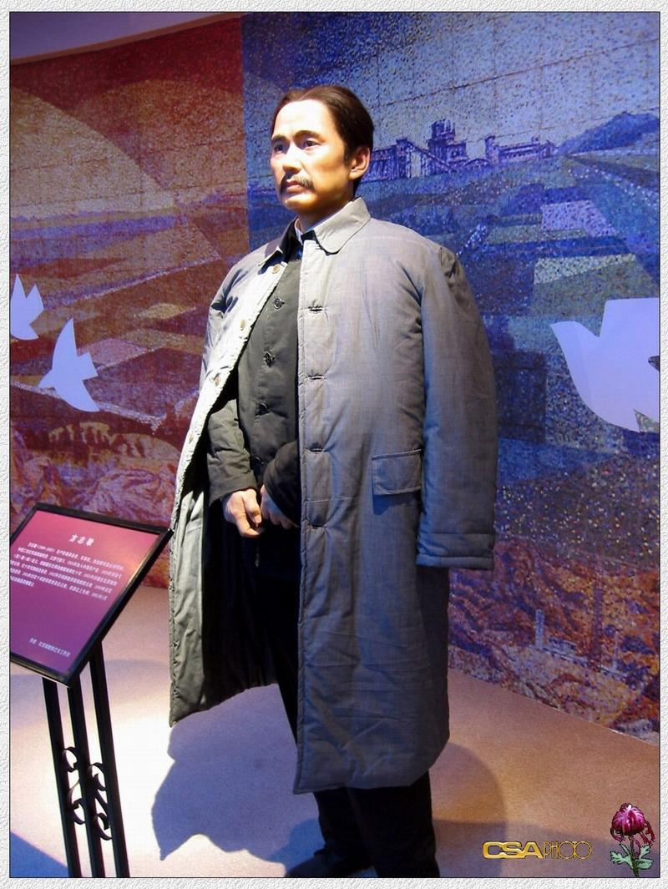
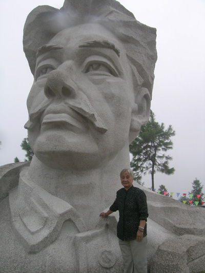
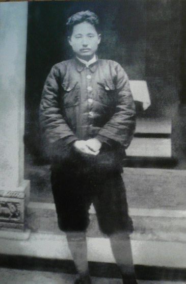
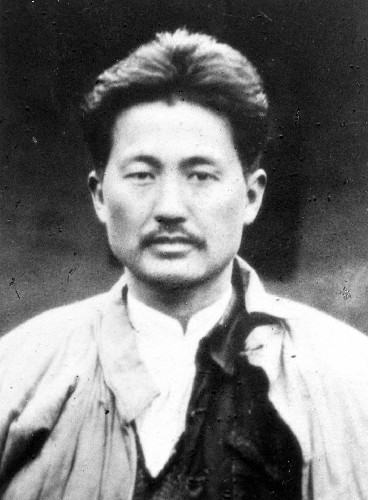
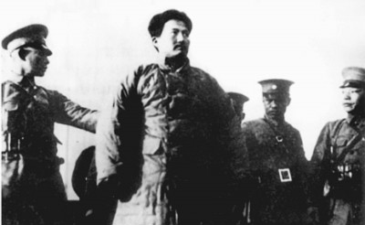

82年前的今天，中国工农红军北上抗日先遣队政委、提出“我们信仰的主义，乃是宇宙的真理”的方志敏牺牲

（万象特约作者：一一）

82年前的今天，1个月改变人生，第1个要抗日的方志敏被俘牺牲

方志敏（1899年8月21日－1935年8月6日），江西弋阳人，革命家、政治家、军事家。

青年时期，曾到上海一个月，却加入了共青团，找到了党组织，成为他人生中的重要转折。在组织农民运动中，杀死了自己的五叔，大义灭亲。创建赣东北革命根据地，曾攻入景德镇，绑架外国商人，获得不少赎金。

反围剿失败后，组建了中国工农红军北上抗日先遣队，是最早打出抗日旗号的红军。在前往抗日前线途中，突围失败被俘。国民政府先后在上饶、弋阳、南昌策划了三次“庆祝生擒方志敏大会”示众。方志敏拒绝投降后，英勇就义。

2013年5月22日，《解放军报》发表署名文章《中国梦的自信在哪里》，引用了方志敏的原话：“敌人只能砍下我们的头颅，决不能动摇我们的信仰！因为我们信仰的主义，乃是宇宙的真理！为着共产主义牺牲，为着苏维埃流血，那是我们十分情愿的啊！”

一个月的人生大转折

1899年8月21日，方志敏出身于江西弋阳农民家庭。7岁入私塾。17岁，考入弋阳县立高等小学。1919年夏（20岁），考入江西省立甲种工业学校预科班，次年升入应用机械科。1921年春，因领导该校学生反对腐败教育，要求教育改革而被校方开除。

1922年7月（23岁），赴上海，任《民国日报》校对，不久加入中国社会主义青年团。8月，赴南昌创办“文化书社”，出版《青年声》周报，创建青年团南昌地方组织。方志敏在上海逗留的时间虽短，但找到了党组织，结识了陈独秀、瞿秋白、恽代英、向警予等中共领导人，这是他人生中的重要转折。

处死五叔的大义灭亲

1924年3月（25岁），方志敏加入中国共产党。7月，任国民党江西省党部执行委员兼农民部部长。不久，回老家弋阳，建立农民协会，领导农民运动。方志敏的五叔带头对抗农民运动，靠民团镇压农民。1925年夏天，他带领农民抓住五叔，他的祖母、父亲都来求情，他仍然下令把五叔处死。

1926年5月（27岁），出席广东省第二次农民代表大会。1927年3月，在南昌创办江西农民运动训练班，组织了农民自卫武装。6月5日，被江西省政府主席朱培德“礼送”出境，旋化名李祥松，流亡赣西。8月1日，南昌起义后，潜回弋阳，先后任中共弋阳区委书记、中共横峰区委书记。

绑架外国商人的革命领袖

1927年11月至1928年2月，领导弋横暴动，创建赣东北革命根据地。1930年，率独立团在赣东北、闽北一带开辟根据地。先后领导了贵溪、万年等县的农民暴动，多次击退国军围剿。

7月，组建中国工农红军第十军，攻入景德镇，杀死了瓷上肖像画创始人邓碧珊，还绑架了多名外国商人，获得赎金后释放。在景德镇获得的黄金、白银、股票，价值30多万元。8月，当选为赣东北特区革命委员会主席。

1931年3月，方志敏当选为赣东北特区苏维埃政府主席、红十军政委，率部转战贵溪、余江及闽北地区。1931年11月，当选为苏维埃临时中央政府执行委员、主席团委员。1932年12月，任闽浙赣省苏维埃政府主席。

1933年1月，红十军改编为红十一军，兼任政委，并组建新红十军。12月，任中共闽浙赣省委书记、闽浙赣军区司令员。

抗日不成被生擒

1934年11月，红七军团与红十军合编为红十军团，称中国工农红军北上抗日先遣队，方志敏任军政委员会主席。这是最早打出抗日旗号的红军部队。

11月底，方志敏率红十军团军团向皖南进军，冲破德兴封锁线，与先期出发的红十九师会合。12月14日，在谭家桥与王耀武任旅长的国民革命军补充第一旅激战后失败，红十九师师长寻淮洲战死。红十军团被迫南下向闽浙赣根据地转移。

1935年1月，红十军团在玉山县怀玉山区战败，方志敏与军团长刘畴西等人一道被俘。国民政府先后在上饶、弋阳、南昌策划了三次“庆祝生擒方志敏大会”示众，此后国民政府派顾祝同等劝降，被方志敏拒绝。

为宇宙真理而献身

方志敏死前在狱中写下《我从事革命斗争的略述》、《可爱的中国》、《清贫》、《死!——共产主义的殉道者的记述》等文。坚定地声称“共产主义是宇宙的真理”，愿意为其牺牲。

因在1934年12月，方志敏部下曾绑架美国传教士师达能和史文明夫妇，要求他们付赎金2万元，被拒后将两人杀害。1935年8月6日，国民政府以谋杀师达能夫妇的罪名判处死刑，将方志敏在南昌下沙窝枪决。

1957年，在下沙窝修建化纤厂挖地基时，发现了方志敏9块遗骨。1960年，在南昌西郊梅岭山麓修建方志敏烈士墓，毛泽东亲笔题词。毛泽东称赞他是“以身殉志，不亦伟乎”的“人民英雄”。叶剑英把他喻为文天祥之后的又一位“民族英雄”。

