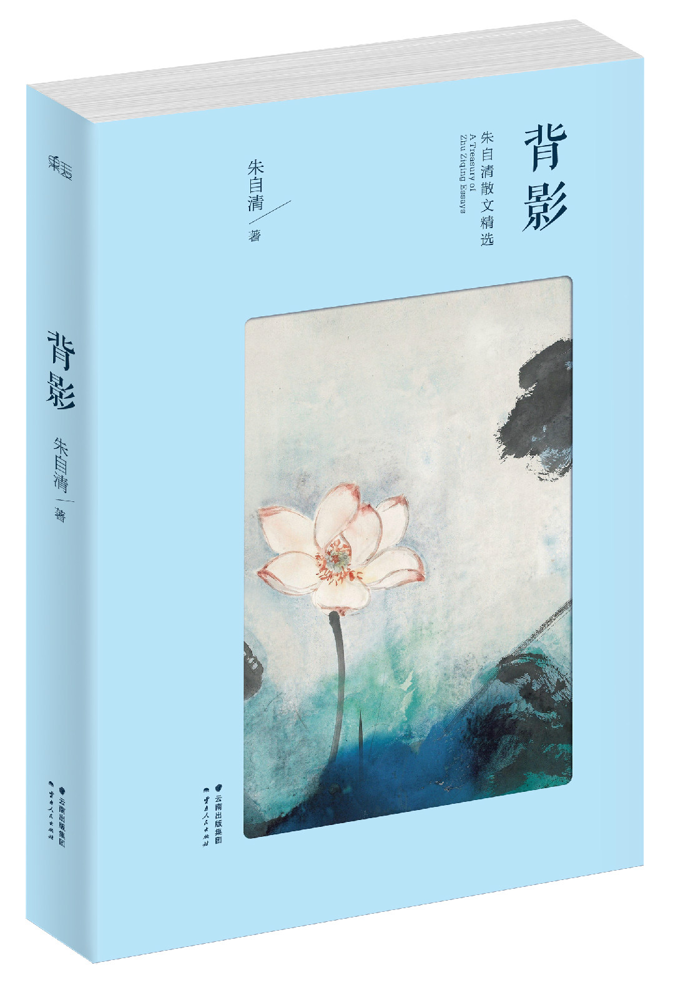
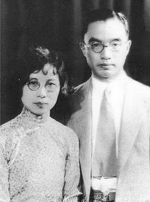
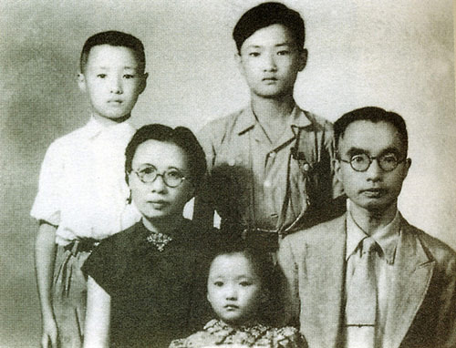

0812朱自清

69年前的今天，荷塘月色下的背影，没被饿死的朱自清病逝

（万象历史特约作者：东西望）

69年前的今天，1948年8月12日，荷塘月色下的背影，没被饿死的朱自清病逝

朱自清（1898年11月22日－1948年8月12日），生于江苏东海，原籍浙江绍兴，长大于江苏扬州，故称“我是扬州人”。现代中国著名诗人、散文家、学者。

朱自清以散文闻名，其中成就较高的是《背影》、《荷塘月色》、《桨声灯影里的秦淮河》、《绿》等抒情散文。其中《背影》描述了在家庭遭变故的情况下，父亲送别远行儿子的经过。文章通过朴素真切的语言，表现了父亲的一片爱子之心和儿子对父亲的愧疚和怀念之情，是中国现代散文史上的名篇。

需要澄清的是，人们普遍认为朱自清死于饥饿，是因为毛泽东的文章《别了，司徒雷登》中的一段话：“朱自清一身重病，宁可饿死，不领美国的救济粮。”这就是朱自清被“饿死”的出处。但这并非实情。朱自清死于严重的十二指肠溃疡导致的十二指肠穿孔，而并非死于饥饿。

哲学系的文艺青年

1898年，朱自清生于江苏省东海县，原籍为浙江绍兴，长大于扬州，自称扬州人。1916年（18岁），考入国立北京大学预科。第二年，就读于大学部哲学系，积极参加五四运动。1920年，毕业后，任教于杭州浙江省立第一师范。

1920年（22岁），文学研究会正式成立，其为早期会员之一。1922年，与俞平伯等人创办《诗》月刊，为新诗运动以来最早的诗刊，办七期后停刊。1923年，开始写作散文，处女作《桨声灯影里的秦淮河》一发表及获好评，周作人曾赞誉为“白话美术文的模范”。

温州中学的校歌校训

1923年2月（25岁），朱自清来到温州，在浙江省立第十中学（今温州中学）任教。他所撰的《十中校歌》，至今传唱不绝。其中的名句“英奇匡国，作圣启蒙”，已成为温州中学几十年来的校训。

期间，朱自清还写有《温州的踪迹》散文四篇，其中的名篇《绿》描写仙岩梅雨潭迷人景致，长期作为范文收入中学语文教科书。1924年，出版诗和散文集《踪迹》。1925年，主编《我们的六月》出版。

清华大学的散文大师

1925年（27岁），便到清华学校任教（后改名国立清华大学），开始从事文学研究，创作方面则以散文为主。1928年（30岁），第一本散文集《背影》出版，以平淡朴素而又清新秀丽的优美文笔独树一帜。1931年（33岁），留学英国，进修语言学和英国文学。

1934年（36岁），《文学季刊》、散文杂志《太白》创刊，为编辑人之一。1935年，编辑《〈中国新文学大系〉诗集》并撰写《导言》。出版散文集《你我》。

有骨气的爱国文化人

1938年（40岁），到昆明，任国立西南联合大学中国文学系主任，当选为中华全国文艺界抗敌协会理事。在抗日战争中，与叶圣陶合著《国文教学》等书。1946年，主编新生报《语言与文学》副刊。

1948年7月18日（50岁），他在《抗议美国扶日政策并拒绝领取美援面粉宣言》上签字。8月12日，因严重的十二指肠溃疡死于北平医院，终年49岁。朱自清被誉为有骨气的爱国文化人，毛泽东称赞他“表现了我们民族的英雄气概”。

死于饥饿的讹传

此外，需要澄清的是，人们之所以普遍认为朱自清死于饥饿，是因为毛泽东的文章《别了，司徒雷登》中的一段话：“朱自清一身重病，宁可饿死，不领美国的救济粮。”这就是朱自清被“饿死”的出处。但这并非实情。朱自清死于严重的十二指肠溃疡导致的十二指肠穿孔，而并非死于饥饿。

虽然当时朱自清的确是在《抗议美国扶日政策并拒绝领取美援面粉宣言》上签字，并拒领政府低价配额的美国面粉，这也确实对朱自清的家庭经济也有比较大的影响（此事每月须损失六百万法币），但是这并没有到影响朱自清一家的正常开销。

在他晚年的日记上，并没有苦于食物短缺的记载。而且，就在他离世前14天，他还在日记里提醒自己：“仍贪食，需当心！”事实表明，朱自清一家当时是吃喝不愁的，但是因为严重的胃病，他不能多吃，却也忍不住吃多。贪食加剧了他的十二指肠溃疡病情，最终导致十二指肠穿孔，医治无效，不幸辞世。

散文史上的背影

朱自清以散文闻名，其中成就较高的是《背影》、《荷塘月色》、《桨声灯影里的秦淮河》、《绿》等抒情散文。其中《背影》为朱自清创作的一篇散文，描述了在家庭遭变故的情况下，父亲送别远行儿子的经过。文章通过朴素真切的语言，表现了父亲的一片爱子之心和儿子对父亲的愧疚和怀念之情，是中国现代散文史上的名篇。

然而，也有不少人批评他的文章。例如叶圣陶说《荷塘月色》等文，“都有点做作，太过于注重修辞，不怎么自然”。韩寒称：“我从不觉得《荷塘月色》是哪门子好文章，为什么编教材的置朱自清这么多好文章不选，偏选一篇堆砌词藻华丽空洞的《荷塘月色》？”洛夫也认为：“既空洞而又滥情。”

人民教育出版社出版的中小学语文教科书，曾先后收录《绿》、《春》、《背影》、《荷塘月色》等文。《背影》一文，也常年入选台湾的国文教科书。

（水木清华池塘边，荷花丛中的朱自清像）