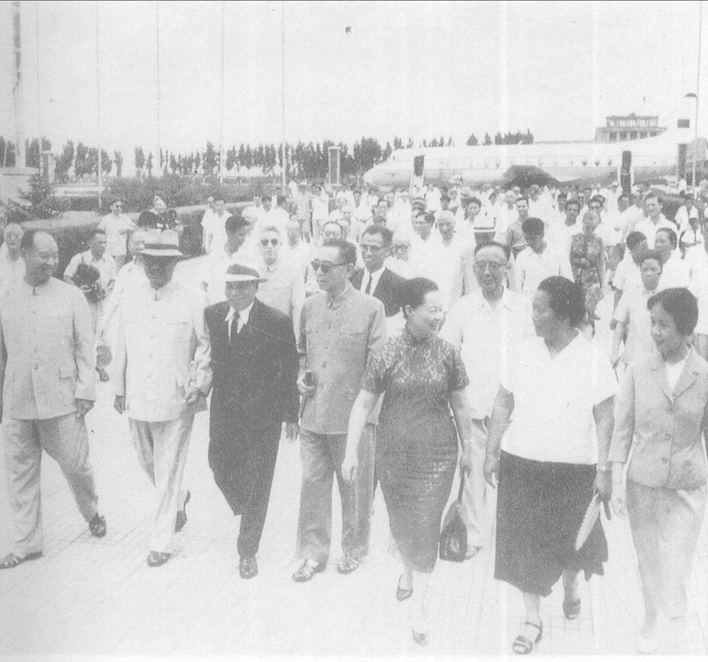
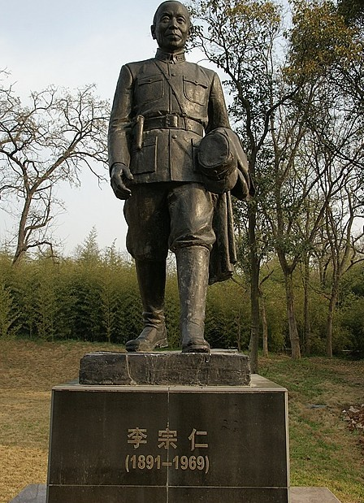

126年前的今天，从广西起步打到山海关、曾任民国代总统的李宗仁逝世于北京

（万象特约作者：一一）

126年前的今天，1891年8月13日，近代中国的支柱，台儿庄大捷的李宗仁生于桂林

李宗仁（1891年8月13日－1969年1月30日），广西桂林人，中华民国陆军一级上将，新桂系首领，曾任首任中华民国副总统、代总统。

他从排长做起，与白崇禧、黄绍竑统一了广西，组成“李白黄”的新桂系。一度逼退蒋介石、汪精卫，占据权力的中枢位置。他打败孙传芳，攻到山海关，逼张学良东北易帜，统一中国。新桂系一度占有大半个中国。

在中原大战中，兵败蒋介石。抗日战争时，任第五战区司令长官，指挥多次大战，在台儿庄大捷中名震一时。1948年，经国民大会当选中华民国副总统，后任代总统。国民党落败后，流亡美国16年后，回归祖国。

曾为李宗仁撰写回忆录的唐德刚认为，李宗仁“匹夫一人系天下安危”，他是“近代中国这座高楼大厦的一根主要支柱”。周恩来这样评价他：李将军一生做过三件大好事，第一是北伐，第二是台儿庄大战，第三是回归祖国。

（1965年，李宗仁回国，周恩来等人到机场迎接）

统一广西的新军阀

1891年8月13日，李宗仁出生于广西临桂县西乡村（今桂林市临桂区）。1908年（17岁），李宗仁考入广西陆军小学堂第三期，1911年毕业。1913年，广西陆军速成学堂毕业。1916年，参加护国军任排长，负伤升连长；再入湖南护法，负伤升营长，到1921年，晋升至统领（相当于团长）。

1923年10月（32岁），李宗仁与前陆小同学白崇禧、黄绍竑（桂系三雄）秘密加入中国国民党。1924年5月23日，李宗仁发表统一广西宣言。1925年夏，击败陆荣廷、沈鸿英等，统一了广西，成为新桂系军阀首脑。

见谁灭谁的新桂系

1926年夏（35岁），参加北伐，任国民革命军第七军军长。1927年7月初，武汉政府汪精卫派唐生智、张发奎两部共20余万大军东征南京。8月，新桂系联合何应钦成功逼迫蒋介石下野，促使南京与武汉两国民政府统一，史称“宁汉合流”。

蒋介石下野后，李宗仁指挥第七军，在白崇禧、何应钦配合下，在栖霞龙潭战斗中全歼了孙传芳的13个整建制师。孙传芳经此惨败后，北洋直系军阀从此淡出政坛。

宁汉合流后，李宗仁着手将汪精卫逐出南京，并讨伐唐生智，史称宁汉战争。不久击败唐生智，新桂系势力从广西、江南扩展到两湖，并进入广东，随后挫败张发奎在广州发动的政变。新桂系在军事上消灭唐、张两部后，发动强大政治攻势，汪精卫被迫于12月15日全体总辞职，新桂系主导国民政府。

二次北伐统一中国

1928年初（37岁），蒋介石借广州事变及“桂系排汪”造成的影响，得以复出。新桂系军队被迫撤离南京、江南等地。蒋与宋美龄结婚时，李宗仁是国民政府全体中央委员中唯一未送结婚贺礼的人。

1928年4月，李宗仁为第四集团军总司令，指挥两湖各部队北上，开始“二次北伐”，讨伐奉系军阀张作霖。第四集团军进至北平、天津、山海关。桂系控制的地区从两广、两湖至平津，总兵力达20余万人。不久，张学良宣布东北易帜，北伐的结束，国民政府完成形式上的统一。

功亏一篑的中原大战

1929年3月（38岁），以李宗仁、白崇禧为首的桂系军阀与蒋介石之间爆发蒋桂战争，结果新桂系战败，逃回广西。蒋介石以“叛乱党国”的罪名，开除李宗仁党籍。此后，李宗仁长期盘踞广西，与蒋介石对抗。

1930年5月（39岁），新桂系北上参加冯玉祥、阎锡山反蒋的中原大战，自桂林北上后势如破竹，6月初攻占长沙、岳阳，迫近武汉；但终因黄绍竑态度犹疑，行军迟缓，致使新桂系部队被各个击破。新桂系、冯玉祥、阎锡山三大派别在中原大战中都被击败。

台儿庄大捷的焦土抗战

1931年（40岁），发生九一八事变，蒋介石于12月15日通电辞职下野。1932年，发生一二八事变，中国国民党各派系谋求妥协，一致抗日。1932年4月，李宗仁出任广西绥靖公署主任，白崇禧任副主任，和广西省政府主席黄旭初形成“后李白黄”。

1936年4月（45岁），李宗仁发表《我的主张——焦土抗战》一文，认为中日全面战争一旦爆发，最后的胜利者必是中国，号召全国军民宁为玉碎，不为瓦全，化全国为焦土，用大刀阔斧来答复侵略者。

1937年7月，抗日战争爆发，李宗仁担任第五战区司令长官。在台儿庄会战中，亲临前线督战指挥，获得国民革命军抗战中首次大胜。同年，先后指挥徐州会战、武汉会战等。徐州大突围中，李宗仁成功指挥60万大军突围，没有出现淞沪会战、南京保卫战撤退时的混乱。

1943年底（52岁），蒋介石将李宗仁调为军事委员会委员长，明升暗降，削去兵权。

成功竞选为副总统

1945年（53岁），抗战胜利后，李宗仁被任命为北平行辕主任，名义上统帅冀、鲁、察、绥、热、平、津、青五省三市。实则并无调兵遣将的实权。1947年底，李宗仁三度拒绝指挥东北战事，坚持参选中华民国副总统。

1948年3月（57岁），国民大会召开，选举行宪后的第一任总统和副总统。4月29日，李宗仁在蒋介石的反对和压力下，最终以1438票对1295票，击败孙科，当选为副总统。

1949年1月21日（58岁），蒋介石下野，李宗仁代总统职，声明愿就毛泽东所提八项条件开始商谈。后谈判破裂，解放军渡过长江，国民党彻底失败。1949年12月5日，李宗仁从香港离职赴美，此后滞留在美国长达16年。

（李宗仁和蒋介石的就职礼）

流亡16年后重回祖国

1954年3月（63岁），台湾国民大会经投票表决，罢免李宗仁的副总统职务。李宗仁成为流落异乡的一介平民。1965年7月20日（74岁），李宗仁和夫人郭德洁，终于回到北京。在机场，周恩来、彭真、贺龙、郭沫若等111名政要亲自接机。26日上午，毛泽东在中南海接见。

1968年8月以后，身体每况愈下，当年国庆的天安门城楼检阅观礼也未能出席。1969年1月30日，李宗仁病情恶化，溘然长逝，享年78岁。周恩来曾这样评价：李将军一生做过三件大好事，第一是北伐，第二是台儿庄大战，第三是回归祖国。

（1966年10月1日，毛泽东与李宗仁在天安门城楼上）

