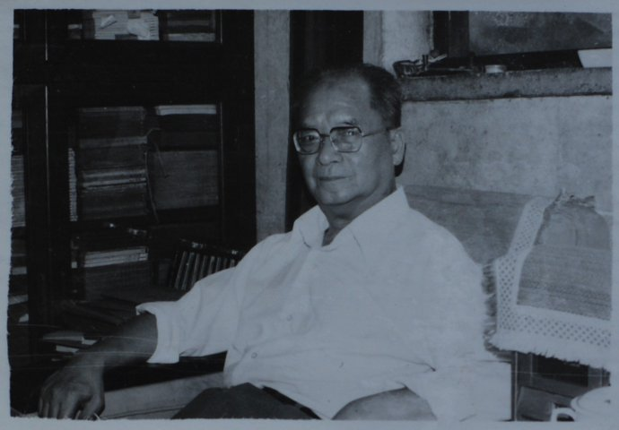
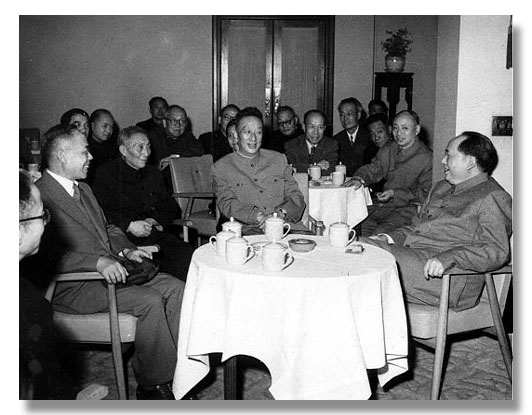

## 25年前的今天，让学霸哑口无言、中国地图开疆第一人谭其骧逝世

### 

谭其骧（1911年2月25日－1992年8月28日），浙江嘉兴人，是中国著名历史学家、中国历史地理学主要奠基人。

他师从顾颉刚先生，精于考据，勇于疑古，敢于提出自己的学术观点，曾经在建国后质疑当时文化部长郭沫若关于曹操和《胡笳十八拍》的研究成果，郭沫若罕见的以沉默回应。

谭其骧是中国历史地理学主要奠基人，从某种意义上来说，谭其骧是中国地图开疆第一人，在其著作《历史上的中国和中国历代疆域》提出了版图中国论的概念，以清朝鼎盛时的疆域作为中国的范围。该观点成为大陆历史观的标准之一。

谭其骧主编的《中国历史地图集》，从1950年代初开始编撰，直到1980年代初才开始正式出版，是当代中国历史、历史地理研究的最重要的参考资料之一。

#### 生平

1911年2月25日，谭其骧出生于浙江嘉兴书香门第，以后进家塾、小学、秀州中学。

1926年（15岁），高中未毕业，离校后在上海考入上海大学。1927年，因四一二事变，上海大学被封，转入暨南大学历史系，得到清华百年历史上四大哲人之一潘光旦的赏识。1930年（19岁），大学毕业后，考入燕京大学读研究生。师从顾颉刚，两年后获硕士学位。此后先后任教于辅仁大学、北京大学、燕京大学、清华大学等。

1940年春，抗战期间，到贵州浙江大学任史地系任教。1946年，抗战结束，随浙大回到杭州。1950年，浙江大学被迫停办历史系，他转到上海复旦大学。1951年，加入九三学社。

1955年，经吴晗推荐，主持《中国历史地图集》的编绘。1957年至1982年间，任复旦大学历史系主任，其间创立了历史地理研究室。1978年2月，谭其骧突发脑血栓，半身不遂。1980年，成为中国科学院院士。

1982年至1986年，历史地理研究室成为历史地理研究所，谭其骧出任所长。1982年至逝世，他又主持了《中华人民共和国国家历史地图集》的编绘。该图集于2014年出版，获得第三届中国出版政府奖。1983年，加入中国共产党。1991年，被美国传记研究所列为最近25年间对世界有重大影响的500位人物之一。

1992年8月28日，因病医治无效，在上海逝世，享年82岁。

#### 地图开疆第一人

谭其骧在其著作《历史上的中国和中国历代疆域》提出了版图中国论的概念，他认为：“现代的中国人不能拿古人心目中的"中国"作为中国的范围。也不能拿今天的中国范围来限定我们历史上的中国范围，而是清朝鼎盛版图的范围为中国历史上的范围，在这个范围之内活动的民族，都是中国史上的民族；在这个范围之内所建立的政权，都是中国史上的政权。”该观点成为大陆历史观的标准之一。

谭其骧认为中国行政区划不合理，表示：“中国现行的沿袭元明清旧制的一级行政区划极不合理，一是许多省区不符合自然、经济和人文区域，二是多数省区太大。这种区划状况不仅阻碍经济发展，并且也不利于社会和谐、政治稳定，有必要予以改变。”

“大跃进”时期，在大批树木被砍去炼钢时，谭其骧撰写了论黄河安流的文章，指出黄河决徙病源在于植被遭到破坏，从而导致严重水土流失。《何以黄河在东汉以后会出现长期安流的局面》一文，提出以牧业为主的民族迁入中游地区和人口锐减造成农垦区缩小，客观上减少了水土流失，是黄河长期安流的决定因素。

谭其骧主编的《中国历史地图集》，从1950年代初开始编撰，直到1980年代初才开始正式出版，是当代中国历史、历史地理研究的重要参考资料。此外，谭其骧还主编了《简明中国历史地图集》、《中华人民共和国国家历史地图集》。并有《长水集》、《长水集续编》等历史论文集。

#### 与学霸论战曹操

1959年，郭沫若写了多篇文章，提出为曹操翻案。谭其骧觉得其中不少论据站不住脚，在《文汇报》上发表了商榷文章《论曹操》，引发大争议。在这篇论文中，谭其骧首先指出，对曹操不存在翻案的问题。因为“自古及今，果然有很多人说曹操坏，却也有不少说他好，也有人在某些方面认为他好，同时在某些方面又认为他坏的”。

谭其骧具体论述了曹操的历史贡献，归纳为四项大功：1．结束了汉末豪族军阀间的混战，统一了北方。2．征服了乌丸和鲜卑，保障了边境的安宁。3．打击了名门豪族，在一定程度上抑制了兼并，澄清了吏治。4．恢复了生产，在一定程度上还发展了生产。

同时指出了曹操的四项罪过：1．打了农民起义军。2．曹操一生打的仗大多数属于统治集团间内部的战争。为了结束混战，求取统一，这些战争是不可避免的，但他在战争过程中杀人太多，这也不能不算是一大罪。3．摧抑豪强兴办屯田诚然对人民有利，但所谓屯田制，实际上是一种用军事手段强制束缚军民在土地上进行官六私四或对半分的高度剥削的制度。4．在道德品质方面，他的忌刻残忍实在也是不可饶恕的。

并得出结论：“总之，曹操是一个有优点、有缺点，功劳很大，罪孽也不小的历史人物。从全面看问题，总的评价应该是功过于罪。但我们不能，也用不着因为他有功而讳言其罪。过去有许多人并没有把他说成是罪过于功，所以这案子基本上无需翻。若一定要把他犯的罪也翻过来，说是并无其事，或虽有其事，但算不得罪，那恐怕是翻不过来的，因为那是历史事实。”

郭沫若对不同意见一般都要著文加以反驳，但对谭其骧这几篇论文居然始终保持沉默，没有作出任何反应。这对于学术地位和政治地位都远远高于谭其骧的郭沫若来说十分罕见。

