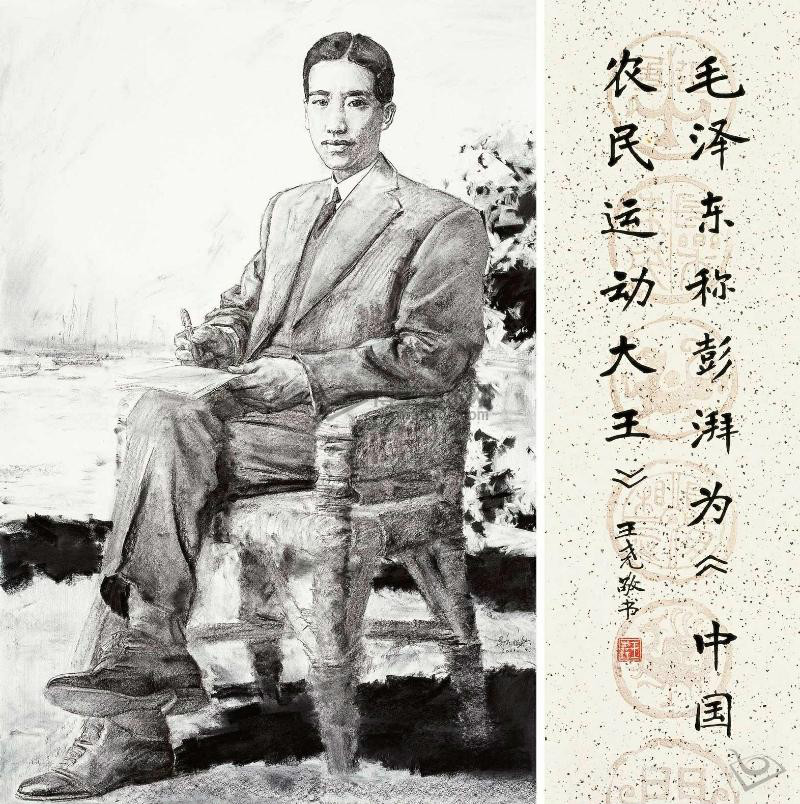
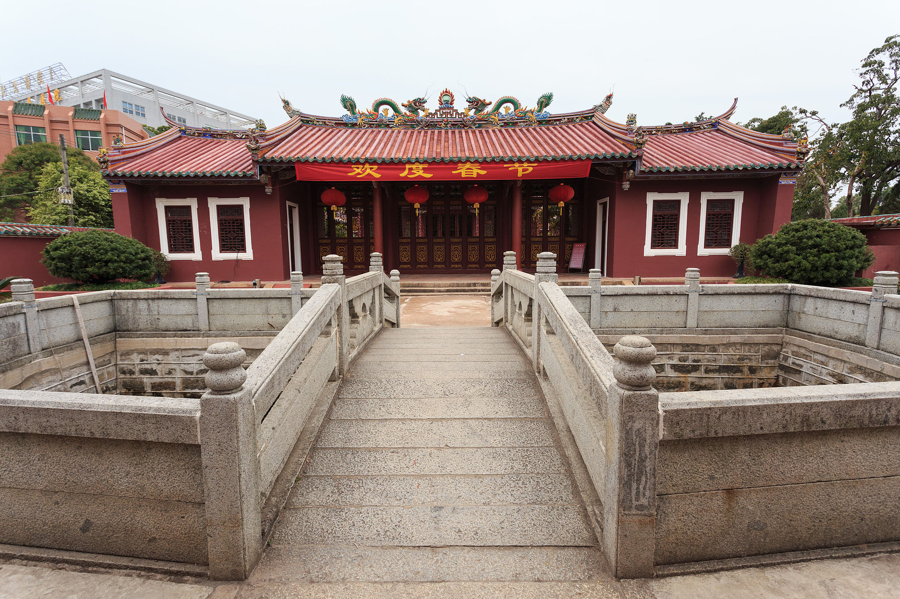
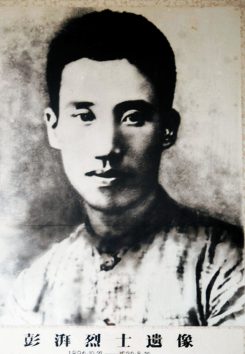

## 88年前的今天，出生地主家庭、被毛泽东称为中国“农民运动大王”的澎湃英勇就义

（万象特约作者：一一）

88年前的今天，首建苏维埃，出身地主的农民运动大王彭湃英勇就义

彭湃（1896年10月22日－1929年8月30日），广东海丰人，中国共产党早期领导人之一，民国时期中国农民运动的领导人，毛泽东称其为中国“农民运动大王”。

澎湃虽出身地主，一生却与“农”永不分离。他认为土地和农民问题是最根本的问题。组建了中国第一个农民协会，开办了广州农民运动讲习所。完成了第一部农民运动著作《海丰农民运动报告》。成立了第一个中国苏维埃地方政权——海陆丰工农兵苏维埃（工农兵民主）政府。制订和颁布了“土地革命法规”，主张“一切田地归农民”，实践“耕者有其田”。1929年，因叛徒告密，被捕牺牲。

#### 由基督徒转变为社会主义革命者

1896年10月22日，彭湃生于广东省汕尾市海丰县，出身地主家庭，但受母亲的穷苦农家身世影响颇深。10岁时，父亲病逝。有兄弟姐妹七男四女。1912年（17岁），结婚。1913年，进县立海丰中学读书。

1917年（21岁），前往日本留学，就读于早稻田大学政治经济科。留日期间亲历了日本发生的米骚乱，因参加反对日本瓜分侵略中国的集会游行被日本警察殴伤、列入黑名单。最终由基督徒转变为社会主义革命者。

1921年夏（25岁），返回中国。应海丰当地学联会学生的请愿，彭湃出任海丰县教育局局长。同年，加入社会主义青年团。1922年夏，由于组织学生游行庆祝“五一劳动节”，被撤去海丰县教育局长职务。

#### 第一个农会和第一部农民运动著作

1922年7月29日晚上（27岁），彭湃与另外5位农民组成全国第一个农民协会——六人农会。为发动、组织农民，成立农会，当众烧毁自家祖传田契，将自己的农田分给农民无偿耕作，同时自己过着俭朴的农民生活。

1923年1月1日元旦，领导成立海丰县总农会，并当选为会长，时会员达2万户，农会人口有10万人，约占全县人口的四分之一。同年5月广东省农会成立，彭湃获推选为广东省农会执行长。

1924年，孙中山在广州召开了国民党第一次全国代表大会，确定了“联俄、容共、扶助农工”的三大政策，彭湃以个人身份加入国民党，出任国民党中央农民部秘书。同年6月30日，开办广州农民运动讲习所，彭湃担任第一届和第五届农讲所主任。

彭湃在创办主持农讲所期间，完成了《海丰农民运动报告》，在国民党中央农民部主办的《中国农民》上连载。这本书是中国共产党最早的一部农民运动著作，对后来毛泽东写的一系列关于农民问题的文章包括《湖南农民运动考察报告》，产生了重要的影响。

#### 南昌起义和第一个苏维埃政府

1927年4月12日，四一二事变发生，彭湃因在武汉政府任职，被南京国民政府通缉。4月底，中国共产党第五次全国代表大会在武汉召开，彭湃当选中央委员。7月2日，汪精卫武汉政府宣布解散共产党机关。

八一南昌起义期间，彭湃参加前敌委员会，参与领导南昌起事，撤出南昌后随军南下广东 ；在8月7日举行的中共中央紧急会议“八七会议”上，当选为临时中央政治局的正式委员。

1927年10月，发动海陆丰暴动，占领海丰、陆丰两县。1927年11月21日，成立海陆丰工农兵苏维埃（工农兵民主）政府，为最早的中国苏维埃地方政权，形成割据势力。由于彭湃在海陆丰地区有着非常高的威望，是实际上的最高决策者。他当时的职务是“中国共产党东江地区特委书记”。他制订和颁布了“土地革命法规”，主张“一切田地归农民”，实践“耕者有其田”。

#### 离开广东

苏维埃政府成立后，40万人口的海陆丰地区，有超过5万名民众逃离，到香港、广州等地避祸。1928年2月29日，苏维埃政权被政府军击溃，彭湃率领残部撤至大南山地区。同年10月，受上海的中共中央指令，彭湃离开广东，绕道香港转往上海。

1928年7月，彭湃在中共六大上当选为中共中央政治局委员，同年底任中共中央农委书记兼江苏省军委书记。

#### 牺牲和纪念

1929年8月24日，由于军委秘书白鑫叛变，彭湃、杨殷、颜昌颐、邢士贞、张际春5人在上海公共租界白鑫家中举行江苏省军委会议时被捕。彭湃在狱中屡遭酷刑，毫不屈服。8月30日，被淞沪警备司令部秘密枪杀于上海龙华刑场。当时刊登在上海报刊上的法院判决文是判处彭湃、杨殷等八年的有期徒刑。

同年11月11日夜，周恩来组织陈赓、顾顺章等中共中央特科人员在法租界霞飞路和合坊将白鑫杀死。

为纪念彭湃、杨殷，当时中国共产党曾在其根据地的许多地方建立了“彭杨红军学校”，即现在的中国人民解放军国防大学的历史前身之一。彭湃曾就读过的海丰县立中学改名为彭湃纪念中学。

1928年至1933年，彭湃家人共有八人丧生，其中六人被中华人民共和国追认为革命烈士。彭士禄，彭湃次子，中国工程院院士，中国核动力科学家，“中国核潜艇之父”，中国核电站主要设计者领导者。

