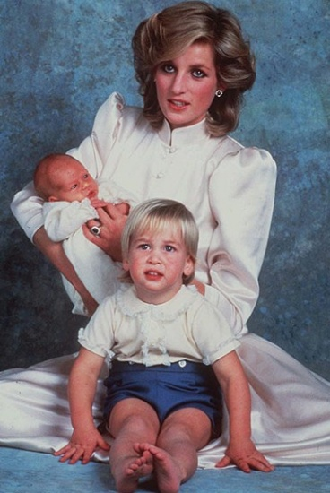
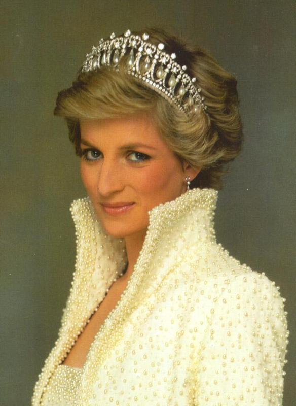
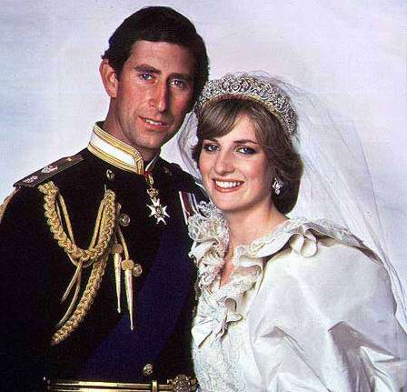
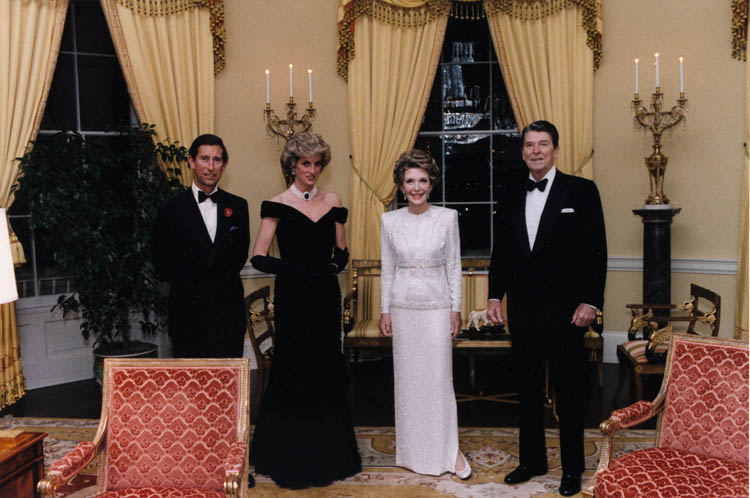
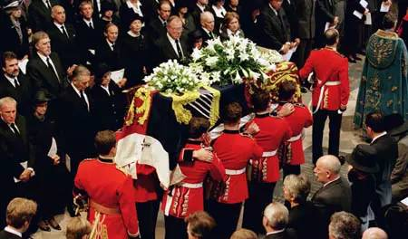

## 20年前的今天，英国王储查尔斯的第一任妻子、“人民的王妃”戴安娜因狗仔队追逐导致车祸死亡

戴安娜是英国王储查尔斯的第一任妻子，他们的结婚大典受到了全球的瞩目，被称为世纪婚礼。但对于这位从小父母婚姻不幸的王妃来说，这个像童话一样的婚姻也是骗人的。由于性格喜好完全不同，导致两人不和。查尔斯和旧情人藕断丝连，令这场英国王室打造出来的世纪婚礼，最终以离婚宣告失败。

感情破裂后的戴安娜一心一意为世界慈善做贡献。她张开双臂拥抱所有的人，哪怕是艾滋病人。她对这个世界的爱温暖了人们，所以在她逝世二十年后依旧为世人所尊敬。或许走出婚姻后的戴安娜才是她真正的模样， 她的公益善举，颠覆并且拯救了英国王室高高在上的冰冷形象，被英国首相布莱尔盛赞为“人民的王妃”，也被英国人民评为“最伟大的100名英国人”第三位。

#### 出身贵族的破裂家庭

1961年7月1日，戴安娜出生于英国贵族家庭，是奥尔索普子爵约翰·斯宾塞的第四个孩子。1967年，父母婚姻因母亲不忠而破裂，戴安娜及姐弟的抚养权归父亲所有。

1970年（9岁），戴安娜被送到私立女校就读。她虽在校内受欢迎，她的成绩并不是很好，但她在跳舞、音乐及游泳方面都有出色的表现。那时戴安娜的理想是成为一位舞蹈家。

18岁时，父亲送她一栋住宅当作成年礼物，同时戴安娜投身社会工作。

#### 10亿人观看的世纪婚礼

1977年（16岁），戴安娜和查尔斯王子在一个派对中认识，同年11月，戴安娜被邀参加查尔斯王子的30岁生日派对。1980年7月，查尔斯王子的友人邀请戴安娜到郊区度假一星期，1个月后，查尔斯王子认定戴安娜是理想的王后，他邀请戴安娜到温莎堡参观，并于一间育婴室向她求婚，戴安娜答应了。

1981年7月29日上午11时正，查尔斯王子和年仅20岁的戴安娜的世纪婚礼于圣保罗座堂举行，共有2650位宾客被邀，共十亿人收看了电视直播。戴安娜盛装打扮，她婚纱的尾部共8米长，戴着斯宾塞的家族冠冕，由她父亲带领她到查尔斯王子手中。

1982年6月21日，戴安娜于晚上9时03分在伦敦圣玛丽医院生下威廉王子 。1984年9月15日，戴安娜在伦敦圣玛丽医院生下第二个孩子哈利王子。

戴安娜在婚后获得“威尔士王妃殿下”的头衔。她成为英国王室的明星，常遭到“狗仔队”贴身追访，而她的打扮、衣着甚至举止都成为英国女性模仿对象之一。由于受不住巨大压力，戴安娜王妃常传出与王室家人不和之消息。而王储查尔斯和旧情人藕断丝连，也令戴安娜的婚姻在短短数年间迅速完结。

#### 天使般的人民的王妃

在慈善的世界里，戴安娜是几乎可以与特蕾莎修女并驾齐名的“天使”。她资助筹建了20多个慈善基金会，出访过北非、印度、安哥拉、巴基斯坦等贫困地区，被联合国授予人道主义奖。她的公益善举，颠覆并且拯救了英国王室高高在上的冰冷形象，被英国首相布莱尔盛赞为“人民的王妃”。

1987年6月，戴安娜将她所拍卖的79件服装所得350万英镑，全部捐给慈善事业。她的品行深深地感动了普通人，尤其是苦难之中的人们。

美国总统比尔·克林顿评价道：“在1987年，一个许多人还相信艾滋病可以通过轻微接触就能传染的年代，戴安娜王妃坐到了一个艾滋病患者的病床上，握住了他的手。她告诉了世界艾滋病患者需要的不是隔离，而是热心和关爱。”

#### 离婚了依然是王妃

1992年12月9日，查尔斯王储和戴安娜王妃正式分居。1996年8月28日，两人正式离婚。离婚后，她因身为未来王储的母亲，获准继续保有威尔士王妃的头衔，却无殿下（HRH）的皇室头衔。

1997年，戴安娜王妃与埃及富家子多迪·法耶兹在纽约度假时认识，二人关系被英国媒体曝光。

#### 狗仔队眼中的车祸

1997年8月30日晚，戴安娜与男友多迪乘坐一辆奔驰W140 S280，在法国巴黎阿尔玛桥隧道中遇上狗仔队追踪，失控越过行车线撞向灯柱和石墙后爆炸。戴安娜和多迪均在车祸中死亡。1997年9月6日举行葬礼，安葬在她父亲的家族墓地，北安普敦郡的奥尔索普（Althorp）。

这场车祸在全球造成极大震惊，其中一个原因是，事发时在场狗仔队在车祸后，只顾在车祸现场不停拍下照片，而未及时协助抢救。而狗仔队和媒体操守问题，也因此成为讨论焦点。而事发车辆除司机、戴安娜和多迪外，还有一名护卫，是车祸中唯一生还者。不过在获救后一直拒绝回应事件，使得引来不少猜测。

1999年，法国司法部公开车祸调查结果，指出车祸是缘于肇事司机酒后驾驶引致。但同年2月，多迪父亲公开声称这次车祸是一场政治阴谋，认为是英国军情六处受到伊丽莎白二世女王和菲利普亲王的指示，策动车祸谋杀戴安娜和多迪。此言论在英国亦引来巨大回响。

2006年12月14日，英国警方公布戴安娜王妃及其男友多迪的死因调查报告，认为这起车祸纯属事故，没有任何证据证明车祸与谋杀相干。车祸发生时，司机确属酒后超速驾驶，车上的人也未系安全带。而法国死因庭也在2005年5月裁定死于交通意外。

#### 不被打扰的宁静

戴安娜生前缺乏安全感，她说对弱小的人有一种亲近感。她死后，她最亲密的弟弟按照自己的梦境把姐姐安置在一个人工湖的小岛上，所有来采访的媒体都止步于岸边，只能远远地看到湖中心的一片绿荫。只有家人可以登陆小岛，在这里戴安娜获得了她一生所渴求的安全感与安宁。

在岛的一侧放置有戴安娜的纪念碑，上面刻着她的一段话，“帮助这个社会最软弱无助的人，是我最大的快乐，这是我生活的内容，也是命运的安排。遇到任何困难，只要你向我呼喊，无论我身在何处，都将向你飞奔而去。”

1999年，时代杂志将戴安娜评为20世纪100最重要的人。2002年，戴安娜在BBC的调查结果中名列“最伟大的100名英国人”第三位。

