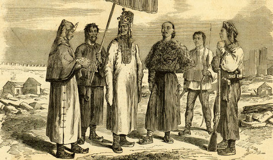

## nnnn姓名（资料）

### 成就特点

- 天京之变被杀
- 太平天国九千岁，东王
- 太平军由广西进军至南京的实际指挥者
- 不识字的烧炭工
- 天父下凡

### 生平

杨秀清（1823年－1856年），原名嗣龙，广西桂平紫荆镇平隘新村（今东王冲）人，汉族客家人，原籍广东嘉应州。依靠耕林烧炭为生。太平天国重要领袖之一，被天王洪秀全封为五王之一的东王，称九千岁。在1856年的“天京之变”中被洪秀全命韦昌辉、秦日纲等人所杀。

封号全称：真天命太平天国传天父上主皇上帝真神真圣旨劝慰师圣神上帝之风雷禾乃师赎病主左辅正军师后师殿中军兼右军东王九千岁

【天父下凡】

杨秀清早年生活困苦，5岁父亲去世，9岁母亲去世，由伯父养大，失学不识字，以耕种、伐林和烧炭为生，一早加入拜上帝会。

1848年春，拜上帝会的领导人之一冯云山被清朝官府禁锢，洪秀全前往广州营救。当时会内人心不稳，杨秀清假装“天父下凡”（降乩）安抚信众。事后冯云山获释，洪秀全回到广西后承认杨秀清可以“代天父传言”，从此杨便进入拜上帝会领导层。

在1851年1月11日洪秀全生日这一天，拜上帝会众在金田村“恭祝万寿”起义，建号太平天国。

【正军师】

金田起义后，洪秀全在1851年封杨秀清为正军师。

1851年底，洪秀全在永安分封诸王，杨秀清领东王封号，并担任太平军统帅，正式掌管兵权。

同年封杨为东王，其他四王皆归东王节制。自从南王冯云山及西王萧朝贵相继战死后，权力更加集中在杨秀清一人身上。

【永安突围】太平军攻克永安后，清朝又调动大军来围困，并收买太平军军帅周锡能，准备里应外合攻破永安州城。获知情报的杨秀清假托“天父下凡”，锁拿周锡能，揭发他投敌的事实。这次谋反案的情报获知及应对处理，破坏了清军打算里应外合攻破永安的计划

1852年4月，杨秀清指挥太平军从永安胜利突围，北取桂林，途中在龙寮岭大峒山谷地成功伏击并歼灭了清军四个总兵共二千余兵力。后进攻桂林受阻，杨秀清转而率军北取全州，准备进入湖南。因途中遭遇埋伏，损失惨重，加之南王冯云山牺牲，杨秀清被迫改变北上路线，转而攻取道州、江华、永明等城镇。6月，太平军进入湖南。

1852年6月，为号召全国各地革命势力合力反抗清王朝，杨秀清与西王萧朝贵会衔发布了《奉天诛妖救世安民谕》、《奉天讨胡檄布四方谕》和《救一切天生天养谕》共三篇檄文，声讨清王朝。

【进军江南】

1852年7月，杨秀清率太平军围攻长沙。2个月后，因长沙久攻不下，领导集团内部对下一步战略行动产生分歧。杨秀清分析形势，提出进军江南的战略方针，得到了包括天王洪秀全在内的大多数领导人赞同。  这次战略方针的制订，将太平天国起义推向了全国范围。

12月，杨秀清带领太平军从水陆两路进攻武昌、汉阳，次年1月攻占两地。1853年3月，杨秀清指挥太平军沿长江东下进抵南京，并于11日后将其攻占，至此，进军江南的计划完成。

【定都和北伐西征】

杨秀清是太平军由广西进军至南京的实际指挥者，战功显赫。当太平军攻下南京后，天王洪秀全打算再攻取河南定都，而杨秀清则属意建都南京，最后杨的意见被采纳。

1853年初，建都南京后，制定太平军下一步战略为太平天国北伐和太平天国西伐两路并进。前者全军覆没，后者虽获得有限战略目标，然而未能尽歼清军主力。

【破江北、江南大营】

1853年底，在太平军主力投入北伐和西征战场的时候，清军开始在天京外围囤积兵力，构建江北、江南两座大营，并对天京发动不间断的进攻。为改善天京处境，杨秀清决定从西征战场抽调部队，摧毁两座大营。

1856年2月，燕王秦日纲破江北大营。

连月征战下，这支部队十分疲劳，破江北大营后秦日纲本想率兵回天京休整，但杨秀清考虑到江南大营势孤，应一鼓作气将其攻下，于是严令秦日纲继续进攻江南大营，即使陈玉成、李秀成申述也没能动摇他的决心。1856年6月，太平军攻破江南大营，威胁天京长达3年的江南、江北两座大营终被摧毁。

1856年太平军攻破江南大营后，杨秀清声望一时无两，集教权、政权、军权于一身的他实质上已经是太平天国的最高统治者

在太平天国前期，天王虽然地位在各王之上，然而在制度上是一个虚位元首，实际权力在正军师东王杨秀清手上。杨秀清不识字，由东殿官吏协助处理文书，由杨负责决定。虽然军政命令在形式上要由军师奏请天王降旨，实际上由杨秀清决定，天王从不否决。此外，杨秀清多次假托“天父下凡”传令，逼使天王听从杨的命令。杨秀清随着功高而变得骄横，与天王和其他诸王的矛盾逐渐加剧。

【天京事变】

到1856年8月，攻破江南大营后，杨秀清以此大功为由，假借代天父传旨，要求洪秀全把他由“九千岁”加封为“万岁”。

洪秀全假装同意，为以示庆祝，颁封日推延至杨秀清生日（公历当年9月23日）时正式封万岁。洪秀全其后密诏，要领兵在外的北王韦昌辉、翼王石达开等人诛杀杨秀清。

韦昌辉在9月1日到天京，与燕王秦日纲在夜间入城，2日凌晨突袭东王府，杨秀清、其家人及大量东王部属被杀。在处理东王余下部属时，诸王设下了圈套，宣称天王降诏指责北王及燕王在对付东王时过度滥杀，需要受杖四百，诱使大批东王部属观刑，取得他们信任及弃械后，乘机将他们全部杀害。屠杀并未因此而终止，不少人因与东王有些关系，甚至只是款待用膳，亦遭屠杀，死亡人数多达2万余，是为“天京之变”。

北王及燕王在同年被杀，后来洪秀全把杨秀清的“图谋篡位”罪名平反。洪秀全追念杨秀清的功绩，将其忌日定为“东王升天节”，又把自己第五子洪天佑过继给杨秀清，称为幼东王。

今南京瞻园，即为杨秀清东王府旧址，现园内设立太平天国历史博物馆。

【评价】

杨秀清的战略主张并非没有缺点，诸如定都金陵，偏安江南，分兵北伐及西征以致分散太平军有生力量。但他是一位雷厉风行，强而有力的政军主事者，是太平军不可缺的核心人物之一。李秀成的《李秀成自述》中可鲜明地看出他的影响：“东王佐政事，事事严整，立法安民……严严整整，民心佩服”，与天京之变之后的“人心改变，政事不一，各有一心，朝中之事，并未实托一人，人人各理一事”形成强烈对比。

杨秀清在上帝教与儒教问题上，亦预见当中的矛盾或会引发传统士大夫势力的反对。1854年眼见湘军力量开始出现时，他假借上帝之口，要求承认儒教经典的基本美德，以图缓和太平天国和传统儒家的矛盾，这与太平天国多年来经营的批判孔孟宣传大相胫庭，甚至直接违背洪秀全口述的天国异像。

由此可以窥见他的统御领导才能，但他亦因弄权而见诛。在杨秀清往后的日子中，他多次假借天父之口，侮辱诸王，甚至要诸王为他抬轿、深宵传召宣诏、甚至当众苛斥洪秀全、对诸王用刑，这些举动最终引起反弹。

杨秀清死后，洪秀全虽继续维持军师制，但对外姓诸王不再信任，大权牢牢为洪秀全及其同姓兄长把持，军师成一虚位之职，导致翼王石达开出走，太平天国自此走向衰亡。

太平天国忠王李秀成在《李秀成自述》中对杨秀清评价说：“东王佐政事，事事严整，立法安民，民心佩服。”

太平天国军师洪仁玕评论说：“过去东王在世时，拓土开疆，犹有日辟百里之势，而今进寸退尺，战胜攻取，大逊于曩时！”

### 照片

