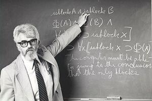
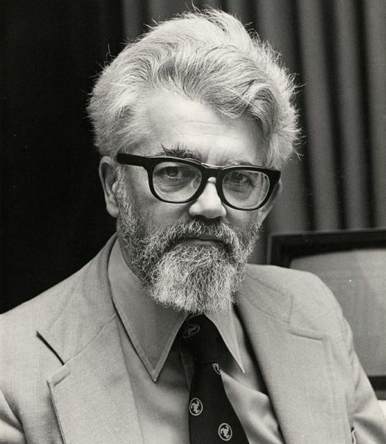

## nnnn姓名（资料）

### 成就特点

- 1971年获得图灵奖
- 1956年的达特矛斯会议上提出了“人工智能”这个概念
- 人工智能之父
- 出生共产党家庭

### 90年前的今天，人工智能之父约翰·麦卡锡出生于美国共产党家庭

#### 美国共产党家庭的大学生

1927年9月4日，约翰·麦卡锡出生于美国马萨诸塞州波士顿。他的父亲是爱尔兰裔美国人，母亲是立陶宛的犹太人，在联合通讯社当记者，后来在一家共产党报社工作。由于是共产党家庭，父母的工作性质决定全家需不断搬迁，从波士顿迁到纽约，然后又到了洛杉矶。

麦卡锡说他的童年平平淡淡。在读中学时，找到了加州理工大学的一份课程清单，自学了大学一年和二年的数学课程。1944年（17岁），他真的到了这所大学，免修头两年的数学课。1948年，获得加州理工学院数学学士学位。

#### 机器智能的好奇心

1948年9月，在读研究生时，他出席了学校主办的“行为的大脑机制西克森研讨会”。会上，大数学家、计算机设计大师冯·诺伊曼散发了关于自复制自动机的论文。尽管当时还没有提出机器智能的概念，但诺伊曼的报告却激发了麦卡锡的好奇心。

1951年（24岁），获得普林斯顿大学数学博士学位。然后分别短暂地为普林斯顿大学、斯坦福大学、达特茅斯学院和麻省理工学院供职。1962年-2000年，麦卡锡于一直在斯坦福担任教授，退休后成为名誉教授。

#### 提出人工智能

1955年，他联合香农（信息论创立者）、明斯基（人工智能大师，《心智社会》的作者，1969年图灵奖获得者）、罗彻斯特（IBM计算机设计者之一），发起了达特矛斯夏季人工智能研究计划。第二年正式启动，洛克菲勒基金会提供了极有限的资助。现在看来，这个项目不但是人工智能发展史的一个重要事件，也是计算机科学的一个里程碑。

1956年（29岁），在达特矛斯会议上，麦卡锡提出了“人工智能”一词，后被誉为人工智能之父。现在看来，那次讨论并没有实质上解决任何具体问题，但它确立了研究目标，使人工智能成为计算机科学中，一门独立的经验科学。

在达特茅斯会议前后，麦卡锡的主要研究方向是计算机下棋。下棋程序的关键之一是：如何减少计算机需要考虑的棋步。麦卡锡经过艰苦探索，终于发明了著名的α-β搜索法，使搜索能有效进行。该搜索法至今仍是解决人工智能问题中一种常用的高效方法。

（2006年，达特茅斯会议当事人重聚）

#### 人工智能的语言LISP

1957年（30岁），Fortran语言发布，这是第一个成功的高级语言。但在Fortran中不允许有递归，麦卡锡希望改进它，提出表处理语言LISP。1958年，麦卡锡到MIT任职，与明斯基一起组建了世界上第一个人工智能实验室。

麦卡锡发明了LISP语言（该语言至今仍在人工智能领域广泛使用），并于1960年将其设计发表在《美国计算机学会通讯》上。LISP是一种通用高级计算机程序语言，长期以来垄断人工智能领域的应用。

1962年，他离开麻省理工学院，前往斯坦福大学，并在那里协助建立了斯坦福人工智能实验室。

#### 获奖、获奖、获奖

1971年（44岁），他因在人工智能领域的贡献，获得计算机界的最高奖项图灵奖。1988年（61岁），获得了京都奖。1991年，获得了美国国家科学奖章。2003年，获得富兰克林学院奖章。

2011年10月24日晚上，约翰·麦卡锡，享年84岁。2012年，麦卡锡获得了斯坦福大学工程英雄称号。

#### 预言互联网文化将崛起

麦卡锡出生在一个共产主义家庭。他是一个读书狂，乐观主义者，言论自由的坚定支持者。他经常在USENET论坛上发表对国际事务的看法。他的主要观点是：“人类的物质发展是可取的和可持续的”。

麦卡锡看到了数学和数学教育的重要性，他在自己的宝马车上有一条标语：“不符合数学的，都是胡言乱语”。他预言互联网文化和社交网络在今后10年将扮演重要角色。

### 照片

