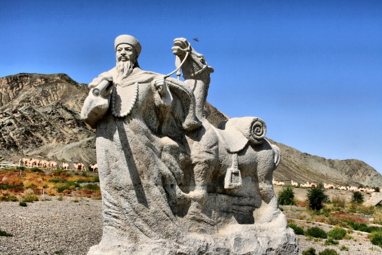

### 收复新疆的晚清四大名臣之一左宗棠去世

左宗棠（1812年11月10日－1885年9月5日），湖南湘阴人，清朝大臣，著名湘军将领，谥号文襄。一生亲历了湘军平定太平天国、洋务运动、同治陕甘回变、清军收复新疆之战等重要中国历史事件。

少时屡试不第，功名止于举人。后在征讨阿古柏时，破格敕赐进士，官至东阁大学士、军机大臣，封二等恪靖侯。与曾国藩、李鸿章、张之洞，并称“晚清四大名臣”。

### 生平

1812年11月10日（嘉庆十七年），左宗棠生于湖南湘阴。从小跟着祖父在自己家的梧塘书塾读书。6岁时，左宗棠攻读《四书》、《五经》等儒家经典，9岁时，左宗棠开始学习写八股文。

1826年，左宗棠参加湖南湘阴县县试，得到第一名。1827年，左宗棠参加长沙府试，得到第二名。此后力图进士，参加会试，三次不中，从此不再参加科举考试。

1837年，两江总督陶澍回乡省亲，他书写了一副对联“春殿语从容，廿载家山印心石在；大江流日夜，八州子弟翘首公归”，被陶澍视为奇才，进入陶澍幕府，并结为亲家。

1851年起，先后入湖南巡抚张亮基、骆秉章幕府，为平定太平军筹划。骆秉章重用左宗棠，对他百依百顺，因而出了名，连咸丰帝都知晓。于是要左宗棠出来任官，攻击太平军。

1856年（44岁），升任兵部郎中。1862年（50岁），由曾国藩举荐升任浙江巡抚，并组成中法混合军和扩充中英混合军与太平军作战，克金华、绍兴等地，升任闽浙总督。

1864年，克杭州，并受封一等恪靖伯。之后致力于剿灭东南太平军残部。

1866年（54岁），在福州马尾办船厂，也就是后来的福建船政局，并创办求是堂艺局，培养海军人才。

1866年，改任陕甘总督，其间创办兰州制造局。后创办甘肃织呢总局。此为中国第一个机器纺织厂，然而该厂从未盈利。

1867年2月，授钦差大臣督办陕甘军务，定“先捻后回”方略，次年参与平定捻军。

1873年12月14日（61岁），授协办大学士，次年9月18日授东阁大学士。

1875年4月，奉命以钦差大臣督办新疆军务，破例免予考试，赐封进士﹐并命入翰林，但因大军在外，著原职行事。

1876年（64岁），定“缓进急战”方略，指挥刘锦棠、金顺诸军镇压阿古柏、白彦虎，次年收复除伊犁地区外的新疆全部领土，并为新疆建省开发等预作规划。

1878年3月，由一等恪靖伯，晋二等恪靖侯。

1881年2月（69岁），入北京任军机大臣，10月改任两江总督。

1884年6月（72岁），入京任军机大臣，9月以钦差大臣督办闽海军务。

1885年9月5日，病故于福州，谥文襄。后归葬于长沙石门乡相竹村。有《左文襄公全集》行世。

主要事迹

【平定陕甘回乱】

这次战争的起因主要是回汉矛盾，战争主要表现为失去理智的民族仇杀。同治回乱自1862年起直至1873年结束，持续10余年后才被清廷完全镇压。叛乱在1862年开始，左宗棠在1867年接任陕甘总督前清军处于劣势。

左宗棠首先派刘松山进攻陕北，1868年十二月，刘松山军击败以陕北为根据地的汉人武装董福祥军，逾十万人归降，至1869年五月肃清陕西境内的回军。

1871年，左宗棠进驻甘肃。1872年十月，清军收复西宁城。白彦虎与陕回残军逃到新疆投靠阿古柏，后来又逃至沙俄并最后死于俄国。

1873年九月，甘肃西北部肃州回军首领马文禄在坚守肃州城两年后也接近粮尽，向左宗棠投降。左宗棠在同月处死马文禄，清军并杀死投降的回军一千多人及城内除老弱妇女外的残余回民数千人，同治陕甘回变就此告终。

【收复新疆始末】

1867年，来自今乌兹别克斯坦的阿古柏，建立“洪福汗国”盘踞新疆。

1872年七月，左宗棠率师进驻兰州，准备收复新疆。左宗棠深思后，采用“缓进速决”的战略，要打算展开积极而迅速的战斗。

“缓进”，就是积极治军。左宗棠用一年半的时间筹措军饷，积草屯粮，整顿军队，减少冗员，增强军队战斗力。

“速决”，就是考虑国库空虚，为了紧缩军费开支，大军一旦出发，必须速战速决，力争在一年半左右获取全胜尽早收兵。经过周密计划，左宗棠估算出全部军费开支共需白银八百万两。为防止意外开支，留有余地，左宗棠向朝廷申报一千万两。

皇帝御批道：“宗棠乃社稷大臣，此次西征以国事而自任，只要边地安宁，朝廷何惜千万金，可从国库拨款五百万，并敕令允其自借外国债五百万。”

左宗棠收复新疆的战略是先安定新疆回部，“欲收伊犁，必先克迪化（今乌鲁木齐）”。

到1876年4月出兵时，左宗棠指挥的西征军有刘锦棠所部湘军25个营，张曜所部14个营和徐占彪所部蜀军5个营，左宗棠坐镇肃州，命刘锦棠、金顺分兵两路，先后率师出关。9月，首先攻下迪化。又攻克玛纳斯城，第二年3月，又先后收复达板城和托克逊城。不久，左宗棠军又收复吐鲁番，阿古柏一看通往南路的门户打开，自知大势已去，乃服毒自杀（一说被毒杀）。

这时，李鸿章等海防派，又运作朝廷，发出敕令：“廷臣聚议，西征耗费巨款，今乌城、吐鲁番既得，可以休兵。”左宗棠看罢大不以为然，于是又上疏抗旨，据理力争。慈禧太后看罢他的奏章，被说服，于是才继续新疆收复战。

同年八月，大军从正道向西挺进，先收复南疆东四城：焉耆、库车、阿克苏、乌什；接着收复西四城：喀什、英吉沙、叶尔羌与和田。至此，这场由英、俄两国支持的阿古柏之乱乃告平息。

仅一年多时间，左宗棠就指挥西征军，攻克了被外寇侵占的南疆八城，收复了除伊犁以外的新疆领土。事毕，左宗棠上表申奏朝廷，光绪帝和摄政的西太后嘉其功，诏封二等侯爵。新疆各地也于大小村镇建立左公祠，烧香礼拜。

【中俄伊犁条约】

1881年2月24日，曾国藩的长子曾纪泽与俄方代表订立了《中俄伊犁条约》和《陆路通商章程》。沙俄归还伊犁，但仍割去了伊犁霍尔果斯河以西之领土，中国赔偿俄国兵费九百万卢布(折合白银五百余万两)；俄商在中国新疆各城贸易，暂不纳税，对于伊犁居民，规定“愿仍居原处为中国民，或愿迁居俄国入俄籍者，均听所便”。

【新疆省】

1882年，左宗棠再次向清朝政府奏请新疆建省，提出乘新疆收复伊始和西征大军未撤之威，不失时机地建省设县。这样顺应民心，有利于百废待举，恢复元气，实行切实有效的管理。左宗棠恳切陈词说服了清朝政府，同意着手在新疆建省。

时任新疆巡抚的刘锦棠，制订了建省的具体方案。省会设于迪化(今乌鲁木齐市)，下设镇迪道、伊塔道、阿克苏道、喀什噶尔道及以下设府、厅、州、县。伊犁仍设将军府，但不再统帅全疆的军政事务，政治中心移至迪化。

1884年11月16日，户部奏请添设新疆巡抚、布政使各一人，除刘锦棠任巡抚外，又调甘肃布政使任新疆布政使。从此，新疆省正式建立。

【中法战争】

左宗棠因湘、淮派系之争，以及对陆防海防政策之歧见，与长久相识的李鸿章素来不睦，甚至势同水火。在是否收复新疆的问题上，两人意见就完全相反。

1885年正月，黑旗军和恪靖定边军先在镇南关得胜，然后以一千多人死亡的代价击退法军，夺取了谅山。此事导致法国茹费里内阁垮台。法国引为奇耻大辱。

1885年6月9日，，中国清朝政府和法国为结束中法战争而在天津签订的和约《中法新约》，签字者为李鸿章和法国驻华公使巴德诺。条约否定了中国对越南的宗主权，改由法国全权管理越南。

左宗棠对李鸿章签订条约完全不能理解，对当时主和的李鸿章作出以下批评：“对中国而言，十个法国将军，也比不上一个李鸿章坏事”；“李鸿章误尽苍生，将落个千古骂名”。

9月5日，左宗棠在福州病故。从此，左宗棠系的湘军人马不振，以至于李鸿章的淮军自此在清廷的派系斗争中压倒湘军，控制了军事大权，一直到北洋军，都是清廷的主要军事力量。

