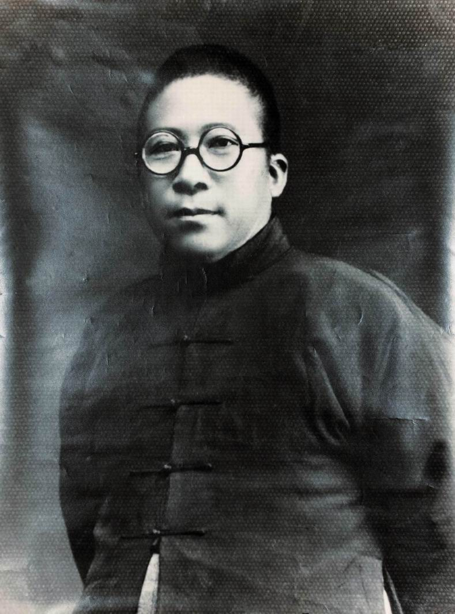
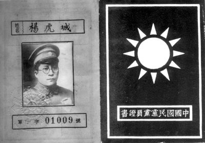
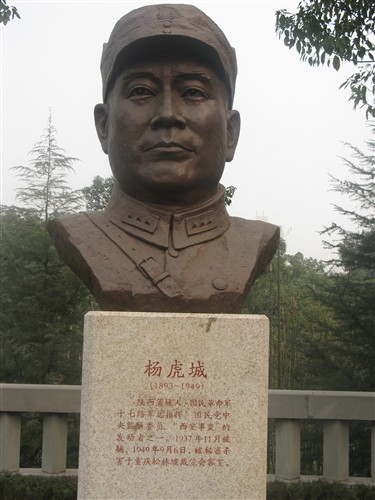
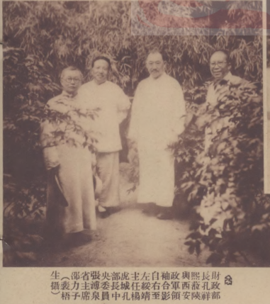

## 0906杨虎城（资料）

### 成就特点

- 西安事变领导者之一
- 流放国外，抗日回国被囚
- 解放前夕，被杀于重庆中美合作所
- 出身绿林游侠，刀客，哥老会
- 经孙中山亲自介绍加入中国国民党
- 申请加入中国共产党，希望“能做第二个贺龙”
- 小萝卜头
- 在台湾得不到平反

### 生平

1893年11月26日，杨虎城生于陕西蒲城农民家庭，起自绿林游侠。伯父为哥老会首领，清政府搜捕多次未获，即把杨虎城的父亲抓去顶罪，处以绞刑。后来伯父被捕，活生生打死。杨虎城有一母一弟，父生前欠债不少，生活穷苦。杨一生识字不多，文牍皆由身边人代劳。

1911年，武昌起义爆发后，参加陕西民军向字营与清军作战。袁世凯成为总统后，裁减民军，他当兵两年后退伍回乡。

当年去姑母家所在的村庄，打死来收债的恶霸秀才李桢，遂落草上山，又拦截了一批税款，买了一支曼利夏步枪（M1895斯太尔-曼利夏步枪），逐渐拥有六、七条枪，百十号人，成为同州一带著名的刀客。

1915年，率众参加陈树藩陕西护国军，反对袁世凯洪宪称帝。

1917年，孙中山在广东组织军政府，号召护法。陕西靖国军兴起响应。

1918年，于右任被推为总司令，由上海绕道回陕就职，设总司令部于三原。下辖7路，共有32个支队，杨虎城为第三路﹙司令曹世英﹚第一支队司令。

1921年，杨虎城部编为陕西陆军独立混成团，杨任团长。称盛一时之陕西靖国军，至此乃告解体。

1922年，杨驻军陕北榆林时，通过杜斌丞介绍，结识陕西共产党创始人之一魏野畴。魏之思想对杨帮助大，曾长期在杨部任职。

1924年，杨虎城经孙中山亲自介绍加入中国国民党，积极参与国民革命军北伐。

1925年7月，孙岳出任陕西军务督办，率领国民军第三军入陕西。杨部受编为国民军第三军第三师。是年冬，国民军第二军师长李云龙继任陕西军务督办，杨虎城为帮办。李云龙旋率部开赴河南作战，西安即由杨部驻守。

1926年，吴佩孚指使镇嵩军七万人围攻西安，杨率部赶赴，与友军一道，不足万人。杨死守西安八个月，直到援军来到解围。

1927年，“四一二事件”后，杨部队之共产党员曾达200余人。以此为基础，成立中共皖北特委，隶属中共河南省委，负责人是魏野畴、南汉宸、蒋听松。

5月，杨部配合武汉北伐军攻入洛阳，打败奉系张学良部下万福麟部。此后，杨之国民革命军第十军在河南商丘一带与直鲁联军作战，杨见政局大变，遂于是年秋率第十军退出战场，至皖北太和休整。杨于此时申请加入中国共产党，希望“能做第二个贺龙”，将部队改编为中国工农红军。但中共河南省委未予批准。不久中共地下党在第十军中醖酿暴动，杨坚持反对，只好于1928年2月与谢葆贞及秘书米暂沉到南京上海一带游览。临行前，他对参谋长说：“这些朋友都是我们请来的，纵一时不能合作，也要对得起朋友，要有道义，要留有他日见面的余地。”4月初，暴动失败，魏野畴等被捕杀。

1928年，经过中共党组织批准后，杨虎城同中共党员谢葆真在皖北太和县结婚。4月底，赴日本半年。

是年秋，中共中央《致东京市委信》中讲到杨虎城：“中央已允其加入，交由你们执行加入手续。加入手续如下：须三个同志的介绍，候补期为半年。再望你们与他谈一次话……”但因东京市委负责人等都已提前回国，此信未能送达。杨生前对此毫无所知，此后再没有提出申请。

1929年，投入蒋介石麾下，任国民革命军新编第十四师师长，在蒋唐战争中击败唐生智。

1930年，在中原大战中，杨奉蒋命率部返回陕西，任陕西省政府主席。战后，新编第十四师西归升格为国民革命军第十七路军，6万多人，被称为“西北军”。之后，杨虎城被南京国民政府任命为讨逆军第十七路总指挥，驻防陕西，后兼任陕西省政府主席、西安绥靖公署主任等职。

后来，中国工农红军长征，先后到达陕蜀地区。

1933年6月1日签订了“共同反蒋抗日”的“汉中密约”，又称“巴山协定”。 这个协议坚持了将近两年。由于得到杨虎城的帮助，红四方面军由入川时的1万人发展至8万之众，成为其历史上的鼎盛时期。

1935年，蒋中正调张学良东北军剿共，西安出现以西北剿匪总司令部副总司令张学良、西安绥靖公署主任杨虎城和陕西省政府主席邵力子为首三种势力并存局面。杨虎城掌握西安市军事控制权。

是年秋，中共令南汉宸派人向杨虎城传达中国共产党八一宣言。同年12月，中共右派汪锋对杨虎城及西北军将领做策反工作。

1936年春，王炳南奉中共指派，专从德国回国去做争取杨虎城的叛变工作，并成为杨虎城的幕僚。中共逐渐与担任剿共任务的杨虎城和张学良结为以“反蒋反日”为目标的，被称为“秘密三角军事联盟”的关系。

1936年9月，中国共产党与东北军正式签订《抗日救国协定》，双方正式结束敌对状态，中国工农红军、张的东北军、杨的西北军形成拥护“民族统一战线”的“铁三角”。

10月，蒋秘密接见杨，询问西安社会形势不稳，杨称赴西安安全无问题。

【西安事变】

1936年12月，蒋中正来到西安，目的是部署和监督剿共。但杨虎城和张学良联合发动“兵谏”，屠杀及扣留蒋中正等数百名国民政府军政核心要员。

张杨对蒋提出“停止一切内战准备抗日”、“改组国民政府”、“驱逐亲日派和容纳抗日分子”、“释放政治犯”等8项政治主张，史称西安事变。

在苏联强烈反对杀害蒋中正的要求下，与宋美龄、周恩来等多方协调下，张学良释放蒋中正。当时舆论大部分强烈反对这种兵变行为——例如北平的胡适当时对此评论说：“在外族入侵的时候，有以绑架肩负国家和民族安危的元首来爱国的吗？”闻一多在课堂上说：“真是胡闹，国家的元首也可以武装劫持！一个带兵的军人，也可以称兵叛乱！这还成何国家？国家绝不容许你们破坏！领袖绝不容许你们妄加伤害！”。

西安事变后，杨虎城失去了对西北军控制。6月29日，杨虎城出国考察军事。杨抵欧洲，继续批评国民政府。七七事变后，杨多次致电要求回国参与中国抗日战争。1937年12月，他偷偷回国，遭到国民政府逮捕，和秘书、家人软禁在南昌。此后一直被关押12年。其间，杨虎城小女儿出生，妻谢葆贞病死。

1949年，转向亲共的李宗仁下令释放他，但是命令并未被施行。6月10日，中国国民党中央监察委员会决议永远开除杨虎城党籍。国共内战中中华民国国军弃守重庆前夕，传闻在毛人凤受蒋介石指示，饬令军统西南特务机关立即清理积案。

在清理积案的指示下，1949年9月6日，杨虎城及其幼子杨拯中、幼女杨拯贵，其秘书宋绮云和夫人徐林侠以及他们的幼子宋振中（昵称“小萝卜头”），随从副官阎继明和警卫员张醒民等一共8人在重庆戴公祠（戴继元公庙）被杀死，传闻中并用硝镪水毁灭尸体。

中华人民共和国成立后，葬于陕西省西安市长安区之“杨虎城将军烈士陵园”内。

【得不到平反】

中国国民党对杨虎城评价极低，称他是“祸国殃民的千古罪人”。

杨虎城次孙杨瀚曾在2005年和2006年多次写信给连战和马英九，请求为杨虎城“平反”。2006年12月12日，中国国民党党史史料编纂委员会主任邵铭煌在作出回应：“张学良与杨虎城当年身为国民党将领，不仅没有积极剿共，还以非常手段挟持统帅，这种行为几乎等于是‘军事政变’，即使在今天的中国，也应该受到制裁，不可能被容忍，更没有所谓‘平反’的问题。”

2013年11月，杨虎城次孙、中华人民共和国全国政协委员杨瀚再次致函中华民国总统马英九，呼吁平反杨虎城以使中国国民党进一步摆脱历史的黑暗。中国国民党党史馆主任王文隆表示，西安事变受军法审判，目前没有平反问题。

【维基概述】

杨虎城（1893年11月26日－1949年9月6日），陕西蒲城人，西安事变领导者之一，坚持把蒋中正除之后快，但不被张学良所接受。曾任中华民国中央监察委员、西北绥靖公署主任、国民革命军第十七路军总指挥、陆军二级上将。

因与张学良发动“西安事变”遭流放国外，随后企图以抗日之名重掌兵权秘密回国被补囚十二年。1949年9月6日，于重庆中美合作所之戴公祠被杀，终年五十六岁。

【】

### 照片

与杨虎城将军.jpg)