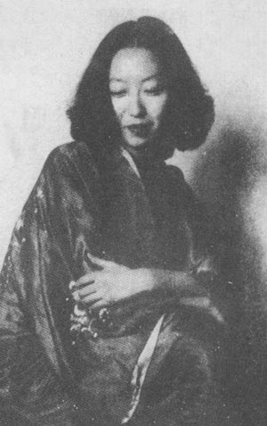
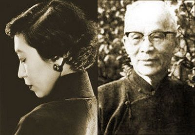
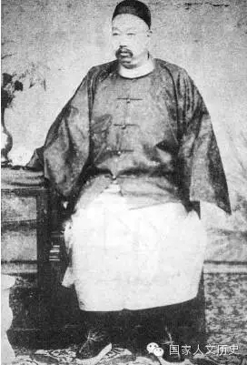

## nnnn姓名（资料）

### 成就特点

- 出自名门，曾外祖父：李鸿章；祖父：张佩纶
- 小说家；《金锁记》“是中国自古以来最出色的中篇小说”。
- 与汉奸胡兰成
- 嫁给大36岁的德裔美国作家
- 四大才女
- 奇装炫人

### 生平

【家世显赫】

1920年9月30日，张爱玲出生在上海公共租界西区的麦根路313号（今静安区康定东路87弄）。张爱玲的家世显赫，祖父张佩纶是清末名臣，祖母是北洋大臣李鸿章的女儿。父亲张志沂是典型的遗少，母亲黄素琼则是长江水师提督黄翼升的孙女。

1922年，张志沂任天津津浦铁路局英文秘书，全家搬家到天津32号路61号大宅。

【欧化的母亲】

1924年，4岁的张爱玲进入私塾学习。同年，张爱玲的姑姐张茂渊（1898-1991）赴英国留学，母亲黄素琼改名黄逸梵，撇下子女陪同前往。张志沂遂将所纳之外室接到家中，并沉迷于鸦片。

1928年，黄素琼从英国回国，张家搬回上海。

1930年，张煐被改名为张爱玲，这是为了上中学报名方便。“爱玲”为英文“Eileen”的译音。同年，张爱玲的父母离婚，张爱玲跟随父亲生活，居住在宝隆花园（今延安中路740弄10号），张爱玲的母亲黄素琼和姑妈张茂渊住在法租界白尔登公寓（今陕西南路213号）。

1931年，张爱玲进入上海白利南路（今长宁路1187号）美国圣公会所办的贵族学校圣玛利亚女中就读。并且开始阅读《红楼梦》。

【继母】

1934年，张爱玲的父亲张志沂与民国政府前总理孙宝琦的女儿孙用蕃（三十六岁）在国际饭店举行婚礼，同时，张爱玲和弟弟张子静，也在继母孙用蕃的虐待下长大。此时张爱玲完成《摩登红楼梦》，父亲张志沂为之撰回目。

1937年，在一些刊物上发表了多篇小说，并在这一年从中学毕业。

1938年，张爱玲与继母和父亲发生口角冲突后，离家出走投奔母亲黄素琼。

【大学】

1939年，她获得伦敦大学的奖学金，准备前往留学，却因第二次世界大战爆发而改入香港大学文学院。在香港大学求学期间，张爱玲结识终生朋友，斯里兰卡裔女子炎樱（Fatima Mohideen）。张爱玲在书对炎樱中有多次描写，并录下一些炎樱语录。

1941年12月8日，太平洋战争爆发后，到12月25日，日军占领香港。

1942年，张爱玲不得不中断学业，回到上海。她就读于圣约翰大学，但是两个月后就因为经济窘困辍学，这时她选择从事文学创作为生。当时她租住赫德路爱林登公寓（常德公寓，现址上海市常德路195号）51室（1942年迁至65室），与姑母张茂渊为邻。

【倾城之恋】

最初她为英文报刊撰写影评，1943年春，张爱玲见到了上海著名作家和编辑周瘦鹃，获得赏识，在1943年和1944年的两年中，得以连续发表多篇轰动性的中短篇小说，包括《沉香屑·第一炉香》、《倾城之恋》、《心经》、《金锁记》等，在沦陷时期的上海一举成名。

1961年，哥伦比亚大学东亚文学系教授夏志清出版《中国现代小说史》，高度评价张爱玲，认为《金锁记》“是中国自古以来最出色的中篇小说”。

【胡兰成】

1944年，张爱玲结识汪精卫政权宣传部次长、作家胡兰成，并与之交往。1944年8月，胡兰成与第二位夫人离婚后，与张爱玲在上海秘密结婚（婚礼上只有炎樱和胡兰成的侄女胡青芸在场）。“胡兰成与张爱玲签订终身，结为夫妇。愿使岁月静好，现世安稳。”前两句是出自张爱玲之手，后两句出由胡兰成所撰。不久，胡兰成前往武汉办报，在医院期间与一名17岁的护士周训德同居。

1944年5月，《万象》月刊第三年第十一期发表了傅雷（笔名迅雨）的《论张爱玲的小说》的评论文章，成为评论张爱玲小说评论文章的奠基之作。胡兰成曾经于1945年5月在《杂志》月刊发表对张爱玲小说的评论《评张爱玲》。

一年之后，1945年8月，日本投降，胡兰成化名张嘉仪，逃亡到浙江温州，任教于温州中学。在流亡期间，胡兰成与范秀美同居。1946年2月，张爱玲曾前往温州探视。

1946年，张爱玲与电影导演桑弧合作写作剧本，颇为成功。 1947年6月10日，张爱玲写信与逃亡中的胡兰成分手。

1948年，张爱玲发表《十八春》（后来改名为《半生缘》）。

1949年上海政权更替后，张爱玲留在上海。

【土改】

1950年夏，张爱玲曾经参加上海文艺代表团到苏北农村参加土改两个月时间。加之与胡兰成的关系，面临政治方面的压力。

1952年7月，声称“继续因战事而中断的学业”，只身离开中国大陆，迁居到香港。

张爱玲在香港期间，任职于美国新闻处（United States Information Service）。开始创作小说《秧歌》与《赤地之恋》，小说的故事背景是“土改”时期。由于作品与当时中共的主流格调不合，被作为“毒草”而批判。在大陆文学界，张爱玲也因此长期被作为反面典型，直到改革开放之后才有所改观。

张爱玲在香港期间结识毕生挚友邝文美及宋淇。在宋淇力捧下，成为电懋的编剧主力之一。编剧收入成为张爱玲往后八年的主要经济来源。

【美国】

1953年，张爱玲离开上海的次年，她的父亲张志沂在租住的上海江苏路285弄28号吴家小客厅去世，终年57岁。

1955年，张爱玲赴美国定居。

1956年3月到6月，生活窘迫的张爱玲居住在新罕布什尔州彼得堡的麦克道威尔文艺营（MacDowell Colony），在此她结识了65岁的左翼剧作家赖雅（Ferdinand Reyher）并怀孕，后不幸流产。同年8月14日，和大自己36岁的德裔美国人赖雅结婚。

1957年，张爱玲的母亲黄素琼在英国伦敦去世，终年64岁，张爱玲没有前去出席葬礼。

1960年，取得美国国籍。

张爱玲在美国翻译清代小说《海上花》，或写作回忆旧上海的作品，而赖雅为左翼作家，两人的作品均不为美国主流社会接受，因此他们夫妇生活颇为窘迫。后来依靠台湾《皇冠》出版集团再版其1940年代的小说抽取版税维持生活。

1967年10月8日，赖雅去世，张爱玲获邀担任美国雷德克里芙学校驻校作家，并且开始将清朝的长篇小说《海上花列传》翻译成为英文。

1969年，张爱玲移居加州，受聘于柏克莱加州大学。

1973年，张爱玲定居洛杉矶，晚年于寓所深居简出。

1983年，张爱玲的《海上花列传》官话翻译本以《海上花开》、《海上花落》两部式形式出版。

张爱玲晚年生活放在两件事情上：一是研究《红楼梦》，二是翻译《海上花列传》，张爱玲“将那种嗲声嗲气的吴语对白，悉数转换成了地道的晚清官话。同时，爱玲对于《海上花列传》最大的贡献就是为作品中出现的晚清服饰、欢场行规、上海的风土人情都做了很多准确详尽的注解。

1995年9月8日，张爱玲的房东发现她逝世于加州洛杉矶西木区罗彻斯特大道的公寓，终年75岁，死因为动脉硬化心血管病。其遗嘱云：“尽速火化；骨灰洒于空旷原野；遗物留给宋淇夫妇处理。”

9月19日，遵照其遗愿，将她的遗体在洛杉机惠提尔玫瑰岗墓园火化，没有举行公开葬礼。

同年张之忌辰日（9月30日），林式同与几位文友将其骨灰撒在太平洋。

【代表作】

《色，戒》.2007年被导演李安搬上银幕，影片与小说同名，并获得威尼斯影展金狮奖。

《金锁记》.曾改编成电视剧《金锁记》

《倾城之恋》.曾改编成电影《倾城之恋》、舞台剧《倾城之恋》

《红玫瑰与白玫瑰》.曾改编成电影《红玫瑰白玫瑰》

《半生缘》（又名《十八春》）：曾改编成电影《半生缘》、舞台剧《半生缘》、电视剧《半生缘》

【奇装炫人】张爱玲在上海时，喜欢特别服装。当时在上海漫画家文亭所绘的“上海女作家三画像”中，给同时期在上海活跃的著名女作家苏青和潘柳黛的定义分别是“辑务繁忙的苏青”和“弄蛇者潘柳黛”，而张爱玲的特征则为“奇装炫人”。

【四大才女】中华民国时期，张爱玲、苏青、关露、潘柳黛是蜚声上海文坛的四大才女，成为上海滩灯红酒绿文化的牺牲品和达官贵人的玩物。同一时期，上海还有一大批“小姐作家”。她们相互之间作矜持状，各自谈及同时代的女作家，都流露自傲，各不相让：“目前女作家的作品，我不大读”，“女作家的作品我从来不看”，……。苏青与张爱玲则互唱互和仿佛唱双簧：“只看张爱玲”（苏青语），“把我同冰心、白薇她们来比较，我实在不能引以为荣，只有和苏青相提并论我是心甘情愿的。”（张爱玲语）。潘柳黛在《论胡兰成论张爱玲》中，对胡兰成说张爱玲有贵族血液（李鸿章的重外孙女），尖刻地讥讽这关系就好像太平洋里淹死一只老母鸡，上海人吃黄浦江的自来水自称“喝到鸡汤”的距离一样，以上海人脑筋之灵，不久将来，“贵族”二字，必可不胫而走，随后果真有“贵族排骨面”上市；后来张爱玲到香港，有人告诉她潘柳黛也在香港，张爱玲回答说：“谁是潘柳黛？我不认识。”

### 照片

与表姐弟在上海的舅舅家合影.jpg)

与姑姑张茂渊合影.jpg)

