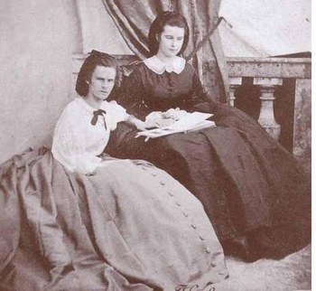
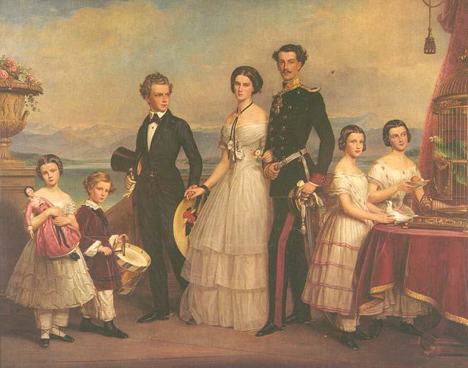
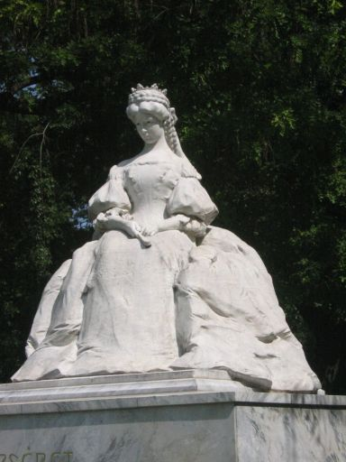

## 0910茜茜公主（资料）

### 成就特点

- 世界上最美丽的皇后
- 自由精神和传统宫廷规矩徘徊的悲剧人物。
- 爱美，瘦
- 被刺杀

### 生平

【概述】

茜茜公主，本名为伊丽莎白·阿马利亚·欧根妮（德语：Elisabeth Amalie Eugenie，1837年12月24日－1898年9月10日），意思是“奥匈帝国的伊丽莎白”。她是奥地利皇帝弗朗茨·约瑟夫一世的妻子，她是奥地利帝国皇后、匈牙利王后、波希米亚及克罗地亚王后。她的美貌和魅力征服了整个欧洲，被世人称为“世界上最美丽的皇后”。

她出生在德国巴伐利亚的一个贵族家庭，通常被家人与朋友昵称为茜茜（Sisi），因而称为茜茜公主。虽然她身为女公爵，但在她16岁遇见弗朗茨之前，却享受着自然的教育生活模式。

婚姻将她推入了欧洲最显赫的王室——哈布斯堡王朝的宫廷生活中，让她始料不及且感到志趣相异。虽然茜茜公主在奥匈帝国的政治影响上有限，但她已经俨然成为一个文化偶像。茜茜公主如同其在电影和戏剧制作一样，被认为是一位在自由精神和传统宫廷规矩徘徊的悲剧人物。

【意外相爱】

1837年12月24日，伊丽莎白出生于德国巴伐利亚的一个贵族家庭。父亲马克思公爵在宫廷中没有任何职务，他喜好旅游和马戏，不拘小节，喜欢自由自在，被人称为“疯子麦斯”，因此茜茜的童年没有受到太多拘束，并且马克思的性格也深深影响了茜茜。茜茜父母的婚姻纯粹是政治产物，并不幸福，并且马克思也有若干私生子女。童年的茜茜就表露出了忧郁，多愁善感的特质，这种性格伴随她一生。

1853年，伊丽莎白随她母亲与18岁的姐姐海伦赴奥地利的度假村巴德伊舍，原定计划是海伦应当在那里引起其23岁的表亲、奥地利皇帝弗兰茨·约瑟夫一世的注意，并与之订婚。但出乎意外的是弗兰茨·约瑟夫一世竟然爱上了16岁的伊丽莎白。

弗兰茨违拗了他母亲索菲的意见，两人于1年后的1854年4月24日在维也纳的奥古斯丁教堂结婚。弗兰茨·约瑟夫将伊舍的行宫作为结婚礼物送给了伊丽莎白，此后这座行宫改建成了一个E字形。

【宫廷生活】

从一开始16岁的伊丽莎白就很难接受哈布斯堡王朝宫廷内所使用的严格的宫廷规矩，因此她在皇宫里非常孤立。她本人喜欢骑马、读书和艺术，而这些又是维也纳宫廷无法理解的。

婚后她生下两个女儿、一个儿子。但被婆婆兼姨妈——苏菲剥夺子女们的抚养权，她与丈夫弗兰茨·约瑟夫之间的关系开始恶化，遗传下来的精神不稳定也越来越明显。

【大女儿去世】

1857年，悲剧发生，伊丽莎白不顾医生的反对意见，带她的两位女儿离开了奥地利前往匈牙利度假。但两位女孩患上腹泻，她2岁的大女儿因此而死亡。长女的死亡对伊丽莎白的生活和休息造成严重影响，并使她与丈夫产生永久性的裂痕，他们的婚姻渐渐崩溃。

【奥匈帝国】

1867年，匈牙利试图从帝国独立出去，最终达成折衷方案，建立奥匈帝国。伊丽莎白与她疏远的的丈夫团聚一起，于布达佩斯加冕为匈牙利王后。随着两人的复合，不久她生下一个女儿。这次她坚持要按自己的方式抚养这个女儿。但此后不久伊丽莎白就又开始了她漫无目的的旅行生活。

她极端重视其外貌，以致花了很多时间来保持她的美丽；此外亦遵循着严格且苛刻的饮食和运动疗法，以维持她约50公分（20英寸）的腰围，这让她达到近乎消瘦的程度。

伊丽莎白后来不仅只因为她的美丽而有名。报纸针对她的时尚感、饮食和运动处方、马术运动的热爱等发表数篇文章。伊丽莎白亦会写诗。在她沉迷住诗的这几年，伊丽莎白深入研究古代及现代的希腊语，并沉浸在荷马的《伊利亚特》和《奥德赛》中。许多研究希腊的讲师皆曾陪同皇后散步长达一小时，进而彼此讨论对希腊的心得。

【儿子逝世】

1889年，一个打断伊丽莎白平静的日子发生了，她的儿子逝世。30岁的奥地利皇储鲁道夫与女友的遗体一起在他于下奥地利的行宫里发现，经过事后调查认定并非谋杀而是自杀，伊丽莎白从此陷入忧郁症，再也没有恢复过来。

从此以后她只穿黑色衣服，打着一把皮制阳伞，用一把棕色扇子遮住面孔。这是伊丽莎白最著名的个人标志。

皇后还访问了当时北方皇室没有去过的国家：葡萄牙、西班牙、摩洛哥、阿尔及利亚、马耳他、希腊、土耳其和埃及。旅行不仅变成了她生活的意义，而且帮助她逃避自己的痛苦。

【被刺身亡】

1898年9月10日，在瑞士日内瓦，60岁的伊丽莎白和Sztaray伯爵夫人沿着日内瓦湖边的勃朗峰滨湖路步行，准备登上日内瓦号轮船前往蒙特勒，被意大利年轻的无政府主义者卢伊季·卢切尼用一把磨尖的锉刀刺伤心脏。

她遭到袭击后，不知道她的受伤严重程度，还继续登船。直到除去紧身衣，周围人才意识到问题的严重。终因流血过多身亡，时年60岁。她的最后一句话是：“出了什么事？”

她被葬在维也纳的皇家墓室里，几个世纪以来它一直是哈布斯堡王朝家族成员的主要安葬地。

【影视】

在20世纪伊丽莎白成为了一个代表性人物，在这一点上她可以与戴安娜王妃相比：一个喜爱自由的，被束缚在陈腐的宫廷仪式中的人。许多作家、电影编剧、戏剧作家都从她的生平中吸取题材。

1955年，因罗密·施奈德与卡尔海因茨伯姆合演电影《茜茜公主》而使她的名字广为人知，值得注意的是，电影与原著小说的原文片名“Sissi”与公主实际上的小名“Sisi”在拼字上有点出入。

伊丽莎白总是觉得她与1856年在巴黎逝世的海涅同心相契，将她自己看作海涅的学生，说海涅亲自告诉她怎样写诗。她决定她在1880年代写的诗在1950年发表。实际上这些诗一直到1980年代才发表。布莉吉特·哈曼（Brigitte Hamann）女士出版了伊丽莎白的诗歌和绘画，在进行解析后，撰写了一本传记：《伊丽莎白：不情愿的皇后》（Elisabeth, Kaiserin Wider Willen），首次向人们完整展示了和过往影视演绎截然不同的，伊丽莎白真实的一生。

1992年9月3日，取材于这部传记，一部由麦可孔策编剧，席维斯·李维作曲的音乐剧《伊丽莎白》，首演于维也纳大剧院并创下了当地票房的历史纪录，“重振维也纳戏剧艺术的辉煌”，自此成为迄今最成功的德语音乐剧。

【】

### 照片

