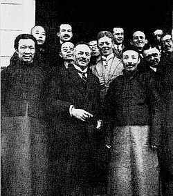
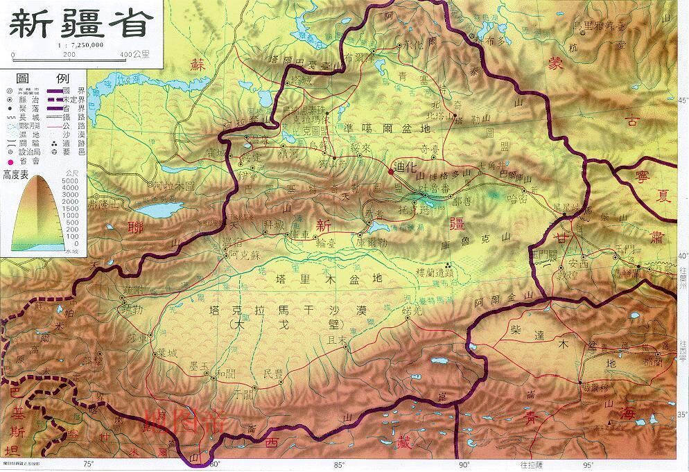

## nnnn姓名（资料）

### 成就特点

- ​
- ​

### 生平

76年前的今天，杨增新、盛世才之间的新疆王金树仁去世

金树仁（1879年－1941年9月12日），字德庵，汉族，甘肃省河州永靖县金家嘴（今宁夏回族自治州永靖县）人，中华民国国民政府时期新疆省政治、军事领导人。

追随杨增新的神童

1879年，金树仁生于甘肃省河州永靖县金家嘴（今宁夏永靖县）。年仅13岁时，考中秀才，被视为神童。1896年（17岁），云南人杨增新任河州知州，金树仁受其器重。

1901年（22岁），杨增新调任甘肃学政兼高等学堂监督，金树仁追随到省城，入甘肃文高等学堂、法政学堂。完成学业后，金树仁先后任龙泉书院、凤林书院院长。

1909年（30岁），金树仁参加科考，举为孝廉方正，同年又考取拔贡。1911年（32岁），辛亥革命后，中华民国第一届国会选举，金树仁当选议会议员、众议院议员。

十年新疆基层历练

1915年（36岁），杨增新主政新疆之后，急需人才，金树仁便应召西出阳关，投其麾下，任书记官兼科员。随后，参加政治研究所招考，金树仁名列第一。第二年六月，参加全省县长考试，以甲等成绩分发任阿克苏县县长。

其后十余年，金树仁皆在新疆基层历练。1926年，因政绩显著，升任新疆省公署政务厅厅长。

杨增新之后的新疆王

1928年（49岁），新疆发生“七七事变”，军务厅长樊耀南在宴会中刺杀杨增新。金树仁闻变不惊，集结部队包围现场，樊耀南弹尽被捕。次日，全部余党一并擒获，磔刑处死。事后，南京政府以平乱有功，任金树仁为新疆省主席兼总司令。

金树仁管理新疆期间，施政及管理上一反杨增新的怀柔作风，对穆斯林实施严格的控管，尤其是开征“屠畜税”以及禁止麦加朝觐，最受穆斯林的强烈反抗。此外，实施改土归流，废止土司制度，终于引起穆斯林的反抗。

1931年（52岁），哈密地区的穆斯林首先起兵反抗，史称哈密暴动。同时在马仲英的介入下，吐鲁番与和阗也相继发生穆斯林的反抗活动。

（斯文·赫定与樊耀南合照，前排右一为樊耀南）

盛世才之前的新疆王

1933年4月12日（54岁），新疆省参谋处长陈中、迪化城防指挥官白受之、航空学校校长李笑天、迪化县长陶明樾等人，联合自东北撤退来的东北抗日义勇军残部（首领郑润成），以及自苏联流亡来的白俄归化军（首领巴品古特），共同发动了军事政变，占领了首府迪化，并推教育厅长刘文龙为临时省主席。

金树仁试图举兵反攻，却因盛世才的叛变，加上伊犁屯垦使张培元坐观成败，而败走塔城。同年4月24日，金树仁宣布下野。不少人劝他留在塔城，与苏联协商，获取帮助，金树仁以内部矛盾，不让外人渔利为由，皆以婉拒。随即逃往苏联，经由西伯利亚回到国民政府所在地南京。

（盛世才）

逃过一劫终归故土

1935年10月（56岁），金树仁至南昌面见蒋介石，继而赴南京国民政府述职。行政院秘书长褚民谊唆使他人控告金树仁，欲以金树仁擅自与苏联订立通商协定判罪。10月10日，国民政府主席林森宣布：“金树仁与苏联政府订立临时通商协定，是为维护地方，因以获罪，应予特赦。”

随后，金树仁返回甘肃兰州。1941年9月12日（62岁），金树仁去世，归葬于永靖县。

### 

