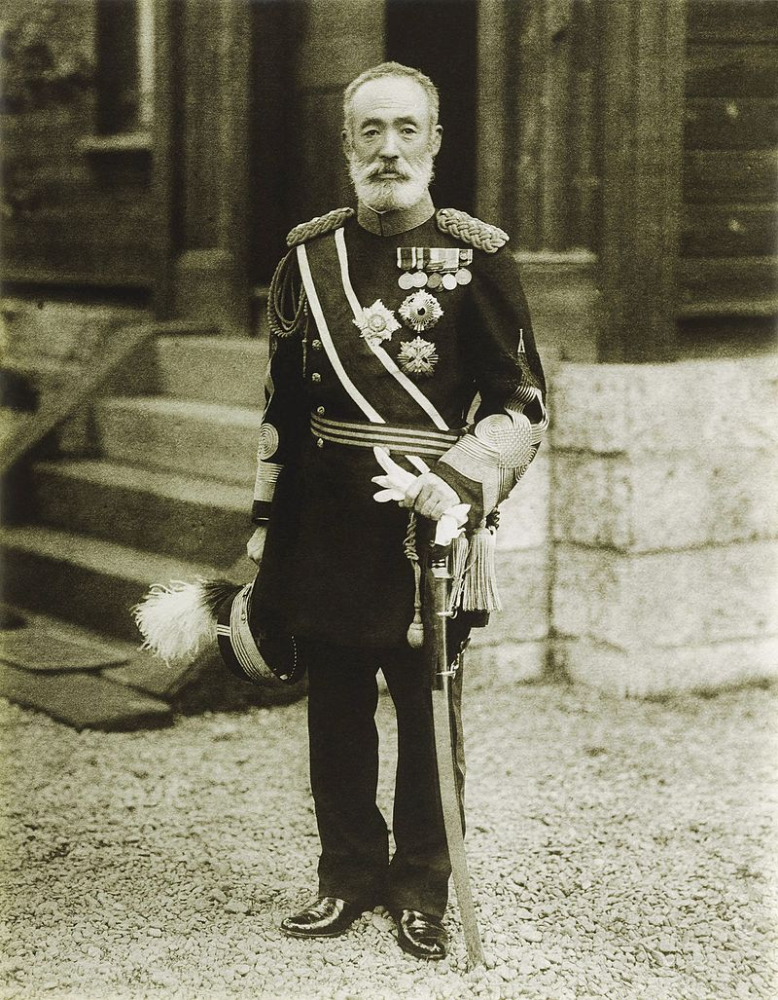
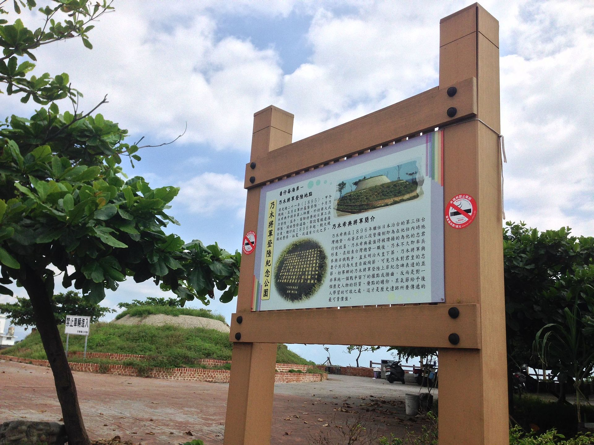
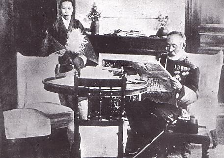

## nnnn姓名（资料）

### 成就特点

- 大日本帝国陆军大将
- 台湾日治时期第3任总督（1896-1898）
- 以“肉弹”战术攻克旅顺，在二战前被多数日本人奉为“军神”。
- 善于写中国诗
- 两个儿子战死
- 1912年明治天皇病逝后，同其妻剖腹殉节，成为日本武士道精神的典型代表

### 生平

105年前的今天，被奉为军神、武士道的代表乃木希典为天皇殉死

乃木希典（1849年12月25日－1912年9月13日），大日本帝国陆军大将。曾参加中日甲午战争，在旅顺屠杀2万平民。率军登陆并攻占台湾，任台湾总督，曾一度打算卖掉台湾。日俄战争中，两个儿子都死在中国战场。以伤亡1万多人的肉弹战术，攻占203高地，占领旅顺，被誉为战神。明治天皇死后，夫妻俩切腹殉死，被认为是武士道精神的典范。

自责堕落的天皇亲兵

1849年12月25日，乃木希典出生于日本本州山口县一个下层武士的家庭。自幼的教育是武士道精神与儒学忠君思想，善于写中国诗。1871年（明治四年，22岁），日本开始实施效忠天皇的“亲兵制度”，组建中央统帅的直辖部队，乃木希典以藩兵身份遴选为天皇“亲兵”。

1877年（28岁），在镇压西乡隆盛反叛的西南战争中，身为第十四联队队长的乃木希典率军增援，途中联队军旗被夺走。乃木希典非常自责，拚命往前冲，企图战死，负伤之后，被抬到野战医院，仍旧企图逃脱到前线作战。后来乃木希典写请罪书给总指挥官山县有朋，请求严厉处分。虽然山县有朋并不问罪，但乃木希典仍相当自责，曾企图切腹自杀，被儿玉源太郎发现并阻止。也由于自责，乃木希典染上酒瘾，经常借酒消愁。

1886年（37岁），赴德国留学2年，学习军事，受到很大的震撼。回国以后，他给军部呈上“肃军意见书”，要求按照德国陆军的方式整顿军队，讲究军人的风纪和精神面貌，强调军人的气质和风貌。要求军人无论何时何地都必须穿军装，要干干净净一丝不苟。他把酒瘾也戒掉了，变成一个极为自律的人。

中日甲午战争的旅顺屠城

1894年（45岁），在中日甲午战争中任第一旅团长。临行前明治天皇送行，在酒会上乃木希典给天皇献诗一首：“肥马大刀无所酬，皇恩空沿几春秋。斗瓢倾尽醉余梦，踏破支那四百州。”

1894年10月24日，他带领先头部队在辽东半岛花园口登陆。因为有15个日军斥侯兵，被清军逮住后，绑在行刑柱上折磨至死。在旅顺破城时，屠杀了2万无辜平民。

随后，乃木希典足迹遍布辽东半岛。写下诗句：“对峙两军今如何？战声恰似迅雷过。奉天城外三更雪，百万精兵渡大河。”1895年，晋升为陆军中将，特封为男爵。

想卖掉台湾的总督

1895年10月11日，乃木希典率第二师团登陆台湾屏东枋寮，占领东港、凤山。 10月20日，刘永福弃守逃往厦门，乃木希典不费一枪一弹占领台南。

从清朝割让台湾后，1896年10月14日，任台湾总督（至1898年2月）。然而，台湾人民对日本反抗激烈。12月，日军21人在花莲新城遭到太鲁阁族歼灭，史称新城事件。

1897年春，乃木希典回国，力劝首相把台湾卖掉。他抱怨说：“就像乞丐，讨到一匹马，既不会骑，又会被马踢。”原打算把台湾卖给英国，结果法国人十分感兴趣。双方经过讨价还价，初定台湾的售价为1500万法郎。

1898年，伊藤博文成为日本首相。再次提出卖台湾的事，一度出现以一亿日圆卖给法国的想法，甚至卖还给清朝。然而，儿玉源太郎认为是管理无能，主动请缨担任总督。于是乃木希典辞职，儿玉源太郎成为台湾总督。

（位在台湾屏东枋寮乡的乃木将军登陆纪念公园）

（1896年，左三为乃木希典）

两个儿子死在中国

1904年2月6日，日俄战争爆发，乃木希典出任第3集团军司令官，负责指挥旅顺会战。5月27日，乃木希典的长子在金州的南山战役中受伤死亡。乃木希典赋诗：“山月草木转荒凉，十里血腥新战场。征马不前人不语，金州城外立斜阳。”

5月29日，乃木希典与次子登陆大连湾，争夺旅顺。11月27日，日军进攻旅顺203高地（因海拔203米而得名，可俯瞰旅顺军港）。3天后，次子战死。

（乃木希典的两个儿子的合影）

肉弹战神

12月5日，日军以“肉弹”战术冲锋肉搏，最后夺取203高地。203高地争夺战中，日军共出动兵力 6.4 万人，死伤 1.7 万人。1905年1月，日军占领了203高地之后，从山上向旅顺城区和港口猛轰，停泊在港里的俄舰全被击毁。俄军的城防司令被炸死，辽东地区总司令官投降。

日军在203高地顶峰修建了一个炮弹型的纪念碑，乃木希典赋诗：“尔灵山（203之谐音）险岂难攀，男子功名期克坚，铁血覆山山形改，万人齐仰尔灵山。”

1905年3月，参加了奉天会战。1907年，因战功升为伯爵。

（203高地上日军建筑的尔灵山纪念塔）

（1905年，攻占旅顺后的合影）

夫妻殉死的武士道精神

由于在旅顺战中，日军死伤惨重，乃木希典便想自杀请罪。但明治天皇不许，任命他为学习院院长，负责教导皇孙裕仁。乃木希典推行军事式教育，对裕仁很严格。据说当时明治天皇说：“你为朕失去了两个儿子，现在朕将这班孩子交给你。”

1912年7月30日，明治天皇驾崩。1912年9月13日，明治天皇出殡当天晚上，乃木希典的妻子静子首先以刀刺自己的胸部自杀，接着乃木希典切腹，然后再自行介错（补刀），切断自己的颈动脉，死亡。

乃木希典为天皇殉死，成了“武士道”精神的象征，在其故居等多地建有“乃木神社”。在二战前，他被多数日本人奉为“军神”。现代的日本史学界，对其军事能力，大多持否定态度，甚至认为他只是个“愚将”，二战前的肯定和吹嘘，不过是鼓吹愚忠天皇的人为神话而已。

（自杀当日的乃木希典夫妻）

