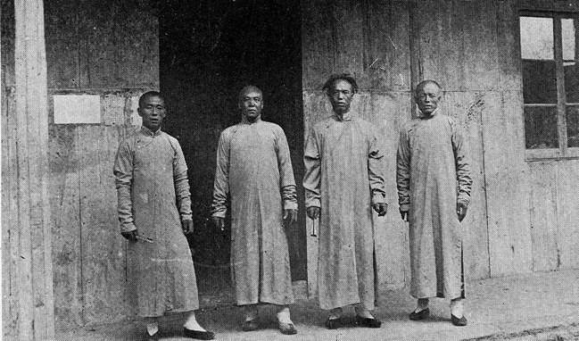
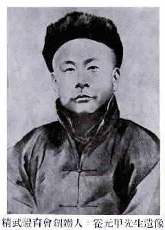
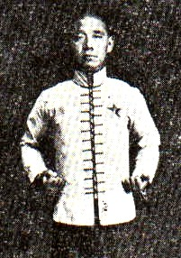
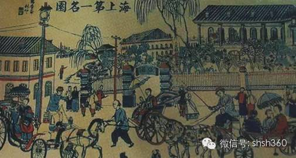

## nnnn姓名（资料）

### 成就特点

- ​
- ​

### 生平

霍元甲（1868年1月18日－1910年9月14日），清末武术家。祖籍河北省沧州市东光县安乐屯，生于直隶省静海县小南河村（今属天津市西青区南河镇，为纪念霍元甲，自2009年1月18日起更名为精武镇）。出身镖师家庭，排行第二。

父亲霍恩第以保镖为业，武艺极高，霍恩第兄弟三人，共有十个儿子，称为霍家师兄弟。

霍元甲幼年体弱，在27岁以前基本上生活在故乡，时常挑柴到天津去卖。

28岁后，到天津当上码头装卸工，后来在农劲荪开设的怀庆药栈当帮工，升任掌柜。

1909年，41岁的霍元甲，由农劲荪介绍来上海，接受由陈公哲、陈铁生所创办“精武体操会”中主教武术。

1910年，“精武体操会”易名精武体育会，霍元甲任主教席。

1910年9月14日，霍先生去世时年仅42岁。

【精武体操学校】

精武体操学校是由革命党人倡议在上海所成立的一所小武馆。由农劲荪（又名农竹）任校长。霍元甲被邀在任主要教员，可惜开学后3个月后即逝世。后来霍元甲被塑造为民族英雄，以宣传反对日本及俄国的入侵意图。

清末民初，由热血年轻商人陈公哲等人响应同盟会会员陈其美提出的短期内训练出有强健体魄，又有军事技能的青年计划而创立，后来发展至世界各地的精武体育会。

霍元甲在创立精武体育会之后数月内即逝世，随后，精武会由元甲之兄元卿、次子霍东阁任教。各地分会相继分起，十数年后，海内外精武分会达43处，会员逾40万之众。

1919年，精武体育会在上海举行成立十周年纪念活动时，孙中山先生亲笔题赠“尚武精神”匾额，并担任该会的名誉会长，还为该会特刊《精武本纪》撰写了序文。

【张园比武】

任职报馆的陈铁生，在报章中宣传上海张园擂台比武事件。该埸擂台比武开始、司仪说明相约好西洋力士奥皮音比试，可惜力士最终离开中国。

1909年春，英国大力士奥皮音来上海在北四川路52号亚波罗影戏院（Apollo Theatre）“登台表演举重，露肌及健美种种姿态，约二十分钟，一连数晚，最后一场言，愿与华人角力。于言谈中，带多少轻蔑口吻，翌日见于报端，沪人哗然。”于是陈有美、农劲荪、陈铁生、陈公哲等“咸欲聘请技击名家，登台与赛，以显黄魂。”

霍元甲接到邀请，便携其徒刘振声于1909年3月赶到上海商谈比武事宜，并商定“用摔跤方式，以身跌于地分胜负”。

于是，发起人开始筹措资金在上海静安寺路张氏味莼园（张园）内搭建了“高四尺，宽广二十尺”的擂台。六月中旬下午四时，比赛的时间已到，但奥皮音并没有来。就这样，霍元甲名扬上海。

【逝世】

在1912年向恺然（平江不肖生）出版《拳术》和《近代侠义英雄传》两部作品之中。他根据传闻，编写霍元甲被日本医生秋野用“慢性烂肺药”毒死的故事。该说法被广为流传。

有一个说法是霍元甲死于肝病，霍元甲长久以来患有黄疸，众所周知，当时霍元甲患了肝脏之病。

霍家后人宣称，1989年，霍家在给霍元甲与其妻坟墓迁移时，发现霍元甲的遗骨上有黑色斑点。经过天津市公安局实验室检测该黑色斑点为砷化物（即砒霜）。但也可能与服用中药中的雄黄有关，主要成分为硫化砷。

【流行作品】

霍元甲的传奇被多次拍成电影及电视剧。

电影方面，有1982年时由袁和平执导，梁家仁、仓田保昭主演的《霍元甲》。

2006年版的《霍元甲》由李连杰饰演霍元甲，因电影剧情需要有多处未与史实契合，主要欲表达霍元甲的节操与武术精神。

电视方面，1981年香港丽的电视拍摄的由黄元申、米雪、梁小龙主演的《大侠霍元甲》，曾经风靡中国大陆。

2008年由郑伊健（饰演霍元甲）、陈小春（饰演陈真）主演的新版《霍元甲》以全新的角度诠释了霍元甲生平。

### 照片

