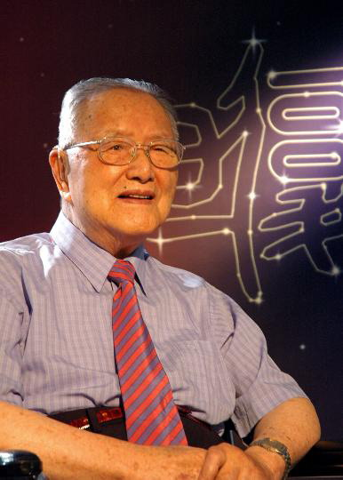
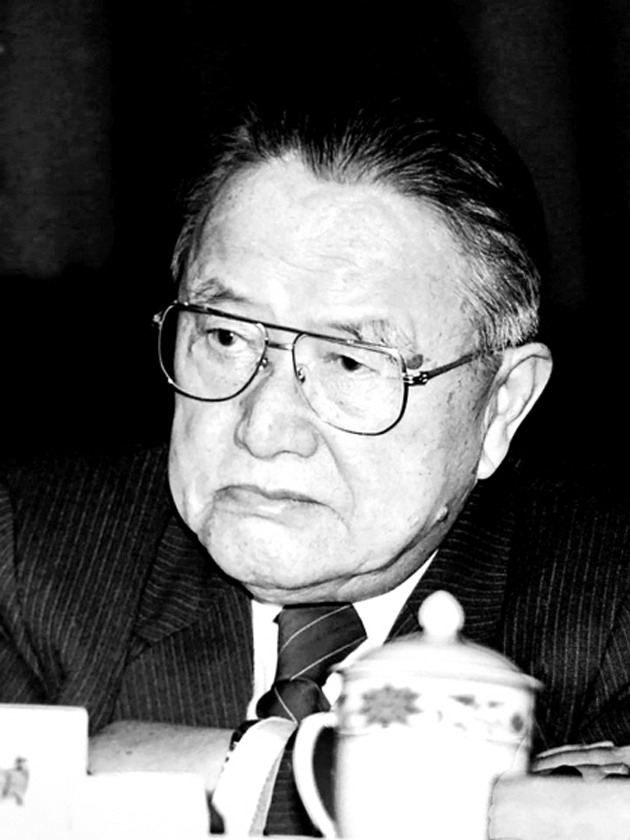
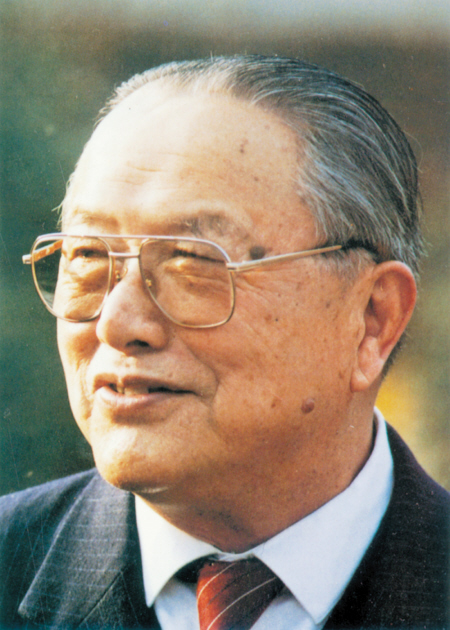

## nnnn姓名（资料）

### 成就特点

- 中国现代遗传学的主要奠基人之一，有“中国遗传学泰斗”之称。
- 将“基因”一词首次带入中文
- 在复旦大学相继建立了中国第一个遗传学专业、第一个生命科学院和第一个遗传学研究所。
- 曾连任三届中国民主同盟中央名誉主席。
- 1999年，国际编号为3542号小行星被命名为“谈家桢星”
- 中国的摩尔根

### 生平

【年轻求学】

1909年9月15日，谈家桢出生于浙江省宁波市的慈溪。父亲是邮政局的一名小职员。6岁那年，上私塾，12岁毕业于教会办的道本小学。 

1921年，进入教会办的宁波斐迪中学。 1925年，转学到浙江湖州东吴第三中学高中部。

1926年，谈家桢以优异的成绩毕业于东吴第三中学，并被学校免试保送苏州东吴大学，主修生物学。

1930年，毕业于苏州东吴大学。 经胡经甫推荐，谈家桢成了燕京大学唯一从事遗传学教学和研究的李汝祺教授的研究生。 
1932年，毕业于北京燕京大学研究院，获理学硕士学位。

【师从摩尔根】

1934年，谈家桢告别了母亲和新婚夫人，赴美国加州理工学院攻读博士学位，师从现代遗传学奠基人摩尔根及其助手。

摩尔根发现了染色体的遗传机制，创立染色体遗传理论， 是现代实验生物学奠基人。于1933年由于发现染色体在遗传中的作用， 赢得了诺贝尔生理学或医学奖。

1936年，他的博士论文《果蝇常染色体的遗传图》通过答辩，获加州理工学院哲学博士学位。

【回国效力】

1937年，浙江大学校长竺可桢聘他为生物系教授。

 不久抗日战争爆发，浙江大学辗转内迁。最后生物系迁到湄潭的一个破旧不堪的唐家祠堂里。在这以后6年的时间里，谈家桢在研究上取得了重要的成就。他的一些代表性论文就是在这段时间里完成的，同时也培养了以后在科研、教学上成绩卓著的第一代研究生。

1944年，谈家桢发现了瓢虫鞘翅色斑变异的镶嵌显性遗传现象，这一创新性研究成果，至今仍被列为教科书的经典内容。

1946年，发表了“异色瓢虫色斑遗传中的嵌镶显性”的论文。这些成果引起国际遗传学界的巨大反响，认为是丰富和发展了摩尔根遗传学说。

【】

1952年，院系调整后任复旦大学生物系教授兼系主任。

1961年起，曾先后担任复旦大学遗传所所长，复旦大学副校长，生命科学院院长和校长顾问等职务。

1989年9月，谈老以自己的稿酬和积蓄设立了“谈家桢生命科学奖学金”。

1992年6月，谈家桢一行12人（7位科学家，5位家属）应台湾中央研究院院长、著名物理学家吴大猷的邀请，作为大陆第一批科学家访问台湾。

2008年11月1日7时18分，在上海华东医院逝世，享年99岁。

【成就】

把毕生精力贡献给了遗传学事业；为遗传学研究培养了大批优秀人才；建立了中国第一个遗传学专业，创建了第一个遗传学研究所，组建了第一个生命科学院。

特别在果蝇种群间的演变和异色瓢虫色斑遗传变异研究领域有开创性的成就，为奠定现代综合进化理论提供重要论据。

在浙江大学任教期间他发现了瓢虫色斑遗传的镶嵌显性现象。引起国际遗传学界的巨大反响，认为是对经典遗传学发展的一大贡献。

他先后发表了百余篇研究论文和学术论述方面文章。

《奇妙的克隆》收入初中语文人教版八年级上第十七课。

1951年加入中国民主同盟，历任民盟第五、六、七届中央副主席，民盟第八、九届中央名誉主席。

【多国院士】

1980年，当选中国科学院院士

1985年，当选第三世界科学院院士

1985年，当选美国国家科学院外籍院士

1987年，当选意大利国家科学院外籍院士

1995年，求是科学基金会杰出科学家奖

1999年，当选为纽约科学院名誉终身院士

1999年，国际编号为3542号小行星被命名为“谈家桢星”

### 照片

