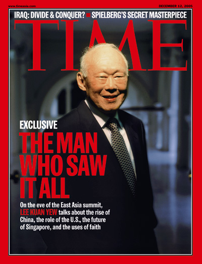
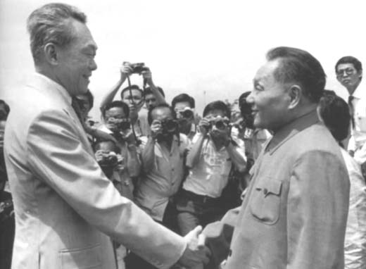
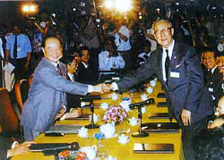
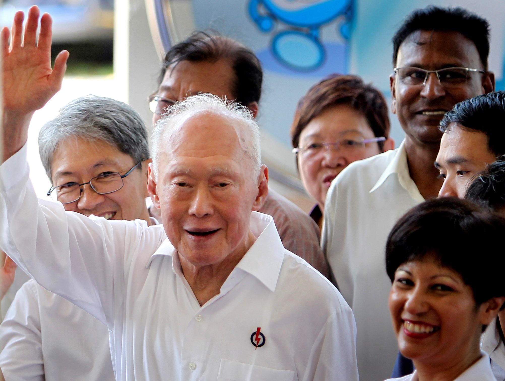
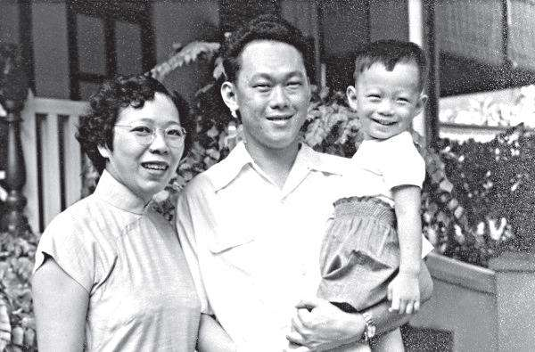
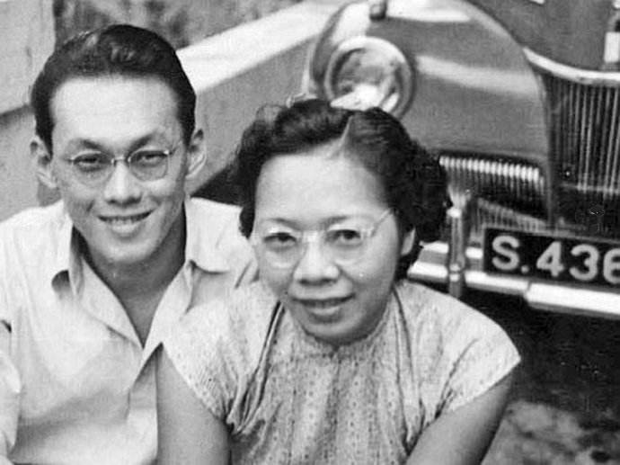
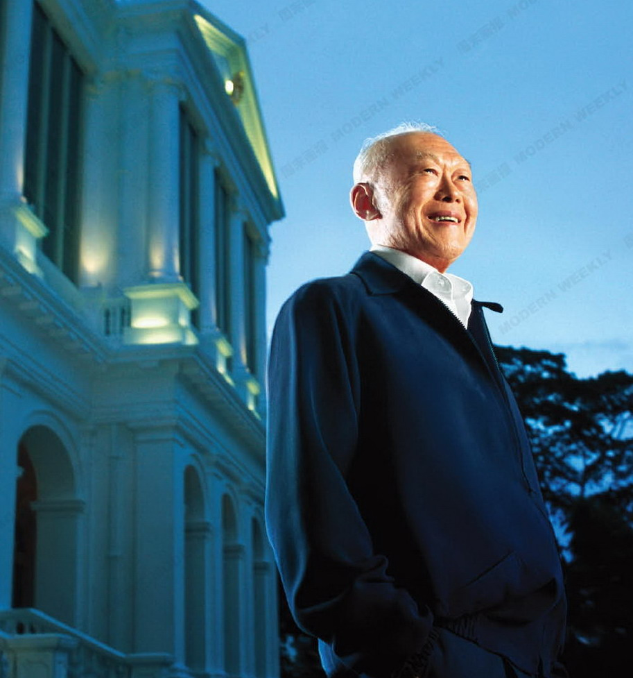
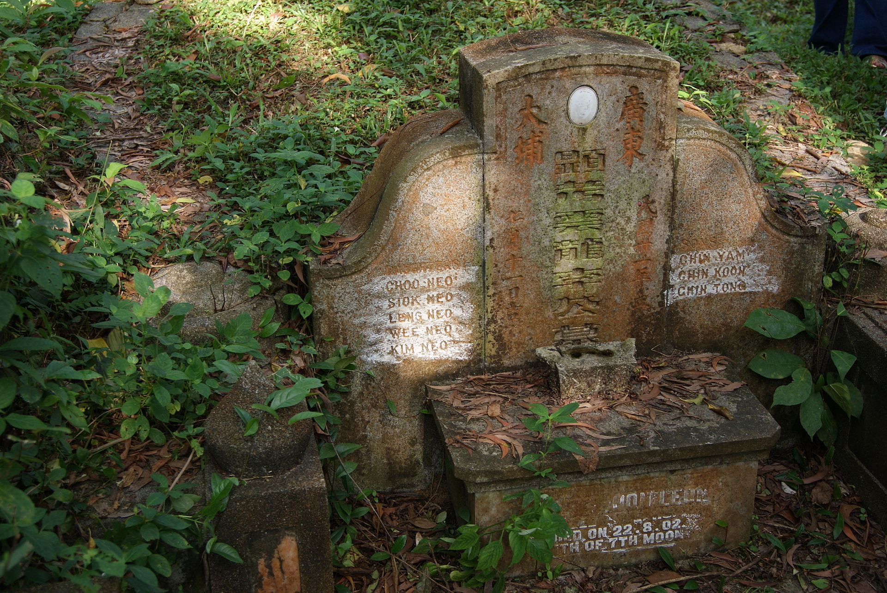

## nnnn姓名（资料）

### 成就特点

- 首任新加坡总理，新加坡国父，首任人民行动党秘书长
- 新加坡李氏家族政治的创始人
- 2011年，《商业内幕》网站在其“20世纪最成功的独裁者”排名中将李光耀列为第二位
- ​

### 生平

李光耀（1923年9月16日－2015年3月23日）

1923年9月16日，李光耀生于新加坡甘榜爪哇路（Kampong Java Road）92号的一座别墅内。客家人，祖籍广东梅州市大埔县高陂镇党溪乡。曾祖父于1862年从广东大埔移居到海峡殖民地。

1935年，李光耀考入当地的英校莱佛士书院（初中部）；

1940年，考入该校的高中部，但在日军占领新加坡后中断学业。

1942年开始学习中文和日文，成为首届官方日语考试毕业生后1943-1945年间于大日本帝国大本营陆军参谋部报道部工作。

二战结束后的1946年，李光耀在亲友的帮助下凑集学费，并获大英帝国女王奖学金，乘运兵船不列颠号远赴英国留学。在留英初期，李光耀就读于伦敦经济学院，并在学习时受到导师拉斯基的社会主义理论影响，逐渐展现反对英国殖民统治倾向，但却在后期一直以“反共者”著称。

一年后，李光耀转到剑桥大学攻读法律，并于1949年考获双重一等荣誉学位，名列榜首毕业，随后取得律师资格。1950年，他与以前在莱佛士书院的同学柯玉芝结婚。（1937年在莱佛士书院念高中，是这所传统男校的唯一女生。）【学姐】

【总理】

1950年8月，李光耀回到新加坡，开始从事律师工作。

1952年，李光耀因为代表“新加坡罢工的邮差”与政府谈判而声名大噪，在工会中建立了群众基础，从而为其将来的从政之路奠定了基石。

1954年10月，李光耀参与成立人民行动党，并顺利当选立法议会议员，为新加坡争取自治地位。

1959年6月3日，新加坡自治邦成立，而人民行动党也成为立法议院第一大党，由李光耀出任自治邦政府总理。

【与马来西亚合并】

1961年，行动党内以李光耀为首的“反共分子”与“亲共分子”决裂，李光耀逐渐右倾。1963年2月，尚未独立的新加坡在李光耀带领下，配合马来亚、英国殖民政府发起大规模保安行动（即著名的“冷藏行动”），拘捕及拘留至少133人，包括反对派重量级政客、新闻记者和编辑以及学生，外界普遍认为这次行动是针对共产主义者，打压反对新加坡和马来亚合并的声音。

同年7月，李光耀在伦敦与马来亚东姑阿都拉曼政府达成协议，新马正式合并。

【独立】

新马合并后，马来西亚联邦政府与新加坡自治邦政府在经济等多项政策上很快就产生严重的分歧。1964年，新加坡发生种族骚乱，李光耀政府籍此指责马来西亚首相东姑阿都拉曼与联邦政府试图推行“种族沙文主义”，使马来人在联邦内享有特殊的高等待遇，并在幕后煽动在新加坡的马来人反对新加坡自治邦政府。而联邦政府高层则对此十分反感，也因随后双方多次协商未果，导致新加坡最终在1965年被驱逐出马来西亚联邦，并于8月9日被迫宣布独立。

新加坡独立后，李光耀积极的推动经济改革与发展，在位期间推动了开发裕廊工业园区、创立公积金制度、成立贪污调查局，并进行教育改革等多项政策，成功使得新加坡在三十年内发展成为最富裕繁荣的国家之一。新加坡政府以高效率、廉洁著称，且人民的生活水平提高，但自由备受限制。

【垂帘听政】

1990年，李光耀辞去总理职务，担任内阁资政（Senior Minister），维持其在政坛的影响力，被指“垂帘听政”。 2004年，他改任“Minister Mentor”（中文仍称内阁资政）。他始终提倡亚洲价值观，认为亚洲国家不需要完全依照西方的价值观行事。李光耀因此也一直对西方国家对他专制独裁的批评不加理会，他认为西方民主不能强加给亚洲人民。

2011年5月14日，人民行动党在大选中，获得建国以来最低得票率，并首次在阿裕尼集选区败给反对党新加坡工人党。李光耀与另一位前总理吴作栋发表联合声明，宣布不会出任新内阁任何职务。他结束长达二十年的资政，连同总理生涯，正式结束在政府内阁长达52年的生涯，亦代表其长子李显龙正式接班。

2013年，李光耀出版自传，表示感到身体一天比一天衰弱，希望早日离开人世。

2015年3月23日凌晨3时18分（新加坡标准时间），李光耀因重症肺炎医治无效逝世，享寿91岁。2015年3月29日下午14时, 在新加坡国立大学文化中心举行国葬。

【中国的关系】

新加坡初独立之时，李光耀曾对外说了这么一段话。“我不是中国人，就如肯尼迪总统不是个爱尔兰人。慢慢的，世人会知道，新加坡姓李、姓高、王、杨、林的人们，外表上是中国人，说着华文，然而却与中国人不同。我们有中国人的血统，我们不否认这点；但重要的是，我们以新加坡的立场思考，关心新加坡的权益，而不是以中国人的立场，为中国人的权益着想。”

1976年5月，李光耀应周恩来逝世前的邀请首次访华，会晤过中国共产党中央委员会主席毛泽东、国务院总理华国锋等多位中华人民共和国领导人。之后，他多次访中国大陆，和邓小平、赵紫阳、李先念等中华人民共和国国家领导人会面。

1978年，时任国务院副总理邓小平出访新加坡，并获李的高规格接待。两人确实有许多共同点，例如在经济上皆力主市场经济和改革开放，皆留学欧洲，皆喜博览群籍知识丰富，极具理想抱负远见，施政手法精明务实，政治斗争经验丰富，有战争经验皆遇过生死关头，自奉甚俭而正直廉洁，两人都深具领导魅力等，因而李光耀与邓小平两人被许多传媒拿来比较。

1990年10月3日，新加坡共和国宣布与中华人民共和国建立外交关系，成为同中华人民共和国建交最晚的亚洲国家之一。

1992年，在李光耀和访新的中华人民共和国主席杨尚昆促成下，海峡两岸曾于1993年在新加坡举行“汪辜会谈”，极具象征意义。

另外，苏州工业园区也是由李光耀主导建设的。

据统计，2013年之前《人民日报》曾经12次称李光耀为“中国人民的老朋友”。但在更早以前，曾经94次称李光耀为“傀儡”（“帝国主义者的傀儡”、“新加坡李光耀傀儡政权”、“拉赫曼—李光耀傀儡集团”等是最常见的搭配形式），是“老朋友”称呼的近8倍。

【台湾】

李光耀与中华民国方面的关系十分密切。1970年代，新加坡和中华民国进行了包括军事在内的多项合作，李本人也多次访问台湾，与时任总统蒋经国私交很好。1988年李登辉上台后，双李也交往甚密，1989年3月李登辉就任总统后首次访问即是新加坡。后来基于对李光耀友谊，李登辉在“辜汪会谈”地点让原本不是第一选择的新加坡脱颖而出。

亲民党主席宋楚瑜说，有一年李光耀来访，与蒋经国到溪头，当时李光耀可用闽南语跟台湾民众直接沟通，让蒋经国好羡慕，蒋经国自惭自己身为国家领导人，反而听不懂台湾民众说什么，于是才开始学闽南语，到蒋后期，虽仍不太会讲，但听都已经听得懂。

【】

李光耀于1994年获颁搞笑诺贝尔奖心理学奖，表彰其30年来“对300万新加坡公民不管何时何地吐痰、嚼口香糖、喂鸽处罚之影响的研究”。

李光耀在新加坡有很高威望，他领导的政府廉明、高效率。但是也有很多西方媒体指责新加坡没有新闻自由，在政治上也不民主，文化发展亦因政治需要而备受压抑，反对派长期受打压及迫害。

李光耀掌权以来，引用殖民地时期制定的《内部安全法令》囚禁约2600名异己。前国会议员谢太宝甚至在未经审判的情况下，被新加坡当局监禁与软禁长达32年（监禁23年，软禁9年）之久。 2011年，《商业内幕》网站在其“20世纪最成功的独裁者”中将李光耀排列为第二位。（而第一位为伊德里斯一世，第三位是佛朗哥，蒋介石名列第四位。）、

【作为】

统一官方工作通用语言为英语：1960年代，李光耀坚持以英语为政府工作通用语言，教育政策一律用英语教学，使新加坡顺利与世界接轨。

推行讲华语运动，让使用新加坡福建话（闽南语泉漳片）、潮州话、粤语、客语的各祖籍汉人使用华语（北方官话），取代民间通用的福建话。

反对两党政治：李光耀还说，如果新加坡决定发展成为像西方国家如英国与美国的两党制政治，新加坡必然“走向平庸”，因为“最优秀的人才不会选择从政，参选得冒很大风险，竞选活动会变得非常不文明、甚至卑鄙恶毒”。

治安政策：李光耀的自传认为日本统治时期是新加坡治安最好的时候，而他认为日本人维持治安的方法简单而有效——“不听话就打，开始时宪兵部整晚都是打人的声音，后来慢慢就没有了；但是，只要你听话日本人会尽力做好管理者应该做的事情”。新加坡政府的廉洁和高效是被广泛认可的，同时新加坡也是一个使用严刑峻法以及保留肉刑（包括鞭刑）的国家，可能与李光耀日治期间的经历体会有关。

【亚洲价值】

李光耀主张“亚洲价值”。

“人性的某些基本方面是不会改变的。人性中有恶的东西，你必须防止它。西方人相信，只要有一个好的政府制度，一切问题都可以解决；东方人是不相信的。东方人相信，个人离不开家庭，家庭属于家族，家族又延伸到朋友与社会。”

“在西方，特别是在二次大战后，政府被认为可以对个人完成过去由家庭完成的义务；这种情况鼓励了单亲家庭的出现，因为政府被认为可以代替父亲，这是我这个东亚人所厌恶的。家庭是久经考验的规范，是建成社会的砖瓦。”

对亚洲价值阐明得最清楚的，可能是新加坡提出的五大原则：一、社会与国家比个人更重要；二、国之本在家；三、国家和社会要尊重个人；四、和谐比冲突(指言论多元的社会)更能维持社会秩序。五、宗教与宗教之间不仅应和平共处，而且应互补；用李光耀的最概括的话来说，就是“社会第一，个人第二”

### 照片

