## nnnn姓名（资料）

### 成就特点

- 中华民国迁往台湾前最后一任美国驻华大使
- 燕京大学创始人
- 出生于中国杭州，杭州市荣誉市民
- 美国传教士

### 生平

司徒雷登的父母都是早期到中国的美南长老会传教士。他的父亲司徒尔于1868年只身一人来杭州传教。

1876年6月24日，司徒雷登出生于杭州。父母都是早期到中国的美南长老会传教士。从血统上说，他是一位纯粹的美国人。但用司徒雷登自己的话来说，自己“是一个中国人更多于是一个美国人”。他会讲一口纯正的杭州话。

11岁时，到美国弗吉尼亚州上学，在那里曾被人讥笑为不会说英语的怪物。

当他在弗吉尼亚州的汉普登-悉尼学院求学期间，受到“学生志愿国外传教运动”的影响，而立志于传教，转入纽约协和神学院。

1904年，他结婚后携妻子艾琳·罗德（Aline Rodd）回到杭州，成了第二代美南长老会传教士。

1908年，司徒雷登应邀前往南京，出任金陵神学院希腊文教授。

1910年，任南京教会事业委员会主席。辛亥革命时，兼任美联社驻南京特约记者。

【燕京大学校长】

1918年，北京有两所教会大学决定合并：一所是汇文大学，一所是协和大学。却因内在矛盾太多，多次协商未果。

1919年1月，司徒雷登北上，会见即将合并的两校有关人士，经多方斡旋，成立了由蔡元培等五人组成的校名委员会，最后采纳了诚静怡博士的建议，以“燕京大学”为校名，同时也解决了其他矛盾。

司徒雷登出任首任燕京大学校长，他作为燕大的长期领导人为该校的发展壮大作出不可磨灭的贡献。

司徒雷登接手的燕京大学，校址在北京东城的盔甲厂，规模很小，学生只有94人。从1922年起，他15年内往返美国10次，募捐筹款，其中一次就募得150万美元。这在当时几乎是个天文数字。

有了经费后，他决定给学校另选新址。他和同事寻遍北京四郊，找到清华园西边的一块地。这里原是清代一个亲王废弃的园地，后转到陕西督军陈树藩手中。司徒雷登专门到陕西会见陈树藩，陈对建校很感兴趣，以6万大洋将地产卖给燕京大学，并把其中的1/3捐作奖学金。

经过数年建设，1929年新校址正式投入使用。燕京大学校园的建设，融合了中西文化，是司徒雷登的得意之作。他自豪地宣称：“凡是来访者，无不称赞燕京大学是世界上最美丽的校园——它有助于加深学生对这个学校及其国际主义理想的感情。”

司徒雷登四处募捐，张学良将军曾为此大学捐款。为燕京大学在北京西郊建造了一所宫殿式的美仑美奂的新校园，不惜出重金延请中外著名学者如吴雷川、许地山、邓之诚、郭绍虞、顾颉刚、赵紫宸、容庚、钱穆、吴文藻等人来燕大任教，提升燕大知名度和学术地位。

1927年，燕大与哈佛大学合作组成了著名的哈佛燕京学社，促进中美文化交流。

到1930年代，燕大已发展成为中国学术水平最高的教会大学。

燕京大学仅仅存在了33年（1952年停办），其间还受到日本侵华战争的严重干扰，注册学生总共不超过10000名，却为中国培育了一大批高水平的人才，很多是各个领域的领军人物：其中中国科学院院士42人，中国工程院院士11人，再加上其他卓有成绩者，超过100人，占了注册学生的1%以上，可说是科学家的摇篮。二战时，中国驻世界各大城市的新闻特派员，9/10是燕京大学新闻系的毕业生。

司徒雷登提倡学术自由，注意与学生、员工互动交流，对学生和蔼可亲，对教职员热情温暖，给许多学生和员工留下深刻印象。司徒雷登同情学生运动，九一八事变后，他甚至亲自带领学生上街游行，高呼抗日口号。

1930年，美国普林斯顿大学授予他荣誉文学博士学位。1933年，受美国总统罗斯福召见，听取他对中国时局的意见。

【4年监禁】

1941年，太平洋战争爆发，他被日军关押在北京，直到1945年8月获释，继任燕大校长（后为校务长）到离开中国。四年的监禁生涯中，司徒雷登完成了他的大部分自传。后来，司徒雷登根据他在狱中所写的自传写成了《在华五十年》一书。

【美国驻华大使】

1945年秋天重庆谈判期间，曾被毛泽东宴请。

1946年7月11日，司徒雷登出任美国驻华大使，任期恰好是整个国共内战时期（1946年－1949年），同时仍担任燕大校务长之职。

同年，被当时的国民政府授予杭州市荣誉市民。

作为一名外交界新手，却要应付当时复杂的国内外局势，他一厢情愿地希望能将二战结束后的中国引向和平建设的方向，但其努力既不可能被国共双方所真正接受，也从未得到美国政府信任。

1949年4月，解放军攻占南京，他没有随国民政府南下广州，留在那里。

8月2日，司徒雷登始离开南京返美。8月5日美国国务卿迪安·艾奇逊发表《中美关系白皮书》，表示中华民国在国共内战的失败与美国无关。

8月8日，毛泽东写了一篇文章《别了，司徒雷登》，文中借他对国民党和美国当局极尽讽刺。这篇文章曾被收入中国大陆的中学语文教材，这使司徒雷登在中国比在美国更知名，1949年后在大陆成长起来的人中，普遍知道司徒雷登这个名字。他被长期当作是美国对华政策失败的代表人物。

1952年11月28日，他正式辞去大使。

【归葬中国】

他回到美国后，他先被美国国务院下了“禁言令”，被反共极右的麦卡锡主义者骚扰。1949年12月，患了脑血栓，导致半身不遂和失语症，由其学生兼私人秘书的傅泾波和家人照顾其起居。

1962年9月19日，司徒雷登因心脏病突发在华盛顿病故。他一直希望能够将骨灰送到中国，埋在燕京大学校园内，并就此立下遗嘱。

逝世后，傅泾波1973年和1984年两次访问北京，均向有关当局提出将司徒雷登骨灰回葬燕园之事。傅泾波在1986年还为此事请中国驻美大使递信给邓小平。1986年6月，经中共中央书记处批准，北大校务委员会主任王学珍去信同意司徒雷登骨灰以原燕京大学校长名义安葬于临湖轩。“不料，一群‘马列主义老太太’联名反对，事情不得不搁置。”燕大校友王百强回忆，有人联名上书反对安葬。为首的上书者，正是司徒雷登当年一位秘书的遗孀。反对的主要原因是因为司徒雷登是毛泽东点名批评的人。于是，1987年4月，中美驻美使馆正式通知傅泾波，此事因故暂缓办理。

在回葬燕园受阻后，傅泾波与1988年去世，傅的后人为完成其心愿，开始考虑让司徒雷登骨灰安葬杭州。杭州当局积极回应，2008年11月18日，司徒雷登的骨灰正式移葬杭州半山安贤园。

【评价】

历史学家林孟熹这样评论他：“整个20世纪大概没有一个美国人像司徒雷登博士那样，曾长期而全面地卷入到中国的政治、文化、教育各个领域，并且产生过难以估量的影响。”

作家冰心谈及燕京大学往事时曾说：“我就不爱听什么‘别了，司徒雷登’，人家司徒雷登帮过很多进步学生，好几个人都是坐着他的车才去了解放区。应该感谢每一个帮助自己的人，忘恩负义不好。”

作为蒋宋美龄亲信及蒋中正麾下得力干员之一的黄仁霖，曾担任过励志社工作的他，也是一位虔诚的基督徒，他在他的回忆录中评论到“司徒雷登是一个著名的传教士和教育家。他实际上是北平燕京大学的创办人，曾经出过一番力，因此他被中国政府和人民所推重。但他的政治见识和经验。却很有限而且非常幼稚。

【】

### 照片

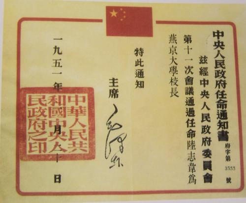

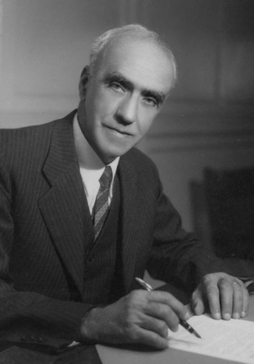

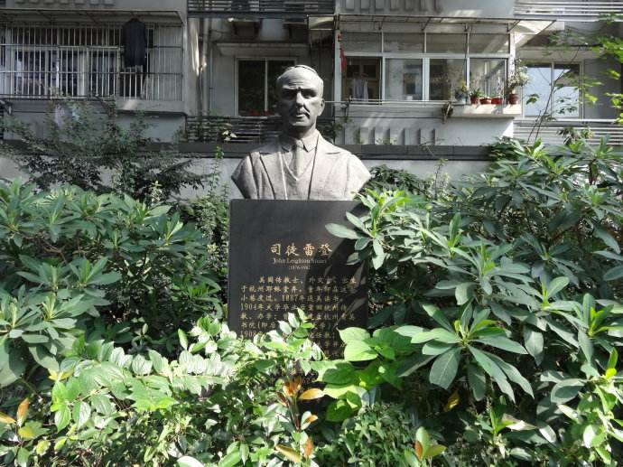

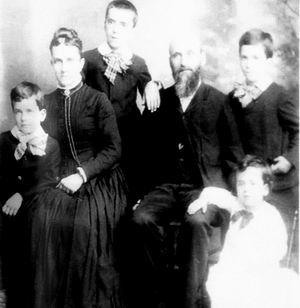

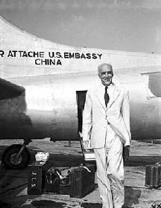

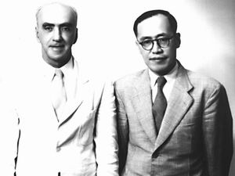

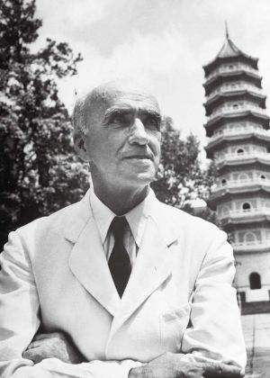

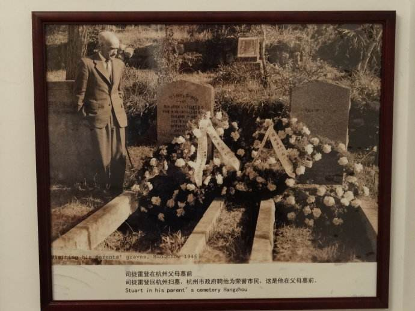

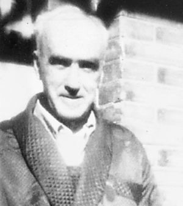

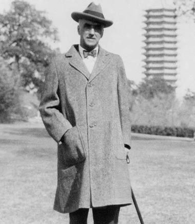

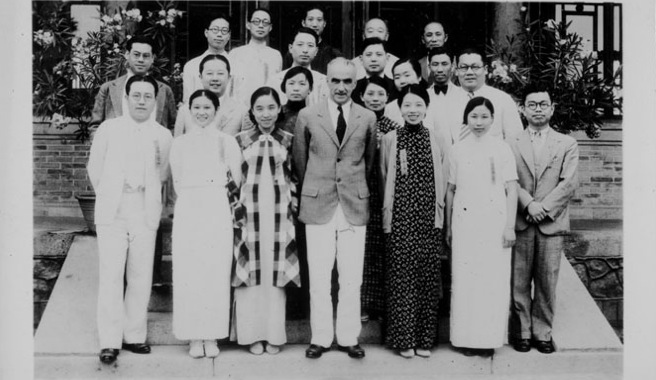

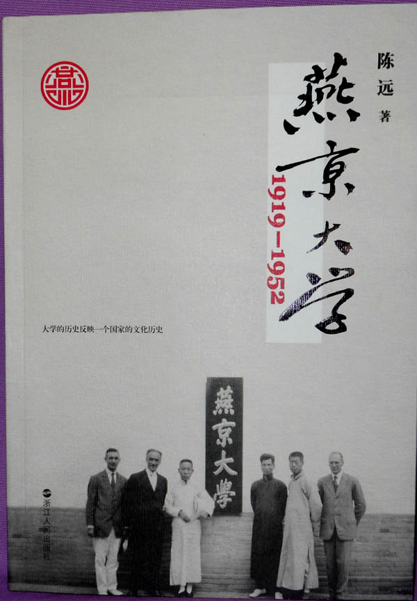

