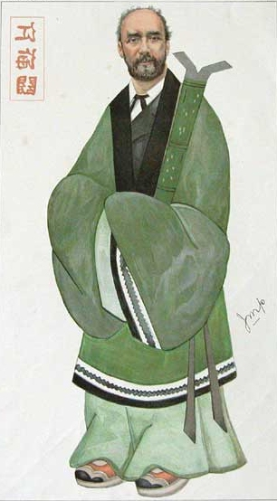
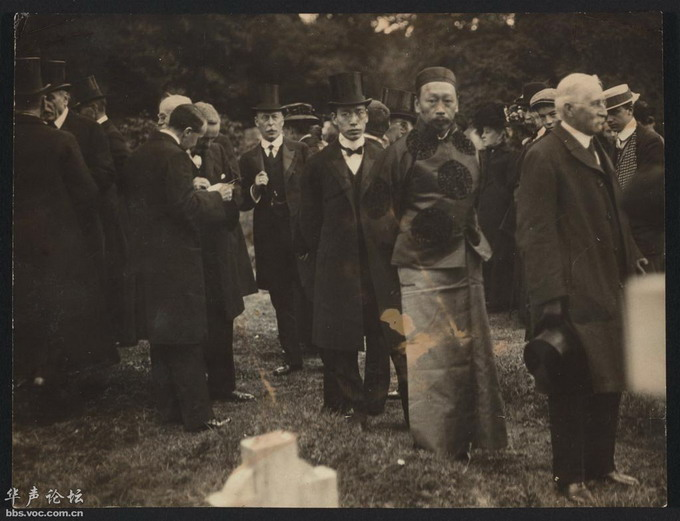
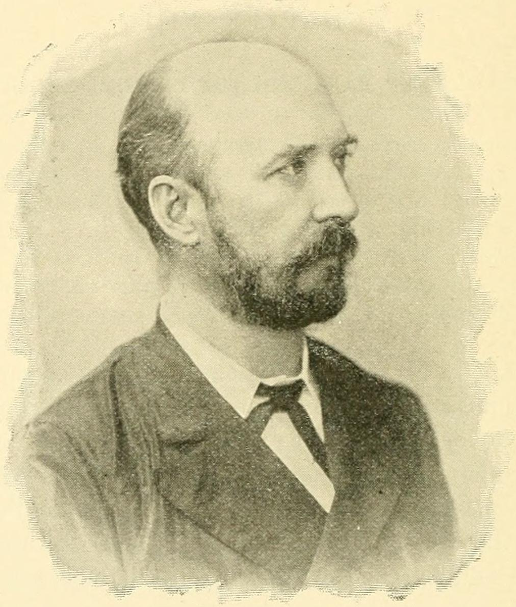
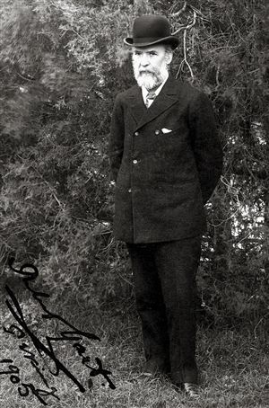
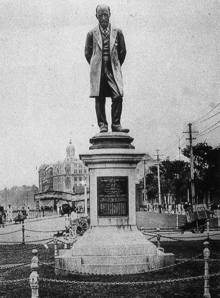
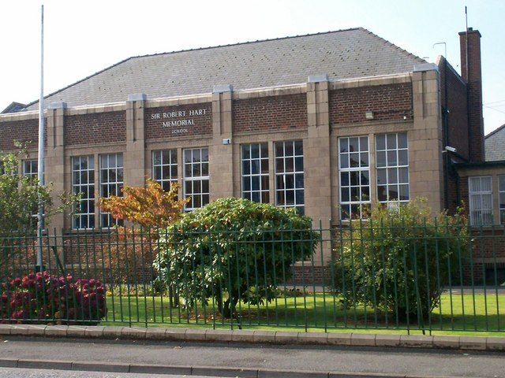

## nnnn姓名（资料）

### 成就特点

- 担任晚清海关总税务司半个世纪（1861年－1911年）
- 倡议下中国第一所新式学校—京师同文馆成立
- 全球最清廉的海关
- 创建了中国的现代邮政系统
- 中国雇员
- 拒绝出任驻华、韩公使
- 一品大员
- 助葡萄牙“永据”澳门
- 购买八艘军舰，后来成为北洋水师的起源

### 生平

1835年2月20日，赫德出生于英国北爱尔兰。父亲在蒸馏酒厂工作。他被送入位于英格兰汤顿的卫斯理宗学校，开始学习拉丁语。后转送位于都柏林的卫斯理联系学校（现都柏林卫斯理书院）。

少年赫德学习勤奋，15岁时学校课程结束。入读当时新创立的贝尔法斯特女王学院。他轻松通过了入学考试，并赢得奖学金（大学第二及第三年又分别赢得奖学金）。1853年他完成学位考试，在18岁的年纪获得文学士学位。

【中国的翻译官】

1854年5月，被提名加入驻中国的领事团队，离开英国赴中国。

先抵达香港，担任见习翻译三个月。随后，赴宁波英国领事馆任翻译官。

1858年3月，赫德被调到英法联军占领下的广州担任大英法会理华洋政务总局（Allied Commission）书记官，又被充作香港督署书记官。赫德在政务总局的上司是巴夏礼，赫德对工作“极度的感兴趣”。

1858年10月，赫德改任英国驻广州领事馆阿礼国手下的翻译官。

【入职海关】

1859年，与赫德熟识的两广总督劳崇光请赫德出面在广东建设类似于李泰国的上海江海关的新式海关。赫德自认对海关事务一窍不通，但去信李泰国询问在广州设立海关的提议。李请赫德出任大清皇家海关副税务司，赫德接受邀请，并询问英国政府是否同意他从领事队伍辞职。英国政府回复准许赫德辞职，但告诫赫德不会允许他随意回到英国领事队伍。赫德在1859年5月向英国递交辞呈，入职中国海关。

1861年，在太平军逼近上海的同时，李泰国向清廷请病假。李泰国离沪期间，清廷任命两名署理总税务司：乔治·亨利·菲茨罗伊（曾任额尔金伯爵的私人秘书）与赫德。菲茨罗伊愿意留在上海，而赫德则走访全国各地筹办海关。随着天津条约的签署，中国通商口岸迅速增加，海关系统急需扩张以管理日益增多的国际贸易。

【中国第一所新式学校】

1862年（同治元年），在赫德与恭亲王的倡议下中国第一所新式学校—京师同文馆成立，并在广州设分部。同文馆旨在培养中国未来的外交及其他人才，学生学习外语、外国文化以及科学，经费来自海关税收，分责人也由总税务司推荐。

同文馆后来并入京师大学堂，今北京大学。

1863年（同治二年），李泰国回到上海。11月30日李泰国去职，同日赫德正式接替担任海关总税务司，徙驻上海。

作为大清皇家海关总税务司，赫德的主要职责是为中国政府收取关税，同时负责将新式海关制度推广到帝国各处的海、河港口及内陆关口，将海关的运作制度化，并提高海关的效率和诚信度。

赫德任内建立的新式海关包括1864年（同治三年）所置台湾南北新关、1899年（光绪二十五年）与德使筹置的胶海新关、1886年（光绪十二年）赴香港、澳门，置关九龙、拱北、1905年（光绪三十一年），寻与日使筹置大连湾新关、1907年（光绪三十三年）东三省度地置关等。

1864年（同治三年），赫德还驻京，加按察使衔，成为清朝的正三品大员。1865年（同治四年），总税务署从上海迁到北京。从此，赫德居住在北京40多年。1869年（同治八年），晋布政使衔，官阶从二品。

在海关任内赫德一直利用他对清廷的影响推动本职外的近代化改革。赫德在任内创建了税收、统计、浚港、检疫等一整套严格的海关管理制度，新建了沿海港口的灯塔、气象站，为北京政府开辟了一个稳定的、有保障的、并逐渐增长的新的税收来源，不但比旧式衙门清廉，甚至也是当时全球最清廉的海关；赫德主持的海关还创建了中国的现代邮政系统。

【海军】

1874年，中国开始建设新式海军，总理衙门委托赫德通过金登干购买四艘舰艇，1879年（光绪五年），赫德又协助清帝国购买八艘军舰，后来成为北洋水师的起源。1879年赫德向总理衙门提议试办海防条例，组装南北两洋海军，并自荐出任总海防司。

总理衙门要求赫德在总税务司与总海防司之间选择其一，赫德选择继续担任总税务司、放弃总海防司职位。

【外交】

在外交方面，赫德鼓励清朝在其他国家设立使领馆。赫德本人也富有外交才能，与中西官员建立友好关系，并利用这些关系来保证海关在风波中继续运作。由于中国各处被列强割据，赫德时常需要利用他的外交能力与列强使节协商设立海关和征收关税事宜，并在本职工作之外为中国外交服务。

1876年（光绪二年），赫德协助签订《烟台条约》，其美国籍税务司认为赫德阻止了一场中国与英国之间的战争。

1884年（光绪十年）中法越南冲突爆发后，赫德赴金陵与法使议越南案。不久，法国转而攻击台湾，海关关舰“飞虎”号在台湾海域为灯塔补时被俘。赫德派遣驻伦敦的中国海关官员金登干（James Duncan Campbell）赴巴黎协商释放关舰，同时试探议和解决冲突，1885年初金登干会见法国总理茹费理，同时赫德说服总理衙门同意在赔款和越南问题上做出让步，最终由金登干代表中国与法国议定合约，中法双方在天津签署《中法新约》。

赫德认识到自己中国雇员的身份，“从某种意义上讲”，是中国人民的“同胞”，是中国政府用来对付外国商人的外籍雇员。1885年，英国政府请赫德出任驻华、韩公使，在犹豫四个月后赫德拒绝了任命。

1886年（光绪十一年），赫德获赏花翎、双龙二等第一宝星。1889年（光绪十五年），升为正一品，1893年（光绪十九年），赏三代一品封典。

赫德在中国任官长达五十年，与掌管总理衙门的恭亲王奕䜣合作密切。同时也与李鸿章合作。

1900年（光绪二十六年）八国联军入京镇压义和团运动后，赫德与李配合参加《辛丑条约》谈判，尽力维护中国利益以求达到中国能够承受的议和条件。此后晋太子少保。1902年（光绪二十八年），召入觐，赐“福”字。

【离开中国】

1908年4月13日上午7时，73岁高龄的总税务司赫德因病休假离职回国，并在办公室留下一张意味深长的便条：“1908年4月13日上午7时，鹭宾·赫德走了。”此后他仍然挂着总税务司的头衔直到1910年。

离开中国三年后，1911年9月20日赫德因肺炎发作后心脏衰竭病逝于英国白金汉郡芬格斯特。清廷追赐优恤、加尚书衔、太子太保。

【个人生活】

1857年他在中国纳了妻妾“阿姚”，并与她生了三个儿女。

1863年出任总税务司后，赫德决定与（留在南方的）阿姚分离，并找一个符合身份的英国妻子。

1864年12月，他到访香港及广州，为阿姚作了慷慨的安排，并准备把两个孩子送到英国，但这一计划显然被推迟，因为在进行道别时他又使阿姚怀上第三个孩子。

1866年5月他第一次休假赴英。8月22日，与海斯特在都柏林结婚。9月离开爱尔兰赴北京。赫德与海斯特育有三个子女。

慈禧太后曾送给赫德小女儿一枚戒指。

1882年起海斯特和三个孩子长期住在伦敦。两人之间的关系通过书信维系。

他对三个婚生儿女的成人生活表示失望，但在写给金登干的信中也承认他是疏忽的父亲，没有在他们的生活里竖起榜样，但说中国是他的首要职责。

【获各国勋赏最多】

由于赫德对中国海关和中外外交的贡献，赫德成为了世界近代史上获各国勋赏最多的个人之一，共受封四个世袭勋位、十五个一等骑士（爵士）勋位，及众多其他名誉学术及市政荣誉。赫德所受封赏包括中国政府授予的一品顶戴、花翎、双龙二等第一宝星、三代一品封典、太子太保衔；英国授予的圣米迦勒及圣乔治同袍勋章、爵级司令勋章、爵级大十字勋章、从男爵位（封邑是阿马郡的基莫里亚蒂（Kilmoriarty））；普鲁士的一级皇冠勋章、以及丹麦的丹尼布洛大十字勋章等。

【上海滩的铜像】

民国初年，坐落于上海九江路外滩海关大楼前的赫德铜像，赫德去世后由英国驻沪领事馆及上海公共租界工部局建。1914年5月23日在九江路外滩的海关大楼前举行揭幕仪式。铜像由英国人设计并在英国铸造。铜像底座为四级台阶，台阶之上是长方形的基座，靠北的座基上镌一健步行走的男子，南面的石碑为一女子站在岩石上双手高举红灯望大海。东面和西面的石碑上则刻赫德生卒年代及生平事迹，其中写道：“前清太子太保尚书衔总税务司英男爵赫君德，字鹭宾，生于道光己未，卒于宣统辛亥，享遐龄者七十七年；综关榷者四十八载，创办全国邮政，建设沿海灯楼，资矜式于邦人，备咨询于政府，诚悫谦忍，智果明通，立中华不朽之功，膺世界非常之誉，爰铸铜像，以资不忘”。20世纪40年代上海沦陷期间，此一铜像被拆毁。

### 照片

